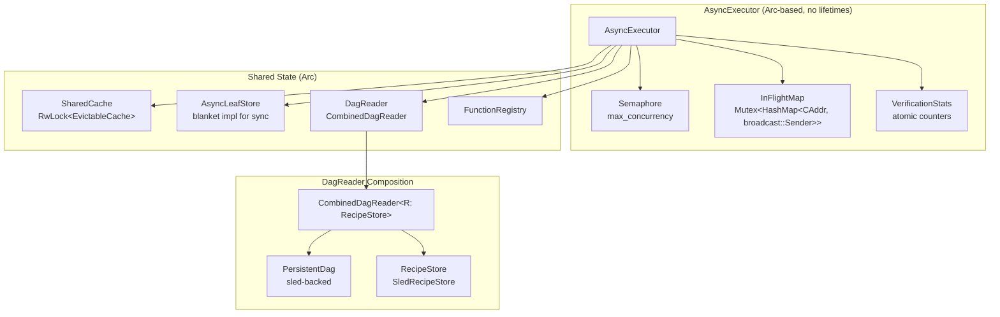
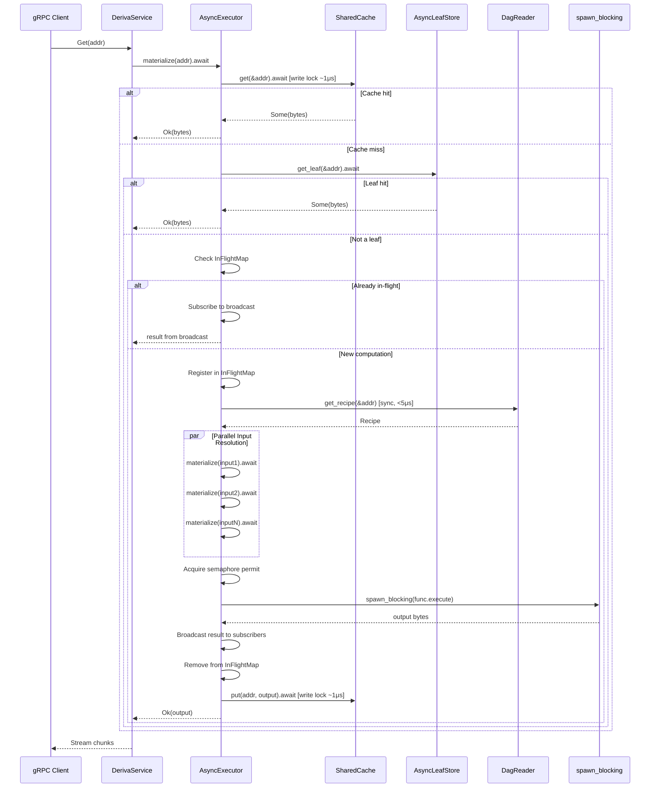
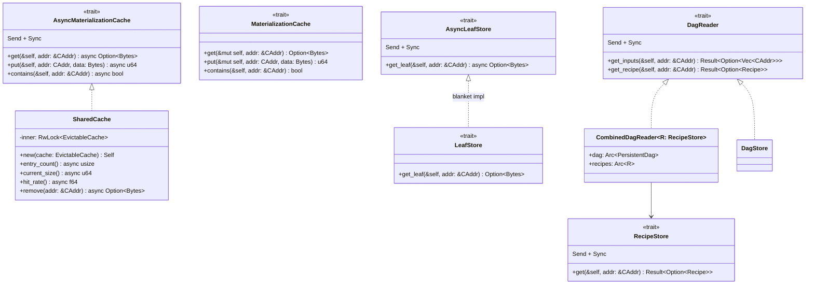
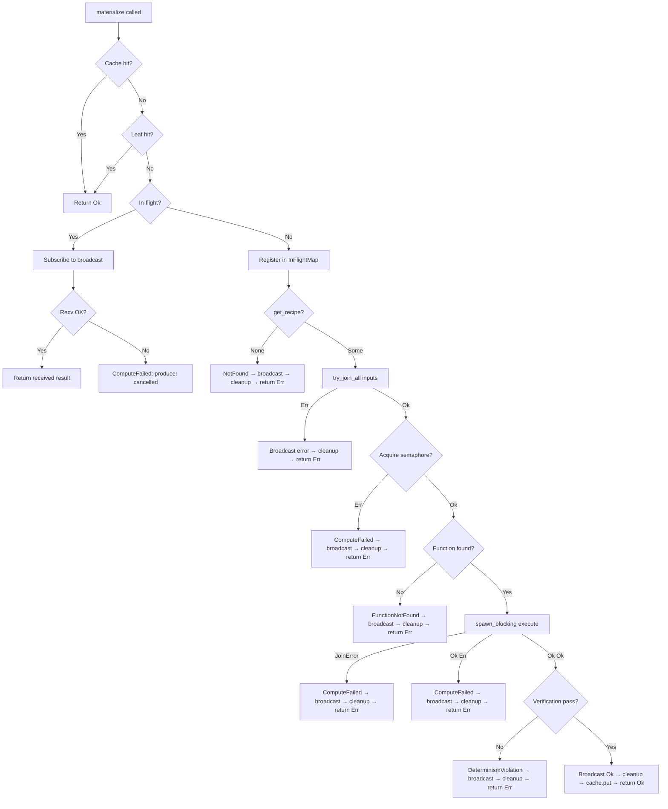

# Design Document: Async Compute Engine

## Overview

The Async Compute Engine (Phase 2.2) replaces the synchronous `Executor` with a Tokio-based `AsyncExecutor` that yields during I/O, uses fine-grained locking for concurrent request handling, eliminates stack overflow risk via heap-allocated futures, and lays the foundation for parallel materialization.

The core problem with the Phase 1 synchronous executor is threefold:
1. **`&mut self` cache prevents concurrency** — `EvictableCache::get` updates metadata, requiring exclusive access that serializes all Get RPCs.
2. **Lock scope spans entire materialization** — DAG read locks and cache write locks are held for the full recursive traversal plus compute time, blocking all other RPCs.
3. **Stack overflow risk** — synchronous recursion grows the call stack proportional to DAG depth.

The async engine solves these by moving to interior mutability (`tokio::sync::RwLock` inside `SharedCache`), `Arc`-based shared ownership (no lifetime parameters), `BoxFuture` for O(1) stack depth, `spawn_blocking` for CPU isolation, and `try_join_all` for parallel input resolution.

### Key Design Decisions

| Decision | Choice | Rationale |
|----------|--------|-----------|
| Cache concurrency | `tokio::sync::RwLock` inside SharedCache | Allows &self access, fine-grained lock per operation |
| Ownership model | `Arc<T>` for all shared state | Eliminates lifetime parameters, enables Clone for task spawning |
| Async recursion | `BoxFuture` (manual) | O(1) stack depth, explicit allocation, no extra crate dependency |
| CPU isolation | `spawn_blocking` for compute functions | Prevents runtime thread starvation |
| Input resolution | `try_join_all` for parallel fan-in | Wall-clock time = max(branch) instead of sum(branches) |
| Deduplication | `InFlightMap` with broadcast channels | Single computation per CAddr, all requesters get result |
| Concurrency limit | `Semaphore` at compute step only | Prevents resource exhaustion without deadlocking deep DAGs |
| DAG access | Synchronous `DagReader` trait | sled reads complete in <5μs, async overhead not justified |

## Architecture



### Materialization Flow (Phase 2.2)



### Lock Contention: Phase 1 vs Phase 2.2

```
Phase 1 — Two concurrent Get RPCs (serialized):

Time ──────────────────────────────────────────────▶
Task A: [========= cache.write() held 500ms =========]
Task B:                                               [========= 500ms =========]
Total: 1000ms (serialized)

Phase 2.2 — Two concurrent Get RPCs (overlapped):

Time ──────────────────────────────────────────────▶
Task A: [c][leaf][dag][mat1][mat2][compute][c]   ← lock windows ~1μs each
Task B:  [c][leaf][dag][mat1][mat2][compute][c]  ← runs concurrently
Total: ~500ms (overlapped)
```

## Components and Interfaces

### Trait Hierarchy



### AsyncMaterializationCache Trait

```rust
#[async_trait]
pub trait AsyncMaterializationCache: Send + Sync {
    async fn get(&self, addr: &CAddr) -> Option<Bytes>;
    async fn put(&self, addr: CAddr, data: Bytes) -> u64;
    async fn contains(&self, addr: &CAddr) -> bool;
}
```

Key design point: `get` takes `&self` (not `&mut self`). Interior mutability is pushed into the implementation. `SharedCache` uses `tokio::sync::RwLock<EvictableCache>` internally — `get()` acquires a write lock (because `EvictableCache::get` updates `access_count`/`last_accessed`), `contains()` acquires only a read lock, and `put()` acquires a write lock. All locks are released within the single operation (~1μs), not held across the entire materialization.

### AsyncLeafStore Trait

```rust
#[async_trait]
pub trait AsyncLeafStore: Send + Sync {
    async fn get_leaf(&self, addr: &CAddr) -> Option<Bytes>;
}

// Blanket impl: any sync LeafStore + Send + Sync gets async for free
#[async_trait]
impl<T: LeafStore + Send + Sync> AsyncLeafStore for T {
    async fn get_leaf(&self, addr: &CAddr) -> Option<Bytes> {
        LeafStore::get_leaf(self, addr)
    }
}
```

The blanket implementation ensures backward compatibility — existing `BlobStore` (which implements `LeafStore`) works without modification in the async engine.

### DagReader Trait

```rust
pub trait DagReader: Send + Sync {
    fn get_inputs(&self, addr: &CAddr) -> Result<Option<Vec<CAddr>>>;
    fn get_recipe(&self, addr: &CAddr) -> Result<Option<Recipe>>;
}
```

Deliberately synchronous because sled reads complete in <5μs — the async overhead (~5μs for task scheduling) would double the cost with no benefit. The `DagStore` implements this directly for unit tests; `CombinedDagReader<R: RecipeStore>` implements it for production.

### RecipeStore Trait

```rust
// In deriva-core (shared dependency)
pub trait RecipeStore: Send + Sync {
    fn get(&self, addr: &CAddr) -> Result<Option<Recipe>>;
}
```

Resides in `deriva-core` to avoid circular dependencies between `deriva-compute` and `deriva-storage`. `SledRecipeStore` in `deriva-storage` implements this trait.

### AsyncExecutor

```rust
pub struct AsyncExecutor<C, L, D> {
    cache: Arc<C>,
    leaf_store: Arc<L>,
    dag: Arc<D>,
    registry: Arc<FunctionRegistry>,
    semaphore: Arc<Semaphore>,
    in_flight: Arc<Mutex<HashMap<CAddr, broadcast::Sender<Result<Bytes>>>>>,
    pub config: ExecutorConfig,
    pub verification_stats: Arc<VerificationStats>,
}
```

All fields are `Arc`-wrapped, enabling `Clone` for the executor (each clone shares the same underlying state). No lifetime parameters — this is the fundamental change enabling concurrent task spawning.

### ExecutorConfig

```rust
pub struct ExecutorConfig {
    pub max_concurrency: usize,           // default: num_cpus * 2
    pub dedup_channel_capacity: usize,    // default: 16
    pub verification: VerificationMode,   // default: Off
}
```

### VerificationMode

```rust
#[derive(Debug, Clone, Copy, PartialEq, Default)]
pub enum VerificationMode {
    #[default]
    Off,
    DualCompute,
    Sampled { rate: f64 },  // 0.0-1.0, deterministic per address
}
```

Sampling uses `addr.as_bytes()[0] / 255.0 < rate` — deterministic per address, so the same address always gets the same verification decision.

## Data Models

### InFlightMap

```rust
type InFlightMap = Arc<Mutex<HashMap<CAddr, broadcast::Sender<Result<Bytes>>>>>;
```

| Field | Type | Purpose |
|-------|------|---------|
| Key | `CAddr` | Address being computed |
| Value | `broadcast::Sender<Result<Bytes>>` | Channel for broadcasting result to all subscribers |

Lifecycle:
1. First requester inserts `(addr, tx)` into map
2. Subsequent requesters find entry, call `tx.subscribe()` to get a receiver
3. Producer sends result via `tx.send(result)`
4. Producer removes entry from map

### VerificationStats

```rust
pub struct VerificationStats {
    pub total_verified: AtomicU64,
    pub total_passed: AtomicU64,
    pub total_failed: AtomicU64,
    pub last_failure: tokio::sync::Mutex<Option<DerivaError>>,
}
```

Atomic counters enable lock-free statistics gathering across concurrent materializations.

### ServerState (Refactored)

```rust
pub struct ServerState {
    pub executor: AsyncExecutor<SharedCache, BlobStore, CombinedDagReader<SledRecipeStore>>,
    pub cache: Arc<SharedCache>,
    pub dag: Arc<PersistentDag>,
    pub recipes: Arc<SledRecipeStore>,
    pub registry: Arc<FunctionRegistry>,
    pub storage: StorageBackend,
}
```

No `RwLock` wrappers on `dag` or `cache` in `ServerState` — concurrency is handled internally by each component.

### Metrics Schema

| Metric Name | Type | Labels | Purpose |
|-------------|------|--------|---------|
| `deriva_materialize_total` | Counter | `result: {cache_hit, leaf, computed}` | Materialization outcome counts |
| `deriva_materialize_duration_seconds` | Histogram | — | End-to-end materialization latency |
| `deriva_materialize_active` | Gauge | — | In-flight materializations (should return to 0) |
| `deriva_cache_total` | Counter | `result: {hit, miss}` | Cache access pattern |
| `deriva_compute_duration_seconds` | Histogram | `function` | Per-function compute latency |
| `deriva_compute_input_bytes` | Histogram | `function` | Input size distribution |
| `deriva_compute_output_bytes` | Histogram | `function` | Output size distribution |

## Correctness Properties

*A property is a characteristic or behavior that should hold true across all valid executions of a system — essentially, a formal statement about what the system should do. Properties serve as the bridge between human-readable specifications and machine-verifiable correctness guarantees.*

### Property 1: Cache Round-Trip Integrity

*For any* CAddr and Bytes value, putting the value into SharedCache and then getting it back SHALL return the exact same bytes.

**Validates: Requirements 1.3, 1.5**

### Property 2: AsyncLeafStore Blanket Equivalence

*For any* type implementing synchronous `LeafStore + Send + Sync` and any CAddr, calling the async `get_leaf` via the blanket `AsyncLeafStore` implementation SHALL return the same `Option<Bytes>` as calling the synchronous `LeafStore::get_leaf` directly.

**Validates: Requirements 2.3**

### Property 3: Materialization Priority Order

*For any* CAddr that exists in both the cache and the leaf store (with potentially different data), `materialize` SHALL return the cached value. For any CAddr that exists in the leaf store but not the cache, `materialize` SHALL return the leaf value without consulting the DAG.

**Validates: Requirements 5.3, 5.4, 5.5**

### Property 4: Deep DAG Completion (BoxFuture Stack Safety)

*For any* linear chain DAG of depth N (where N ranges from 1 to 200), `materialize` on the deepest node SHALL complete successfully without stack overflow, returning the leaf value at the root.

**Validates: Requirements 5.2, 13.1, 13.2, 13.3**

### Property 5: Error Propagation Without Caching

*For any* CAddr where materialization fails (NotFound, FunctionNotFound, or ComputeFailed), the cache SHALL NOT contain an entry for that address after the error is returned, and the error variant SHALL match the root cause.

**Validates: Requirements 5.6, 5.7, 5.8, 14.1, 14.4**

### Property 6: Input Ordering Preservation

*For any* recipe with N inputs (N ≥ 2), the compute function SHALL receive input bytes in the same positional order as declared in `Recipe.inputs`, regardless of which inputs resolve first during parallel resolution.

**Validates: Requirements 7.3**

### Property 7: Deduplication Correctness

*For any* CAddr and N concurrent `materialize` calls (N ≥ 2) arriving before the first completes, all N callers SHALL receive the same `Result<Bytes>`, and the compute function SHALL execute at most once.

**Validates: Requirements 8.1, 8.2, 8.3, 14.2, 14.3**

### Property 8: Semaphore Deadlock Freedom

*For any* DAG whose depth exceeds `max_concurrency`, materialization SHALL complete without deadlock, because the semaphore is acquired only at the compute step (not during recursive input resolution).

**Validates: Requirements 9.1, 9.4**

### Property 9: Deterministic Verification Sampling

*For any* CAddr and sampling rate, the verification decision (verify or skip) SHALL be deterministic — the same address with the same rate SHALL always produce the same decision across multiple calls.

**Validates: Requirements 10.5**

### Property 10: Dual-Compute Passes for Deterministic Functions

*For any* deterministic compute function and any valid inputs, executing with `VerificationMode::DualCompute` SHALL produce a passing result (both executions match byte-for-byte).

**Validates: Requirements 10.2, 10.4**

### Property 11: Parallel Input Error Short-Circuit

*For any* recipe where at least one input fails materialization, `materialize` SHALL return an error (propagating the first failure encountered via `try_join_all`).

**Validates: Requirements 7.2**

## Error Handling

### Error Types

| Error Variant | Trigger | Recovery |
|---------------|---------|----------|
| `NotFound(String)` | CAddr not in cache, leaf store, or DAG | Caller should verify address is valid |
| `FunctionNotFound(String)` | Recipe references unregistered function_id | Register function or fix recipe |
| `ComputeFailed(String)` | `spawn_blocking` panic/join error, semaphore closed, broadcast recv failure | Retry (transient) or fix function (permanent) |
| `DeterminismViolation { addr, function_id, output_1_hash, output_2_hash, output_1_len, output_2_len }` | Dual-compute outputs differ | Fix non-deterministic function |

### Error Propagation Rules

1. **No error caching**: Failed results are NEVER stored in cache. Transient failures (network timeouts, resource exhaustion) can be retried immediately.
2. **Broadcast errors to subscribers**: When a producer fails, all deduplicated subscribers receive the same error via the broadcast channel.
3. **InFlightMap cleanup on error**: The in-flight entry is removed before returning, ensuring subsequent requests attempt a fresh computation.
4. **spawn_blocking join errors**: Task panics are caught by tokio and mapped to `ComputeFailed` with a descriptive message. The panic does not propagate to the async runtime.
5. **Error type preservation**: Errors from recursive `materialize` calls propagate as-is. Only `spawn_blocking` JoinError is wrapped into `ComputeFailed`.

### Error Flow



## Testing Strategy

### Property-Based Tests (proptest)

Property-based tests validate the 11 correctness properties using randomly generated DAGs, CAddrs, and byte payloads. Each test runs a minimum of 100 iterations.

**Library**: `proptest` (already in workspace dev-dependencies)

**Generator strategies**:
- Random `CAddr`: 32 random bytes via `prop::array::uniform32(any::<u8>())`
- Random `Bytes`: `prop::collection::vec(any::<u8>(), 0..1024).prop_map(Bytes::from)`
- Random `Recipe`: function_id from known set, 1-5 random input addrs, empty params
- Random DAG: generate layered DAGs (leaves at layer 0, recipes at layer 1..N referencing previous layers)

**Configuration**: Each property test annotated with:
```rust
// Feature: async-compute, Property N: <property_title>
```

**Property test targets**:
- Properties 1, 2, 3: Pure data-flow tests with in-memory mock stores
- Property 4: Generate linear chain DAGs of depth 1-200
- Properties 5, 11: Generate recipes with missing deps or failing functions
- Property 6: Generate multi-input recipes, inject ordering-sensitive compute functions
- Property 7: Spawn N concurrent tasks for same addr, verify single execution
- Property 8: Generate DAGs deeper than `max_concurrency`, verify completion
- Properties 9, 10: Generate random addrs and rates, verify determinism

### Unit Tests (example-based)

Unit tests cover specific scenarios, edge cases, and error conditions:

- `test_materialize_leaf` — leaf value returned directly
- `test_materialize_cached` — cached value returned without DAG access
- `test_materialize_recipe_identity` — single-input identity function
- `test_materialize_recipe_concat` — multi-input concat function
- `test_materialize_chain_depth_3` — short chain correctness
- `test_materialize_diamond` — diamond DAG (shared inputs)
- `test_materialize_not_found` — unknown address returns NotFound
- `test_materialize_function_not_found` — unknown function returns FunctionNotFound
- `test_materialize_caches_result` — computed value appears in cache
- `test_materialize_does_not_cache_error` — failed result absent from cache
- `test_shared_cache_concurrent_put_get` — 100 concurrent tasks, no deadlock
- `test_verification_dual_compute_deterministic` — deterministic function passes
- `test_verification_dual_compute_nondeterministic` — non-deterministic function fails
- `test_verification_sampled_determinism` — same addr always gets same decision
- `test_deep_dag_50` — depth-50 DAG completes without stack overflow
- `test_semaphore_not_deadlocked_deep_dag` — DAG deeper than max_concurrency completes
- `test_dedup_concurrent_same_addr` — 10 concurrent requests, single compute
- `test_dedup_error_broadcast` — error propagated to all subscribers
- `test_inflight_cleanup_on_error` — in-flight map clean after error

### Integration Tests

- `test_concurrent_get_rpcs` — 5 concurrent gRPC Gets return correct data
- `test_get_during_put` — Get and Put operations don't block each other
- `test_invalidate_during_get` — cache invalidation during active materialization
- `test_status_during_heavy_load` — Status RPC responds during 50 concurrent Gets
- `test_metrics_populated` — Prometheus metrics reflect actual operations

### Test File Organization

```
crates/deriva-compute/tests/
  async_executor.rs           — unit + property tests for AsyncExecutor
  async_executor_props.rs     — property-based tests (proptest)
  shared_cache.rs             — SharedCache concurrency tests

crates/deriva-server/tests/
  async_integration.rs        — gRPC integration tests with concurrent load
```
