# Design Document: Batch Function Library Expansion

## Overview

Phase 2.15 expands the batch function library from 4 to 100 functions across 11 categories. Batch functions implement the synchronous `ComputeFunction` trait, receiving all inputs as `Vec<Bytes>` and returning a single `Bytes` result. They are preferred for small inputs (below the 3MB streaming threshold from §2.9) where they avoid the overhead of task spawning, channel allocation, and chunk framing. Of the 96 new functions, ~70 have streaming counterparts (dual-registered for automatic mode selection), ~20 are batch-only (format conversion, global sort, schema validation — requiring full input), and the 4 existing functions remain unchanged.

### Key Design Decisions

1. **Simple trait implementation**: Each function implements `ComputeFunction` with `execute(inputs, params) -> Result<Bytes>`. No helpers needed — batch execution is inherently straightforward.
2. **Dual registration with streaming**: Functions with streaming counterparts are registered in both maps, enabling §2.9 to automatically select the optimal path.
3. **Feature-gated**: All 96 new functions gated behind `feature = "extended-batch"` (which pulls in `extended-streaming` for shared crypto/compression deps + format-conversion crates).
4. **Batch advantages**: Full-input context for compression (5–15% better ratio), correct global operations (sort, unique, reverse), and simpler validation (JSON parse, schema check).
5. **Consistent error contract**: `InputCount` for wrong number of inputs, `InvalidParam` for bad parameters, `ExecutionFailed` for processing errors.

## Architecture

### Function Categories

```mermaid
graph TB
    subgraph "Batch Function Library (100 total)"
        direction LR
        E["Existing (4):<br/>Identity, Concat,<br/>Uppercase, Repeat"]
        T["Transforms (16):<br/>Lowercase, Reverse,<br/>Base64, Hex, Xor,<br/>Bitwise, Pad, Trim"]
        C["Compression (12):<br/>zlib, zstd, lz4,<br/>snappy, brotli, gzip"]
        CR["Crypto (11):<br/>SHA-256/384/512, MD5,<br/>BLAKE3, HMAC, AES-CTR,<br/>AES-GCM, ChaCha20,<br/>Ed25519, Argon2"]
        AN["Analytics (10):<br/>Histogram, Percentile,<br/>Mean/Median/Min/Max,<br/>Entropy, Frequency"]
        CB["Combiners (8):<br/>Interleave, ZipConcat,<br/>Diff, Patch, Merge,<br/>Select, Alternate"]
        SL["Slicing (10):<br/>Take, Skip, Slice,<br/>Sort, Shuffle, Head,<br/>Tail, Nth, ChunkSplit"]
        TX["Text (14):<br/>Grep, Replace, Split,<br/>Join, SortLines, Head,<br/>Tail, LineCount,<br/>WordCount, Charset"]
        VA["Validation (8):<br/>JSON, UTF-8, Schema,<br/>SizeCheck, MagicBytes,<br/>RegexMatch, NotEmpty"]
        FC["Format (8):<br/>JSON↔YAML, JSON↔CSV,<br/>JSON↔TOML, Pretty,<br/>Minify"]
        CA["CAS (9):<br/>CAddr, Verify, Merkle,<br/>ContentType, Metadata,<br/>ContentHash"]
    end

    Registry[FunctionRegistry] --> E
    Registry --> T
    Registry --> C
    Registry --> CR
    Registry --> AN
    Registry --> CB
    Registry --> SL
    Registry --> TX
    Registry --> VA
    Registry --> FC
    Registry --> CA
```



### Batch vs Streaming Parity

| Category | Batch Functions | Streaming Counterpart? | Rationale |
|----------|----------------|----------------------|-----------|
| Transforms | 16 | ~14 dual-registered | Identical semantics for most; batch Reverse is global |
| Compression | 12 | 10 dual-registered | Batch gets better ratio (full context window) |
| Crypto | 11 | 10 dual-registered | AES/HMAC/hash have streaming equivalents |
| Analytics | 10 | 8 dual-registered | Some batch-only (percentile, reservoir sample) |
| Combiners | 8 | 3 dual-registered | Diff/Patch/Merge batch-only |
| Slicing | 10 | 3 dual-registered | Sort/Shuffle/Nth batch-only (need full input) |
| Text | 14 | 8 dual-registered | Sort/unique/head/tail batch-only |
| Validation | 8 | 4 dual-registered | JSON/Schema batch-only (need full parse) |
| Format | 8 | 0 (batch-only) | All require full-input parsing |
| CAS | 9 | 3 dual-registered | Merkle/metadata batch-only |

## Components and Interfaces

### ComputeFunction Trait (existing, unchanged)

```rust
pub trait ComputeFunction: Send + Sync {
    fn id(&self) -> FunctionId;
    fn execute(
        &self,
        inputs: Vec<Bytes>,
        params: &BTreeMap<String, Value>,
    ) -> Result<Bytes, ComputeError>;
    fn estimated_cost(&self, input_sizes: &[u64]) -> ComputeCost;
}
```

### ComputeError (existing, unchanged)

```rust
pub enum ComputeError {
    InputCount { expected: usize, got: usize },
    InvalidParam(String),
    ExecutionFailed(String),
    FunctionNotFound(String),
}
```

### Registration Pattern

```rust
#[cfg(feature = "extended-batch")]
pub fn register_extended_batch(registry: &mut FunctionRegistry) {
    // Transforms
    registry.register("lowercase", "1.0.0", Arc::new(LowercaseFn));
    registry.register("reverse", "1.0.0", Arc::new(ReverseFn));
    // ... 94 more
}
```

### Dependency Strategy

```toml
[features]
extended-batch = [
    "extended-streaming",   # shared crypto/compression deps
    "serde_json", "serde_yaml", "toml", "csv",
    "encoding_rs", "jsonschema", "rand",
    "chacha20poly1305", "ed25519-dalek", "argon2",
]
```

Additional deps beyond §2.14: `rand`, `serde_json`, `serde_yaml`, `toml`, `csv`, `encoding_rs`, `jsonschema`, `chacha20poly1305`, `ed25519-dalek`, `argon2`.

## Data Models

### FunctionId Convention

All batch functions use `"name@version"` format:
- `lowercase@1.0.0`, `sha256@1.0.0`, `zstd_compress@1.0.0`, etc.
- The name is snake_case matching the struct name minus `Fn` suffix
- Version follows semver; all initial implementations are `1.0.0`

### estimated_cost Implementation Pattern

```rust
fn estimated_cost(&self, input_sizes: &[u64]) -> ComputeCost {
    let total: u64 = input_sizes.iter().sum();
    ComputeCost {
        cpu_ms: total / (1024 * 1024),  // ~1ms per MB baseline
        memory_bytes: total * 2,         // input + output buffer
    }
}
```

Compression/crypto functions adjust the multiplier based on algorithm complexity.

### Batch-Only Functions (No Streaming Counterpart)

These functions require full input access and cannot operate chunk-by-chunk:

| Function | Reason |
|----------|--------|
| `sort@1.0.0` | Global lexicographic ordering |
| `shuffle@1.0.0` | Deterministic random permutation |
| `unique_lines@1.0.0` | Global deduplication |
| `json_validate@1.0.0` | Full JSON parse required |
| `schema_validate@1.0.0` | Full JSON + schema match |
| `json_to_yaml@1.0.0` | Full JSON parse → YAML emit |
| `yaml_to_json@1.0.0` | Full YAML parse → JSON emit |
| `csv_to_json@1.0.0` | Full CSV parse with header |
| `json_to_csv@1.0.0` | Full JSON parse for key union |
| `toml_to_json@1.0.0` | Full TOML parse |
| `json_to_toml@1.0.0` | Full JSON parse |
| `reservoir_sample@1.0.0` | Requires full stream for uniform sampling |
| `percentile@1.0.0` | Requires sorted full dataset |
| `median@1.0.0` | Requires sorted full dataset |
| `diff@1.0.0` | Line-based comparison of two full inputs |
| `patch@1.0.0` | Apply diff to full input |
| `merge@1.0.0` | Multi-way merge of sorted inputs |

## Correctness Properties

### Property 1: Round-trip for encoding pairs

*For any* byte sequence and any encode/decode pair (base64, hex, base32, base64url, base58, url, html), `decode(encode(x))` SHALL produce bytes identical to x.

**Validates: Requirements 11.8, 11.9, 11.10, 11.11, 11.12, 11.13, 11.14**

### Property 2: Round-trip for compression pairs

*For any* byte sequence and any compress/decompress pair (zlib, zstd, lz4, snappy, brotli, gzip), `decompress(compress(x))` SHALL produce bytes identical to x.

**Validates: Requirements 3.7**

### Property 3: Round-trip for encryption pairs

*For any* byte sequence and matching key/nonce, `decrypt(encrypt(x, key, nonce), key, nonce)` SHALL produce bytes identical to x for AES-CTR, AES-GCM, and ChaCha20.

**Validates: Requirements 4.12**

### Property 4: Hash determinism

*For any* byte sequence, hash functions (sha256, sha384, sha512, md5, blake3) SHALL always produce the same output for the same input.

**Validates: Requirements 4.13**

### Property 5: Sort stability

*For any* input with newline-separated lines, `sort_lines` SHALL produce output where every line from the input appears exactly once and lines are in non-decreasing lexicographic order.

**Validates: Requirements 5.7**

### Property 6: Reverse involution

*For any* byte sequence, `reverse(reverse(x))` SHALL produce bytes identical to x.

**Validates: Requirements 8.12**

### Property 7: Shuffle determinism

*For any* input and fixed seed, `shuffle(x, seed)` SHALL produce identical output across repeated invocations.

**Validates: Requirements 8.11**

### Property 8: Format conversion round-trip

*For any* valid JSON object, `yaml_to_json(json_to_yaml(x))` SHALL produce JSON semantically equivalent to x (values preserved, key order may differ).

**Validates: Requirements 10.1, 10.2**

### Property 9: XOR involution

*For any* byte sequence and key, `xor(xor(x, k), k)` SHALL produce bytes identical to x.

**Validates: Requirements 1.6**

### Property 10: Input count validation

*For any* batch function with expected input count N, calling with M ≠ N inputs SHALL return `ComputeError::InputCount { expected: N, got: M }`.

**Validates: Requirements 1.2**

### Property 11: Estimated cost proportionality

*For any* batch function and input sizes [s1, s2, ...], `estimated_cost` SHALL return a ComputeCost where both `cpu_ms` and `memory_bytes` are non-negative and increase monotonically with the sum of input sizes.

**Validates: Requirements 1.5**

### Property 12: CAddr consistency

*For any* byte sequence, `caddr_of_leaf(x)` SHALL produce output identical to `blake3(x)`.

**Validates: Requirements 12.10**

## Error Handling

| Error Type | When | Message Format |
|-----------|------|----------------|
| `InputCount` | Wrong number of inputs | `"expected {N}, got {M}"` |
| `InvalidParam` | Missing required param | `"missing param: {name}"` |
| `InvalidParam` | Invalid param value | `"{name} must be {constraint}"` |
| `ExecutionFailed` | Decompression of corrupt data | `"{codec}: {detail}"` |
| `ExecutionFailed` | Invalid encoding input | `"{format}: invalid {detail}"` |
| `ExecutionFailed` | JSON parse failure | `"json: {error} at line {l} col {c}"` |
| `ExecutionFailed` | Schema validation failure | `"schema: {N} validation errors"` |
| `ExecutionFailed` | AEAD auth tag mismatch | `"aes_gcm: authentication failed"` |
| `ExecutionFailed` | Size check failure | `"size {actual} not in [{min}, {max}]"` |
| `ExecutionFailed` | Empty input (not_empty) | `"input is empty"` |

All errors include enough context for diagnosis without exposing internal state.

## Testing Strategy

### Property-Based Tests (proptest, 100+ iterations)

| Property | Generator | Validation |
|----------|-----------|------------|
| P1: Encoding round-trip | Random Bytes (0–1MB) × 7 encoding pairs | decode(encode(x)) == x |
| P2: Compression round-trip | Random Bytes (0–1MB) × 6 codec pairs | decompress(compress(x)) == x |
| P3: Encryption round-trip | Random Bytes + random key/nonce × 3 ciphers | decrypt(encrypt(x)) == x |
| P4: Hash determinism | Random Bytes × 5 hash fns, call twice | result1 == result2 |
| P5: Sort correctness | Random lines | output is sorted + contains all lines |
| P6: Reverse involution | Random Bytes | reverse(reverse(x)) == x |
| P7: Shuffle determinism | Random lines + fixed seed, call twice | result1 == result2 |
| P8: Format round-trip | Random valid JSON objects | yaml_to_json(json_to_yaml(x)) ≅ x |
| P9: XOR involution | Random Bytes + random key | xor(xor(x,k),k) == x |
| P10: Input count | Random input counts ≠ expected | Correct error variant returned |
| P11: Cost proportionality | Random input sizes | cost increases with sum |
| P12: CAddr == blake3 | Random Bytes | caddr_of_leaf(x) == blake3(x) |

### Unit Tests (per function)

Each of the 96 new functions has at minimum:
- 1 correctness test (known input → expected output)
- 1 empty-input test (if applicable: empty bytes → correct behavior)
- 1 error test (invalid input → correct ComputeError variant)
- Parameter validation tests (missing/invalid params → InvalidParam)

Total: ~400 unit tests minimum.

### Integration Tests

- Registry contains exactly 100 batch functions after initialization
- Dual-registered functions discoverable in both batch and streaming maps
- §2.9 mode selection picks batch for small inputs, streaming for large
- Pipeline execution with batch functions produces correct results
- Feature flag gating: `extended-batch` disabled → only 4 functions
