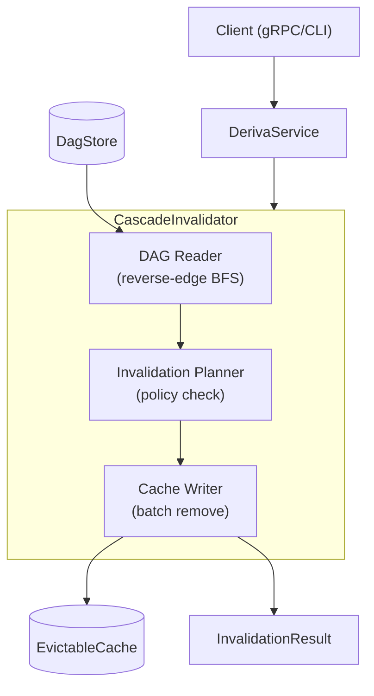
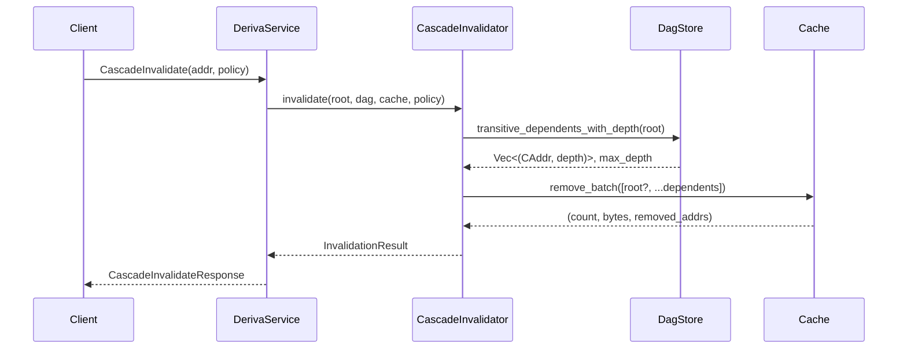

# Design Document: Cascade Invalidation

## Overview

Cascade Invalidation adds transitive cache eviction to the Deriva system. When a leaf or recipe is invalidated, the `CascadeInvalidator` engine automatically discovers all downstream dependents via reverse-edge BFS traversal on the DAG and evicts them from the cache in a single batch operation. This eliminates the "silent stale data" problem where only the root is removed but dependents remain cached with stale data.

The design introduces three invalidation policies (None, Immediate, DryRun), a depth-tracking BFS for observability, batch cache removal for efficiency, and careful lock ordering to maintain deadlock freedom with the existing `get()` path. The feature is exposed via a new `CascadeInvalidate` gRPC RPC, an enhanced backward-compatible `Invalidate` RPC, and CLI flags.

### Key Design Decisions

1. **Stateless invalidator**: `CascadeInvalidator` holds no state — it accepts DAG and cache references and returns a result. This simplifies testing and avoids lifetime complexity.
2. **Snapshot-based async path**: The async variant releases the DAG lock before acquiring the cache lock, tolerating harmless over/under-eviction from concurrent DAG mutations.
3. **No deferred policy**: Deferred batching adds complexity with minimal single-node benefit. Deferred becomes relevant in Phase 3 (distributed invalidation).
4. **Batch remove**: A dedicated `remove_batch` on the cache avoids per-entry lock overhead and returns aggregate statistics in one pass.

## Architecture



### Component Interaction Sequence



### Data Flow — Diamond DAG Example

```
Initial state (all cached):

  Leaf A ──┐
           ├──▶ Recipe X ──┐
  Leaf B ──┘               ├──▶ Recipe Z
           ┌──▶ Recipe Y ──┘
  Leaf C ──┘

Cache: { A: ✓, B: ✓, C: ✓, X: ✓, Y: ✓, Z: ✓ }

cascade_invalidate(A, Immediate, include_root=true):
  BFS from A: X(d=1), Y(d=1), Z(d=2)
  Eviction list: [A, X, Y, Z]
  Result: evicted=4, traversed=3, max_depth=2

After cascade:
  Cache: { B: ✓, C: ✓ }
```

## Components and Interfaces

### CascadeInvalidator (stateless engine)

```rust
pub struct CascadeInvalidator;

impl CascadeInvalidator {
    /// Synchronous cascade invalidation.
    pub fn invalidate(
        root: &CAddr,
        dag: &DagStore,
        cache: &mut EvictableCache,
        policy: CascadePolicy,
        include_root: bool,
        detail_addrs: bool,
    ) -> InvalidationResult;
}

/// Async cascade invalidation for SharedCache path.
pub async fn invalidate_cascade_async(
    root: &CAddr,
    dag: &RwLock<DagStore>,
    cache: &SharedCache,
    policy: CascadePolicy,
    include_root: bool,
    detail_addrs: bool,
) -> InvalidationResult;
```

### DagStore (extended)

```rust
impl DagStore {
    /// BFS over reverse edges with depth tracking.
    /// Returns (dependents_with_depth, max_depth).
    pub fn transitive_dependents_with_depth(
        &self,
        addr: &CAddr,
    ) -> (Vec<(CAddr, u32)>, u32);
}
```

### EvictableCache (extended)

```rust
impl EvictableCache {
    /// Remove multiple entries in a single pass.
    /// Returns (count_removed, bytes_reclaimed, removed_addrs).
    pub fn remove_batch(&mut self, addrs: &[CAddr]) -> (u64, u64, Vec<CAddr>);

    /// Check presence without modifying access stats.
    pub fn contains(&self, addr: &CAddr) -> bool;
}
```

### SharedCache (extended)

```rust
impl SharedCache {
    pub async fn remove_batch(&self, addrs: &[CAddr]) -> u64;
    pub async fn contains(&self, addr: &CAddr) -> bool;
    pub async fn remove(&self, addr: &CAddr) -> bool;
}
```

### gRPC Service (extended)

```rust
impl Deriva for DerivaService {
    async fn cascade_invalidate(
        &self,
        request: Request<CascadeInvalidateRequest>,
    ) -> Result<Response<CascadeInvalidateResponse>, Status>;

    // Enhanced existing RPC with optional cascade field
    async fn invalidate(
        &self,
        request: Request<InvalidateRequest>,
    ) -> Result<Response<InvalidateResponse>, Status>;
}
```

## Data Models

### CascadePolicy

```rust
#[derive(Debug, Clone, Copy, PartialEq, Eq)]
pub enum CascadePolicy {
    /// Only invalidate the exact addr (Phase 1 backward-compatible).
    None,
    /// Traverse all transitive dependents and evict immediately.
    Immediate,
    /// Traverse but don't evict — report what would be evicted.
    DryRun,
}

impl Default for CascadePolicy {
    fn default() -> Self { CascadePolicy::Immediate }
}
```

### InvalidationResult

```rust
#[derive(Debug, Clone)]
pub struct InvalidationResult {
    pub root: CAddr,
    pub evicted_count: u64,
    pub traversed_count: u64,
    pub max_depth: u32,
    pub bytes_reclaimed: u64,
    pub evicted_addrs: Vec<CAddr>,
    pub duration: Duration,
}

impl InvalidationResult {
    pub fn empty(root: CAddr) -> Self {
        Self {
            root,
            evicted_count: 0,
            traversed_count: 0,
            max_depth: 0,
            bytes_reclaimed: 0,
            evicted_addrs: Vec::new(),
            duration: Duration::ZERO,
        }
    }
}
```

### gRPC Protocol

```protobuf
message CascadeInvalidateRequest {
    bytes addr = 1;
    string policy = 2;         // "none" | "immediate" | "dry_run"
    bool include_root = 3;
    bool detail_addrs = 4;
}

message CascadeInvalidateResponse {
    uint64 evicted_count = 1;
    uint64 traversed_count = 2;
    uint32 max_depth = 3;
    uint64 bytes_reclaimed = 4;
    repeated bytes evicted_addrs = 5;
    uint64 duration_micros = 6;
}

// Enhanced existing messages:
message InvalidateRequest {
    bytes addr = 1;
    bool cascade = 2;          // NEW: triggers cascade when true
}

message InvalidateResponse {
    bool was_cached = 1;
    uint64 evicted_count = 2;  // NEW: total evicted count
}
```

### Depth-Tracking BFS Design

The BFS uses a `VecDeque<(CAddr, u32)>` queue where each element carries its depth. The algorithm:

```
fn transitive_dependents_with_depth(root):
    visited = HashSet::new()
    queue = VecDeque::new()
    result = Vec::new()
    max_depth = 0

    for dep in direct_dependents(root):
        if visited.insert(dep):
            queue.push_back((dep, 1))

    while (current, depth) = queue.pop_front():
        max_depth = max(max_depth, depth)
        result.push((current, depth))
        for dep in direct_dependents(current):
            if visited.insert(dep):
                queue.push_back((dep, depth + 1))

    return (result, max_depth)
```

**Complexity**: O(V + E) where V = number of transitive dependents, E = number of reverse edges traversed. Each node is visited exactly once (guaranteed by `visited` set). Each edge is traversed exactly once.

**Diamond handling**: The `visited` set ensures that a node reachable via multiple paths (e.g., Z depends on both X and Y which both depend on A) is only included once. The depth recorded is the depth at which the node was *first discovered* (i.e., the shortest BFS distance from root).

### Batch Eviction Strategy

`remove_batch` iterates the address list once, removing each present entry from the HashMap and accumulating statistics:

```rust
pub fn remove_batch(&mut self, addrs: &[CAddr]) -> (u64, u64, Vec<CAddr>) {
    let mut count = 0u64;
    let mut bytes = 0u64;
    let mut removed = Vec::new();

    for addr in addrs {
        if let Some(entry) = self.entries.remove(addr) {
            let size = entry.data.len() as u64;
            self.current_size -= size;
            bytes += size;
            count += 1;
            removed.push(*addr);
        }
    }

    (count, bytes, removed)
}
```

**Why batch?** A single `remove_batch` call avoids repeated method call overhead and allows `current_size` to be decremented incrementally without recomputation. The caller receives aggregate statistics without needing to accumulate them externally.

### Lock Ordering Analysis and Deadlock-Freedom

**Lock resources:**
- `dag` — `RwLock<DagStore>` (read lock for traversal)
- `cache` — `RwLock<EvictableCache>` (write lock for eviction)

**Lock ordering (consistent across all paths):**

| Operation | Lock 1 | Lock 2 |
|-----------|--------|--------|
| `get()` | dag.read() | cache.write() |
| `cascade_invalidate()` (sync) | dag.read() | cache.write() |
| `cascade_invalidate()` (async) | dag.read() → release | cache.write() |

**Deadlock-freedom proof (sync path):**
Both `get()` and `cascade_invalidate()` acquire `dag.read()` first, then `cache.write()`. Since `dag.read()` is a shared lock, multiple concurrent operations can hold it simultaneously. The only exclusive lock is `cache.write()`, which is requested strictly after `dag.read()` in all paths. Since there is no circular dependency in lock acquisition order, deadlock is impossible.

**Deadlock-freedom proof (async path):**
The async variant is even stronger — it *releases* the DAG lock before acquiring the cache lock. This means:
1. No lock is held while waiting for another lock
2. The DAG lock and cache lock are never held simultaneously
3. This eliminates any possibility of lock ordering conflicts

**Trade-off of async path:** Between releasing the DAG lock and acquiring the cache lock, the DAG may be modified. This can cause:
- **Harmless over-eviction**: An entry that is no longer a dependent gets evicted. It will be correctly recomputed on next access.
- **Acceptable under-eviction**: A newly-added dependent is missed. The new dependent was added after traversal started, so it's not stale with respect to the pre-mutation root data.

### Sync vs Async Variants

| Aspect | Synchronous | Async |
|--------|-------------|-------|
| Lock type | `std::sync::RwLock` | `tokio::sync::RwLock` |
| Cache type | `EvictableCache` (direct `&mut`) | `SharedCache` (async wrapper) |
| Lock holding | DAG + cache held together | DAG released before cache acquired |
| Use case | In-process single-threaded tests | Production async server |
| Atomicity | Snapshot is exact during eviction | Snapshot may be stale |
| bytes_reclaimed | Exact (has entry sizes) | 0 (SharedCache doesn't track sizes yet) |

### gRPC Protocol Design

**New RPC: `CascadeInvalidate`** — Full-featured cascade with policy control and detailed results. Used by clients that need DryRun preview, detail_addrs, or explicit policy selection.

**Enhanced RPC: `Invalidate`** — Backward-compatible. The new `cascade` bool field defaults to `false` (protobuf default), so older clients send requests without it and get Phase 1 behavior. Newer clients can set `cascade=true` for simple cascade without needing the full `CascadeInvalidate` request.

**Policy string parsing:**
```
"none"              → CascadePolicy::None
"immediate"         → CascadePolicy::Immediate
"dry_run" | "dryrun" → CascadePolicy::DryRun
"" | <unrecognized> → CascadePolicy::Immediate (safe default)
```

### CLI Interface

```
deriva invalidate <addr>                     # Phase 1 single-entry removal
deriva invalidate <addr> --cascade           # Cascade with Immediate policy
deriva invalidate <addr> --cascade --dry-run # Preview what would be evicted
deriva invalidate <addr> --cascade --detail  # Show evicted addresses
```

Output format for cascade/dry-run:
```
Cascade invalidation:
  Evicted:   4 entries
  Traversed: 3 dependents
  Max depth: 2
  Reclaimed: 1024 bytes
  Duration:  42μs
```

### Metrics Integration

- **CASCADE_DEPTH histogram**: Records `max_depth` after Immediate and DryRun operations. Not recorded for Policy::None (no traversal occurs).
- Histogram buckets: designed for typical DAG depths (1, 2, 5, 10, 20, 50, 100+).
- Labels: none needed (single histogram captures all cascade operations).

## Correctness Properties

*A property is a characteristic or behavior that should hold true across all valid executions of a system — essentially, a formal statement about what the system should do. Properties serve as the bridge between human-readable specifications and machine-verifiable correctness guarantees.*

### Property 1: Policy::None performs no traversal

*For any* DAG structure and any cache state, when CascadeInvalidator is invoked with CascadePolicy::None and include_root=true, the result SHALL have traversed_count == 0, max_depth == 0, and only the root address (if cached) SHALL be evicted from the cache.

**Validates: Requirements 1.2, 4.7**

### Property 2: DryRun is a non-mutating preview of Immediate

*For any* DAG structure and any cache state, invoking CascadeInvalidator with CascadePolicy::DryRun SHALL report the same evicted_count and traversed_count as CascadePolicy::Immediate would for the same inputs, AND the cache SHALL remain completely unchanged after a DryRun invocation.

**Validates: Requirements 1.3, 1.4**

### Property 3: BFS traversal correctness

*For any* DAG and any root address, transitive_dependents_with_depth SHALL return a result where: (a) every returned address is reachable from root via reverse edges, (b) no address appears more than once, (c) the root address itself never appears in the result, and (d) max_depth equals the maximum of all individual depth values (or 0 if empty).

**Validates: Requirements 2.1, 2.2, 2.3, 2.4, 2.5**

### Property 4: Batch remove accuracy

*For any* cache state and any list of addresses, remove_batch SHALL remove exactly the addresses that are in the intersection of the list and the cache's keyset, returning a count_removed equal to the size of that intersection and removed_addrs containing exactly those addresses.

**Validates: Requirements 3.1, 3.2, 3.4**

### Property 5: Cache size invariant after batch remove

*For any* cache state with known current_size, after calling remove_batch, the new current_size SHALL equal the old current_size minus bytes_reclaimed, and bytes_reclaimed SHALL equal the sum of the byte sizes of all entries that were actually removed.

**Validates: Requirements 3.3**

### Property 6: include_root flag controls root eviction

*For any* DAG and cache where the root is cached, when include_root=true the root SHALL be absent from cache after Immediate invalidation, and when include_root=false the root SHALL remain in cache after Immediate invalidation.

**Validates: Requirements 4.2, 4.3**

### Property 7: detail_addrs flag controls evicted_addrs population

*For any* invalidation invocation, when detail_addrs=true the evicted_addrs in the result SHALL contain exactly the set of addresses that were removed from cache, and when detail_addrs=false the evicted_addrs SHALL be empty.

**Validates: Requirements 4.4, 4.5**

### Property 8: Async/sync equivalence

*For any* DAG structure and cache state (without concurrent mutations), the async variant invalidate_cascade_async SHALL produce an InvalidationResult with the same evicted_count, traversed_count, and max_depth as the synchronous CascadeInvalidator::invalidate for identical inputs.

**Validates: Requirements 5.2**

### Property 9: Policy string parsing round-trip

*For any* string in {"none", "immediate", "dry_run", "dryrun"}, parse_cascade_policy SHALL return the corresponding CascadePolicy variant. *For any* string not in that set, parse_cascade_policy SHALL return CascadePolicy::Immediate.

**Validates: Requirements 7.3, 7.4, 7.5, 7.6**

### Property 10: Contains accuracy without LRU side effects

*For any* SharedCache state and any address, contains(addr) SHALL return true if and only if the address is present in the cache, AND calling contains SHALL not change the eviction order of any entry in the cache.

**Validates: Requirements 12.1, 12.2**

## Error Handling

| Error Condition | Handling | gRPC Status |
|----------------|----------|-------------|
| Invalid CAddr in request (unparseable bytes) | Return error immediately, no operation performed | `InvalidArgument` |
| DAG lock poisoned (`PoisonError`) | Return internal error | `Internal` |
| Cache lock poisoned (`PoisonError`) | Return internal error | `Internal` |
| Root address not in DAG | Traversal returns empty dependents; operation proceeds normally (evicts root if cached and include_root=true) | OK (not an error) |
| Root address not in cache | `evicted_count` may be 0; operation still traverses dependents | OK (not an error) |
| Empty eviction list (no dependents, include_root=false) | Returns `InvalidationResult` with all counts zero | OK (not an error) |

### Error Recovery

- Lock poisoning is unrecoverable at the operation level — the server should log and return Internal status. System-level recovery (restart) may be needed.
- No partial state corruption is possible: `remove_batch` either fully succeeds or fails atomically per entry (HashMap::remove is infallible for present keys).
- The async path's snapshot staleness is not an error — it's documented expected behavior.

## Testing Strategy

### Unit Tests

- **DagStore::transitive_dependents_with_depth**: Linear chains, diamonds, wide fan-out, deep chains, disconnected nodes, empty DAG.
- **EvictableCache::remove_batch**: All present, partial present, none present, empty list, size tracking.
- **CascadeInvalidator::invalidate**: All three policies × include_root × detail_addrs combinations. Diamond DAG, deep chain, no dependents, partial cache population.
- **parse_cascade_policy**: All valid strings, empty string, unrecognized strings.
- **InvalidationResult::empty()**: Verify all fields zero.

### Property-Based Tests (using `proptest` crate)

Each property maps to a single property-based test running minimum 100 iterations:

| Property | Generator Strategy |
|----------|-------------------|
| P1: None no-traversal | Random DAGs (1–50 nodes, 0–100 edges) + random cache subsets |
| P2: DryRun == Immediate | Same DAG/cache generators; run both policies, compare results |
| P3: BFS correctness | Random DAGs; verify reachability, uniqueness, root exclusion |
| P4: Batch remove accuracy | Random cache (1–100 entries) + random addr lists |
| P5: Cache size invariant | Random cache + random removals; check size arithmetic |
| P6: include_root flag | Random DAGs with root cached; test both true/false |
| P7: detail_addrs flag | Random DAGs; run with true/false, check evicted_addrs |
| P8: Async/sync equivalence | Random DAGs/caches; run both, compare fields |
| P9: Policy parsing | Arbitrary strings; verify correct variant returned |
| P10: Contains accuracy | Random caches + random queries; verify correctness |

**Configuration:**
- Minimum 100 iterations per property test (proptest default is 256)
- Tag format: `// Feature: cascade-invalidation, Property N: <description>`
- Generator for DAGs: random number of nodes, random edges respecting DAG acyclicity

### Integration Tests

- End-to-end gRPC `CascadeInvalidate` RPC with a running server
- Backward-compatible `Invalidate` RPC with and without `cascade=true`
- CLI integration tests verifying output format
- Concurrent `get()` + `cascade_invalidate()` stress tests (deadlock freedom)
- Concurrent `contains()` calls (read lock sharing)
- Metrics recording verification (CASCADE_DEPTH histogram observed after operations)
