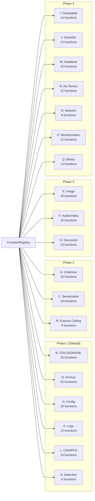

# Design Document: Format-Aware Function Library

## Overview

Phase 2.16 adds a format-aware function library providing 283 functions (IDs 201–483) across 19 format categories. Unlike the core libraries (§2.14/§2.15) which operate on raw bytes, these functions understand file format structure — enabling Parquet column projection, CSV row filtering, image resizing, erasure coding, config merging, PDF text extraction, and more.

All functions implement the same `ComputeFunction` and/or `StreamingComputeFunction` traits, are registered in the same `FunctionRegistry`, and accept parameters via `BTreeMap<String, Value>`. Heavy dependencies are gated behind Cargo feature flags organized into a 4-phase rollout.

### Key Design Decisions

1. **Same traits, same registry**: No new abstractions. Format functions are indistinguishable from core functions in the pipeline infrastructure.
2. **Feature-flag isolation**: Per-category Cargo features keep the default build lean. Phase 1 (lightweight formats) is the only default.
3. **Mode matches format**: Random-access formats (Parquet, ZIP, PDF) → batch-only. Sequential formats (CSV, NDJSON, tar) → both modes. Pure stream codecs → streaming-only.
4. **4-phase rollout**: Phase 1 (5–7 days, lightweight), Phase 2 (7–10 days, columnar/serialization/erasure), Phase 3 (5–8 days, media/documents), Phase 4 (5–8 days, domain-specific).
5. **IDs 201–483**: Non-overlapping with core library (1–100) and reserved range (101–200).

## Architecture

### Category Distribution



### Mode Distribution

| Mode | Count | % | Formats |
|------|-------|---|---------|
| Batch only | 148 | 52% | Parquet, ORC, ZIP, PDF, SQLite, image resize, schema validation |
| Both (batch + streaming) | 107 | 38% | CSV, NDJSON, Avro, tar, CBOR, log lines, FASTA |
| Streaming only | 28 | 10% | gzip frames, bzip2 blocks, line filters, stream codecs |

### File Organization

```
crates/deriva-compute/src/
├── builtins_format_columnar.rs    # Category A (18 fns)
├── builtins_format_csv.rs         # Category B (25 fns)
├── builtins_format_serial.rs      # Category C (19 fns)
├── builtins_format_archive.rs     # Category D (20 fns)
├── builtins_format_image.rs       # Category E (18 fns)
├── builtins_format_media.rs       # Category F (16 fns)
├── builtins_format_document.rs    # Category G (23 fns)
├── builtins_format_config.rs      # Category H (16 fns)
├── builtins_format_geo.rs         # Category I (14 fns)
├── builtins_format_scientific.rs  # Category J (13 fns)
├── builtins_format_log.rs         # Category K (13 fns)
├── builtins_format_cas.rs         # Category L (15 fns)
├── builtins_format_database.rs    # Category M (10 fns)
├── builtins_format_ml.rs          # Category N (12 fns)
├── builtins_format_network.rs     # Category O (8 fns)
├── builtins_format_bio.rs         # Category P (12 fns)
├── builtins_format_binary.rs      # Category Q (13 fns)
├── builtins_format_erasure.rs     # Category R (9 fns)
└── builtins_format_detect.rs      # Category S (9 fns)
```

## Components and Interfaces

### Registration Pattern

Each category exports a conditional registration function:

```rust
#[cfg(feature = "format-csv")]
pub fn register_csv_functions(registry: &mut FunctionRegistry) {
    registry.register("csv_parse", "1.0.0", Arc::new(CsvParseFn));
    registry.register("csv_filter", "1.0.0", Arc::new(CsvFilterFn));
    registry.register_streaming("csv_filter", "1.0.0", Arc::new(StreamingCsvFilterFn));
    // ... 23 more
}
```

### Feature Flag Structure

```toml
[features]
default = ["format-phase1"]
format-phase1 = ["format-csv", "format-archive", "format-config", "format-log", "format-cas", "format-detect"]
format-phase2 = ["format-columnar", "format-serialization", "format-erasure"]
format-phase3 = ["format-image", "format-media", "format-document"]
format-phase4 = ["format-geo", "format-scientific", "format-database", "format-ml", "format-network", "format-bio", "format-binary"]
format-all = ["format-phase1", "format-phase2", "format-phase3", "format-phase4"]
```

### FunctionId Naming Convention

All format-aware functions use `category_operation@version`:
- `csv_filter@1.0.0`, `parquet_read@1.0.0`, `cid_compute@1.0.0`
- `image_resize@1.0.0`, `erasure_encode@1.0.0`, `pdf_extract_text@1.0.0`

### ID Range Allocation

| Range | Category | Phase |
|-------|----------|-------|
| 201–218 | A: Columnar (Parquet, ORC, Arrow) | 2 |
| 219–243 | B: Row-oriented (CSV, JSON, XML) | 1 |
| 244–262 | C: Serialization (Avro, Protobuf, CBOR) | 2 |
| 263–282 | D: Archive (tar, zip, gzip) | 1 |
| 283–300 | E: Image (PNG, JPEG, SVG) | 3 |
| 301–316 | F: Audio/Video (MP3, WAV, MP4) | 3 |
| 317–339 | G: Document (PDF, DOCX, HTML, Markdown) | 3 |
| 340–355 | H: Config (YAML, TOML, INI, HCL) | 1 |
| 356–369 | I: Geospatial (GeoJSON, Shapefile) | 4 |
| 370–382 | J: Scientific (HDF5, NetCDF, NumPy) | 4 |
| 383–395 | K: Log/Observability (syslog, CEF, JSON logs) | 1 |
| 396–410 | L: CAS/IPFS (CID, CAR, UnixFS, DAG-CBOR) | 1 |
| 411–420 | M: Database (SQLite, SST) | 4 |
| 421–432 | N: ML/Tensor (SafeTensors, TFRecord) | 4 |
| 433–440 | O: Network (PCAP, DNS, email) | 4 |
| 441–452 | P: Bioinformatics (FASTA, BAM, VCF) | 4 |
| 453–465 | Q: Specialized binary (WOFF, glTF, WASM) | 4 |
| 466–474 | R: Erasure coding (Reed-Solomon) | 2 |
| 475–483 | S: Detection/Classification | 1 |

## Data Models

### Phase 1 Function Summary (98 functions)

**Category B — CSV/JSON/XML (25 functions):**
- CSV: parse, write, schema infer, column select/rename, filter, sort, aggregate, join, dedup
- NDJSON: parse, write, filter, project
- JSON: path extract, merge, flatten/unflatten
- XML: parse, write, XPath extract, XSLT transform, validate DTD/XSD

**Category D — Archive (20 functions):**
- tar: create, extract, list entries, extract single entry, append
- zip: create, extract, list entries, extract single entry, add file
- gzip/bzip2/xz: format-aware compress/decompress (with headers/magic)
- 7z: list, extract (read-only)

**Category H — Config (16 functions):**
- YAML: parse, write, merge, path extract, validate
- TOML: parse, write, merge, path extract
- INI: parse, write, merge
- HCL: parse, validate
- Cross-format conversion: YAML↔JSON, TOML↔JSON, INI↔JSON

**Category K — Logs (13 functions):**
- syslog: parse, filter by severity/facility
- JSON log: parse, filter by field, extract timestamps
- CEF: parse, validate
- Generic: line grep, timestamp normalize, field extract (regex)

**Category L — CAS/IPFS (15 functions):**
- CID: compute (v0/v1), verify, extract codec/hash
- DAG-CBOR: encode, decode, patch
- CAR: create, extract, list roots, verify
- UnixFS: chunk (fixed/rabin), assemble
- Merkle proof: generate, verify

**Category S — Detection (9 functions):**
- Format detection: magic bytes, MIME inference, encoding detection
- Classification: is_text, is_binary, is_compressed, is_encrypted
- Content profiling: byte histogram, entropy, structure heuristic

### Phase 2 Function Summary (46 functions)

**Category A — Columnar (18 functions):**
- Parquet: read, write, metadata, column projection, row filter, merge, statistics, partition write
- Arrow IPC: read, write, schema extract
- ORC: read, write, metadata, filter
- Cross-format: Parquet↔Arrow, Columnar→Row (NDJSON)

**Category C — Serialization (19 functions):**
- Avro: read, write, schema extract, schema evolve, Avro↔JSON, Avro↔Parquet
- Protobuf: decode, encode, schema extract
- Thrift: decode, encode
- MessagePack: decode, encode
- CBOR: decode, encode
- BSON: decode, encode

**Category R — Erasure Coding (9 functions):**
- Reed-Solomon: encode (data→shards), decode (reconstruct), verify
- Configuration: compute optimal shard count, validate parameters
- Utilities: shard_size, parity_count, missing_shards

### Dependency Map

| Phase | New Dependencies | Approx Size |
|-------|-----------------|-------------|
| 1 | `csv`, `quick-xml`, `jsonpath-rust`, `tar`, `zip`, `cid`, `multihash`, `infer`, `configparser` | ~800 KB |
| 2 | `parquet`, `arrow`, `apache-avro`, `prost`, `rmp-serde`, `ciborium`, `bson`, `reed-solomon-erasure` | ~3 MB |
| 3 | `image`, `lopdf`, `calamine`, `symphonia`, `scraper`, `pulldown-cmark` | ~2 MB |
| 4 | `geojson`, `hdf5`, `rusqlite`, `safetensors`, `noodles`, `wasmparser`, `pcap-parser` | ~2.5 MB |

## Correctness Properties

### Property 1: Trait compliance

*For any* format-aware function, calling `execute()` or `stream_execute()` with valid inputs and parameters SHALL produce a valid `Result<Bytes>` or `Receiver<StreamChunk>` following the same contracts as core library functions.

**Validates: Requirements 1.1, 1.2, 1.3**

### Property 2: Feature isolation

*For any* feature flag configuration, only functions whose corresponding feature is enabled SHALL be present in the FunctionRegistry. Disabled features SHALL not contribute compiled code or registry entries.

**Validates: Requirements 2.6, 2.7**

### Property 3: Format round-trip

*For any* format with paired encode/decode functions (CSV parse/write, Avro read/write, CBOR encode/decode, tar create/extract), encoding then decoding SHALL produce data semantically equivalent to the original input.

**Validates: Requirements 4.1, 5.1, 5.2**

### Property 4: Predicate pushdown correctness

*For any* Parquet file and filter predicate, the result of `parquet_filter` SHALL contain exactly the rows that satisfy the predicate — no false positives (incorrect rows included) and no false negatives (correct rows excluded).

**Validates: Requirements 5.4**

### Property 5: Column projection subset

*For any* columnar file and column projection list, the result of projection SHALL contain exactly and only the requested columns with their data intact.

**Validates: Requirements 5.1**

### Property 6: Erasure coding round-trip

*For any* byte sequence and valid (data_shards, parity_shards) configuration, encoding then decoding (with up to parity_shards missing) SHALL reconstruct the original data exactly.

**Validates: Requirements 5.3**

### Property 7: Mode selection compatibility

*For any* format-aware function registered in both batch and streaming modes, the batch and streaming executions SHALL produce semantically equivalent output for the same input.

**Validates: Requirements 3.4**

### Property 8: ID uniqueness

*For any* two format-aware functions, their Function_IDs SHALL be distinct. No ID in range 201–483 SHALL conflict with another, and no format-aware ID SHALL overlap with core library IDs (1–100).

**Validates: Requirements 1.4**

### Property 9: Detection accuracy

*For any* file with a standard magic byte signature (PNG, JPEG, PDF, ZIP, etc.), the format detection function SHALL correctly identify the MIME type.

**Validates: Requirements 4.7**

### Property 10: Error on invalid format

*For any* format-specific function receiving bytes that do not conform to the expected format, the function SHALL return `ComputeError::ExecutionFailed` with a descriptive parse error rather than panicking or producing incorrect output.

**Validates: Requirements 1.1**

## Error Handling

| Category | Error Condition | Message Format |
|----------|----------------|----------------|
| Columnar | Invalid Parquet footer | `"parquet: invalid footer magic"` |
| Columnar | Non-existent column in projection | `"parquet: column '{name}' not found"` |
| CSV | Invalid CSV (unclosed quote) | `"csv: unclosed quote at row {n}"` |
| JSON | Invalid JSONPath expression | `"jsonpath: parse error at position {n}"` |
| Archive | Corrupt tar header | `"tar: invalid header at offset {n}"` |
| Archive | ZIP with unsupported compression | `"zip: unsupported method {id}"` |
| Serialization | Avro schema mismatch | `"avro: schema resolution failed: {detail}"` |
| Serialization | Invalid Protobuf descriptor | `"protobuf: descriptor parse error"` |
| Erasure | Too many missing shards | `"erasure: {missing} shards missing, max recoverable is {parity}"` |
| Image | Unsupported image format | `"image: unsupported format"` |
| Detection | Unrecognized format | Returns `"application/octet-stream"` (not an error) |
| General | Missing required parameter | `"{function}: missing param '{key}'"` |
| General | Feature not enabled | `FunctionNotFound` (function not in registry) |

## Testing Strategy

### Property-Based Tests (proptest, 100+ iterations)

| Property | Generator | Validation |
|----------|-----------|------------|
| P3: Format round-trip | Random CSV/JSON/Avro/CBOR data | encode → decode == original |
| P4: Filter correctness | Random Parquet + random predicates | Filtered rows satisfy predicate |
| P5: Projection subset | Random columns from schema | Output contains only requested columns |
| P6: Erasure round-trip | Random bytes + random shard configs | Encode → drop M shards → decode == original |
| P7: Mode equivalence | Random inputs below/above threshold | Batch output == streaming collected output |
| P8: ID uniqueness | All registered IDs | No duplicates in 201–483 range |

### Unit Tests (per function)

Each of the 283 functions has at minimum:
- 1 correctness test (known input → expected output)
- 1 invalid-input test (corrupt/wrong format → descriptive error)
- 1 parameter validation test (missing/invalid params → InvalidParam)

Total: ~850 unit tests minimum.

### Integration Tests

- Phase 1 pipeline: CSV parse → filter → JSON convert → cache
- Phase 2 pipeline: Parquet read → column project → Arrow → Avro write
- Erasure pipeline: data → encode (3+2) → drop 2 shards → decode → verify original
- Cross-format: JSON → YAML → TOML → JSON round-trip
- Feature isolation: disabled features produce FunctionNotFound
- Registry completeness: count registered functions per enabled phase

### Phase-Specific Acceptance

| Phase | Gate Criteria |
|-------|--------------|
| 1 | All 98 functions pass unit tests, CSV/JSON round-trip PBT, archive create/extract verified |
| 2 | Parquet projection/filter correct, Avro schema evolution verified, erasure M-shard-loss recovery |
| 3 | Image resize produces valid output, PDF text extraction matches reference, audio metadata correct |
| 4 | Domain-specific roundtrips pass, no panics on malformed domain-specific files |
