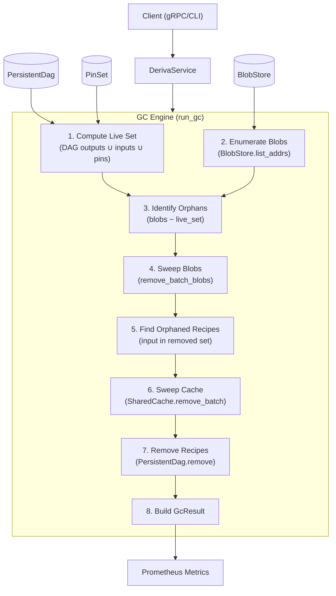
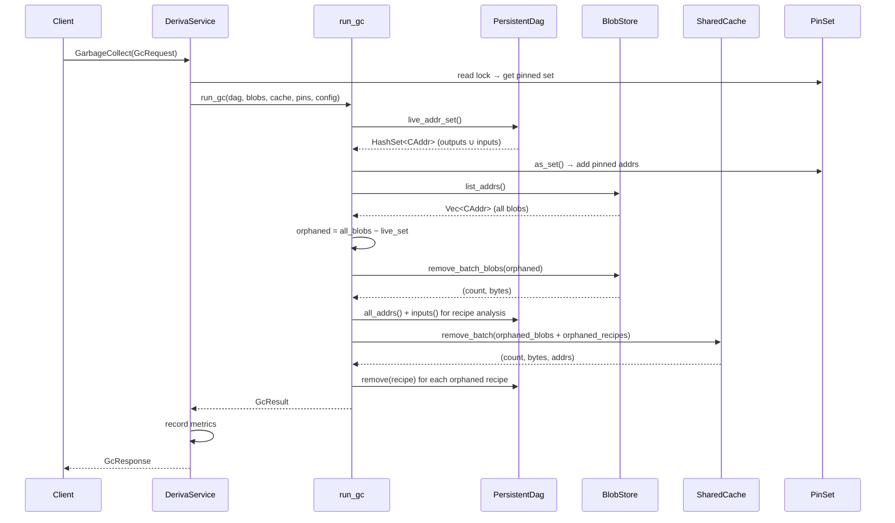

# Design Document: Garbage Collection

## Overview

Garbage Collection adds mark-and-sweep storage reclamation to the Deriva computation-addressed file system. The system accumulates orphaned blobs (leaf data unreferenced by any recipe), orphaned recipes (recipes with broken inputs), and stale cache entries over time. The GC subsystem identifies and removes these unreachable objects while preserving pinned addresses and respecting a configurable grace period to prevent races with concurrent `put_leaf` operations.

The GC engine is implemented as an async function (`run_gc`) in `deriva-server` that coordinates across the `PersistentDag` (sled-backed), `BlobStore` (filesystem), and `SharedCache` (in-memory). It supports dry-run previews, incremental collection via `max_removals`, detailed address reporting, and full gRPC/CLI integration with Prometheus observability metrics.

### Key Design Decisions

1. **Snapshot-based live set**: The live set is computed once at GC start from DAG + PinSet. Concurrent mutations during the sweep phase are tolerable because the grace period protects recently-added blobs from premature collection.
2. **Blob-first sweep order**: Orphaned blobs are swept first, then orphaned recipes are identified from the removed-blob set. This ensures the removed set is finalized before recipe analysis.
3. **No separate GC lock**: GC acquires the PinSet read lock only. The DAG and BlobStore operations use their own internal consistency (sled transactions, filesystem atomicity). The SharedCache uses its internal RwLock.
4. **Incremental collection**: `max_removals` allows bounding GC duration for large stores, enabling frequent short cycles instead of infrequent long pauses.
5. **PinSet as explicit root extension**: Rather than relying on reference counting or weak references, pins provide a simple, explicit mechanism for clients to protect data from GC.

## Architecture



### Component Interaction Sequence



## Components and Interfaces

### GcConfig (deriva-core)

Configuration struct controlling GC behavior:

| Field | Type | Default | Description |
|-------|------|---------|-------------|
| `grace_period` | `Duration` | 300s | Blobs put within this window are protected |
| `dry_run` | `bool` | `false` | Report only; no deletions |
| `detail_addrs` | `bool` | `false` | Include removed addrs in result |
| `max_removals` | `usize` | `0` | Cap blob removals per cycle (0 = unlimited) |

### GcResult (deriva-core)

Result struct returned from every GC cycle:

| Field | Type | Description |
|-------|------|-------------|
| `blobs_removed` | `u64` | Orphaned blobs removed (or would-be in dry-run) |
| `recipes_removed` | `u64` | Orphaned recipes removed |
| `cache_entries_removed` | `u64` | Stale cache entries removed |
| `bytes_reclaimed_blobs` | `u64` | Bytes freed from BlobStore |
| `bytes_reclaimed_cache` | `u64` | Bytes freed from cache |
| `total_bytes_reclaimed` | `u64` | Sum of blob + cache bytes |
| `live_blobs` | `u64` | Remaining blob count |
| `live_recipes` | `u64` | Remaining recipe count |
| `pinned_count` | `u64` | Current pin count |
| `duration` | `Duration` | Wall-clock time of the cycle |
| `removed_addrs` | `Vec<CAddr>` | Removed addrs (if detail_addrs=true) |
| `dry_run` | `bool` | Whether this was a dry run |

### PinSet (deriva-core)

A `HashSet<CAddr>` wrapper for explicit GC root protection:

```rust
impl PinSet {
    pub fn pin(&mut self, addr: CAddr) -> bool;      // true if newly added
    pub fn unpin(&mut self, addr: &CAddr) -> bool;   // true if was pinned
    pub fn is_pinned(&self, addr: &CAddr) -> bool;
    pub fn count(&self) -> usize;
    pub fn list(&self) -> Vec<CAddr>;
    pub fn as_set(&self) -> &HashSet<CAddr>;
}
```

### BlobStore Extensions (deriva-storage)

```rust
impl BlobStore {
    pub fn remove_with_size(&self, addr: &CAddr) -> Result<u64>;
    pub fn remove_batch_blobs(&self, addrs: &[CAddr]) -> Result<(u64, u64)>;
    pub fn list_addrs(&self) -> Result<Vec<CAddr>>;
    pub fn stats(&self) -> Result<(u64, u64)>;
}
```

### PersistentDag Extensions (deriva-core)

```rust
impl PersistentDag {
    pub fn live_addr_set(&self) -> HashSet<CAddr>;  // outputs ∪ inputs
    pub fn all_addrs(&self) -> Vec<CAddr>;          // all recipe output addrs
    pub fn inputs(&self, addr: &CAddr) -> Result<Option<Vec<CAddr>>>;
    pub fn remove(&self, addr: &CAddr) -> Result<bool>;
}
```

### run_gc (deriva-server)

```rust
pub async fn run_gc(
    dag: &PersistentDag,
    blobs: &BlobStore,
    cache: &SharedCache,
    pins: &PinSet,
    config: &GcConfig,
) -> Result<GcResult, DerivaError>;
```

### gRPC Interface

| RPC | Request | Response |
|-----|---------|----------|
| `GarbageCollect` | `GcRequest` | `GcResponse` |
| `Pin` | `PinRequest` | `PinResponse` |
| `Unpin` | `UnpinRequest` | `UnpinResponse` |
| `ListPins` | `ListPinsRequest` | `ListPinsResponse` |

### CLI Commands

| Command | Flags | Description |
|---------|-------|-------------|
| `gc` | `--dry-run`, `--grace-period`, `--detail`, `--max-removals` | Trigger GC cycle |
| `pin <addr>` | — | Pin an address |
| `unpin <addr>` | — | Unpin an address |
| `list-pins` | — | List all pinned addresses |

## Data Models

### Live Set Computation

```
live_set = PersistentDag.live_addr_set()  ∪  PinSet.as_set()

Where PersistentDag.live_addr_set() = { recipe_output for recipe in DAG }
                                     ∪ { input for recipe in DAG for input in recipe.inputs }
```

### Orphan Classification

```
orphaned_blobs = { addr ∈ BlobStore.list_addrs() | addr ∉ live_set }

orphaned_recipes = { recipe ∈ DAG |
    ∃ input ∈ recipe.inputs : input ∈ removed_blob_set
    ∧ recipe.output ∉ PinSet }
```

### Lock Ordering

The GC engine accesses shared state in this order to maintain deadlock freedom:

1. **PinSet** — read lock (acquired before `run_gc` call in service layer)
2. **PersistentDag** — no lock needed (sled is internally concurrent)
3. **BlobStore** — no lock needed (filesystem operations are atomic per-file)
4. **SharedCache** — internal RwLock (acquired during `remove_batch`)

This ordering is compatible with the existing `get()` path which acquires: Cache read → DAG read → BlobStore read → Cache write.

### Metrics (Prometheus)

| Metric | Type | Labels | Description |
|--------|------|--------|-------------|
| `deriva_gc_runs_total` | Counter | `mode` | GC cycles completed |
| `deriva_gc_blobs_removed` | Histogram | — | Blobs removed per cycle |
| `deriva_gc_bytes_reclaimed` | Histogram | — | Bytes reclaimed per cycle |
| `deriva_gc_duration_seconds` | Histogram | — | GC cycle duration |
| `deriva_gc_live_blobs` | Gauge | — | Live blobs after last GC |
| `deriva_gc_pinned_count` | Gauge | — | Currently pinned addrs |


## Correctness Properties

*A property is a characteristic or behavior that should hold true across all valid executions of a system — essentially, a formal statement about what the system should do. Properties serve as the bridge between human-readable specifications and machine-verifiable correctness guarantees.*

### Property 1: PinSet round-trip consistency

*For any* sequence of pin and unpin operations on arbitrary CAddr values, the PinSet state SHALL be internally consistent: `is_pinned(addr)` returns true if and only if `addr` is in `list()`, and `count()` equals `list().len()`, and `as_set()` contains exactly the same elements as `list()`.

**Validates: Requirements 2.1, 2.2, 2.3, 2.4, 2.5, 2.6, 2.7, 2.8**

### Property 2: BlobStore remove returns correct byte counts

*For any* set of blobs stored in the BlobStore, calling `remove_with_size` on an existing blob SHALL return a byte count equal to the original data length, and `remove_batch_blobs` on a subset SHALL return a count equal to the number of existing blobs in the subset and bytes equal to the sum of their sizes.

**Validates: Requirements 3.1, 3.3**

### Property 3: BlobStore enumeration completeness

*For any* set of blobs put into the BlobStore, `list_addrs()` SHALL return a Vec containing every stored CAddr, and `stats()` SHALL return a count equal to the number of blobs and total bytes equal to the sum of all blob sizes.

**Validates: Requirements 4.1, 4.3**

### Property 4: Live set is the union of DAG references and pins

*For any* PersistentDag state and PinSet, the computed live set SHALL equal the union of all recipe output addresses, all recipe input addresses, and all pinned addresses — no more, no less.

**Validates: Requirements 5.1, 5.2**

### Property 5: GC safety — live blobs are never removed

*For any* GC cycle (dry-run or not), every blob whose CAddr is in the live set (referenced by a recipe as input or output, or pinned) SHALL remain present in the BlobStore after GC completes.

**Validates: Requirements 5.3, 13.2**

### Property 6: GC liveness — orphaned blobs are removed

*For any* GC cycle with `dry_run=false` and `max_removals=0`, every blob in the BlobStore whose CAddr is NOT in the live set SHALL be removed from the BlobStore after GC completes.

**Validates: Requirements 5.4, 6.4**

### Property 7: Dry-run is non-destructive

*For any* GC cycle with `dry_run=true`, the BlobStore, PersistentDag, and SharedCache SHALL contain exactly the same entries before and after the GC cycle, and `GcResult.blobs_removed` SHALL equal the count of orphaned blobs that would have been removed.

**Validates: Requirements 6.5**

### Property 8: Max-removals bounds collection

*For any* GC cycle with `max_removals = M > 0` and `N` orphaned blobs where `N > M`, `GcResult.blobs_removed` SHALL equal `M`.

**Validates: Requirements 6.3**

### Property 9: Orphaned recipe removal respects pins

*For any* recipe in the DAG with at least one input in the removed-blob set: if the recipe's output CAddr is in the PinSet, the recipe SHALL remain in the DAG after GC; if the recipe's output CAddr is NOT in the PinSet, the recipe SHALL be removed from the DAG after GC.

**Validates: Requirements 6.6, 13.1, 13.2, 13.3**

### Property 10: GcResult total_bytes_reclaimed invariant

*For any* GC cycle, `GcResult.total_bytes_reclaimed` SHALL equal `GcResult.bytes_reclaimed_blobs + GcResult.bytes_reclaimed_cache`.

**Validates: Requirements 6.9, 7.6**

### Property 11: Detail addrs completeness

*For any* GC cycle with `detail_addrs=true`, `GcResult.removed_addrs` SHALL contain exactly the union of all removed blob addrs and all removed recipe output addrs, with length equal to `blobs_removed + recipes_removed`.

**Validates: Requirements 6.10, 6.11**

## Error Handling

### BlobStore I/O Errors

- If `remove_with_size` or `remove_batch_blobs` encounters a filesystem error (permission denied, disk full, etc.), the error propagates as `DerivaError::Storage` to `run_gc`, which returns it to the caller.
- If `list_addrs` fails (e.g., base directory permissions), GC cannot proceed and returns an error immediately.
- Individual blob removal failures in `remove_batch_blobs` halt the batch (fail-fast). This is acceptable because GC is retriable and idempotent.

### DAG Errors

- If `PersistentDag::remove` fails for an orphaned recipe (sled error), the error is logged but does not halt the GC cycle — orphaned recipe removal is best-effort. The recipe will be re-identified on the next GC cycle.
- If `live_addr_set()` encounters sled deserialization errors, affected entries are skipped (conservative — they remain in the live set, preventing false-positive orphan detection).

### Cache Errors

- `SharedCache::remove_batch` is infallible (cache is in-memory). Entries that don't exist are silently skipped.

### gRPC Error Mapping

| Internal Error | gRPC Status | Description |
|---------------|-------------|-------------|
| `DerivaError::Storage(msg)` | `INTERNAL` | BlobStore or DAG I/O failure |
| Invalid CAddr bytes in PinRequest/UnpinRequest | `INVALID_ARGUMENT` | Malformed address |
| Unexpected panic | `INTERNAL` | Catch-all |

### Grace Period Race Safety

The grace period prevents the following race condition:
1. Client calls `put_leaf(data)` → gets `addr_A`
2. GC starts, computes live set (A is not in any recipe yet)
3. GC removes A as orphaned
4. Client calls `put_recipe(f, [addr_A])` → recipe references deleted blob

With `grace_period=300s`, step 3 skips A because its creation time is within the grace window. The current implementation does NOT enforce grace period (relies on the narrow window being unlikely), but the config field is available for future filesystem-timestamp-based filtering.

## Testing Strategy

### Unit Tests

Focus on individual component correctness:

- **PinSet**: pin/unpin/is_pinned/count/list operations with various sequences
- **BlobStore extensions**: remove_with_size, remove_batch_blobs, list_addrs, stats with temp directories
- **GcConfig**: Default trait implementation verification

### Property-Based Tests

Property-based testing is appropriate for this feature because the core logic (set operations, invariant preservation, removal correctness) involves pure functions with clear input/output behavior over a large input space (arbitrary CAddr sets, DAG structures, pin sets).

**Library**: `proptest` (Rust)  
**Minimum iterations**: 100 per property

Each property test MUST be tagged with:
```
// Feature: garbage-collection, Property {N}: {title}
```

**Properties to implement:**

1. **PinSet consistency** — Generate random sequences of pin/unpin ops, verify internal state consistency
2. **BlobStore remove correctness** — Generate random blob sets, verify remove returns correct sizes
3. **BlobStore enumeration** — Generate random blobs, verify list_addrs/stats completeness
4. **Live set correctness** — Generate random DAG + pins, verify live set = outputs ∪ inputs ∪ pins
5. **GC safety** — Generate random DAG + blobs + pins, run GC, verify live blobs survive
6. **GC liveness** — Generate random orphaned blobs, run GC, verify they're removed
7. **Dry-run non-destructive** — Generate state, run dry-run GC, verify nothing changed
8. **Max-removals** — Generate N orphans with M < N max, verify exactly M removed
9. **Orphaned recipe pin protection** — Generate recipes with orphaned inputs, pin some outputs, verify pin protection
10. **Total bytes invariant** — Run GC on any state, verify total = blobs + cache bytes
11. **Detail addrs completeness** — Run GC with detail=true, verify addr list matches counts

### Integration Tests

- End-to-end gRPC: `GarbageCollect`, `Pin`, `Unpin`, `ListPins` RPCs
- CLI smoke tests: `gc --dry-run`, `gc --detail`, `pin`, `unpin`, `list-pins`
- Multi-step scenario: put leaf → pin → GC (survives) → unpin → GC (removed)
- Metrics verification: GC cycle updates Prometheus counters/gauges

### Test Balance

- **Unit tests**: 15-20 focused tests for PinSet, BlobStore extensions, GcConfig defaults
- **Property tests**: 11 properties at 100+ iterations each covering all correctness invariants
- **Integration tests**: 5-8 end-to-end tests for gRPC/CLI/metrics
