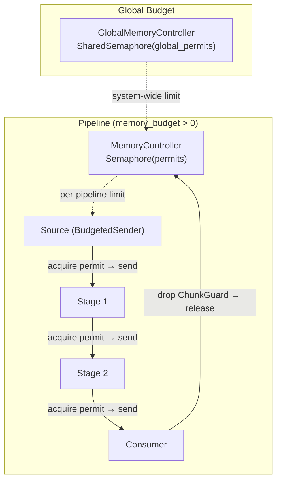
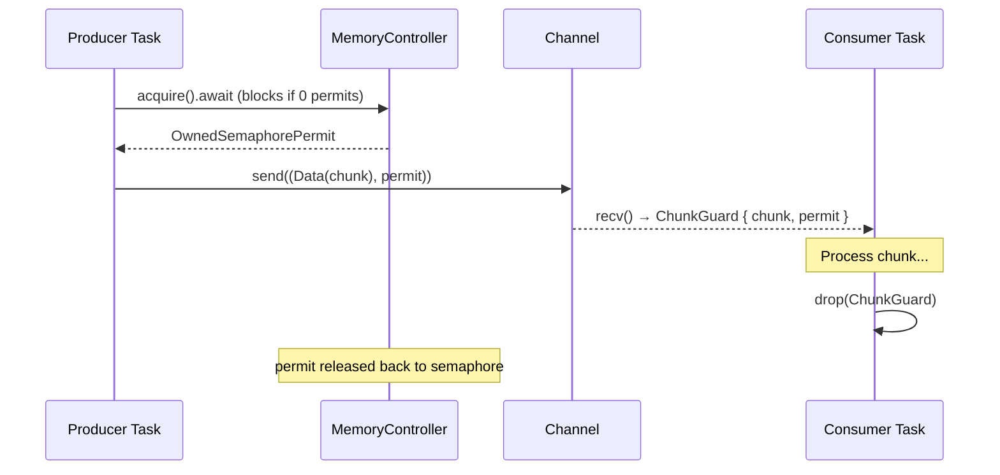

# Design Document: Memory Budget Enforcement

## Overview

Memory Budget Enforcement activates the `memory_budget` field in `PipelineConfig` (currently declared but unused) by introducing semaphore-based permit accounting for in-flight streaming data. A per-pipeline `MemoryController` wraps a `tokio::sync::Semaphore` that limits total in-flight chunks across all channels. Before sending each data chunk, a producer acquires a permit; when the consumer finishes processing, the permit is released via `ChunkGuard` drop. When the budget is exhausted, producers await permit release — applying backpressure that slows pipelines gracefully rather than failing them.

The feature also introduces a configurable global memory budget (default 256MB) to limit total in-flight bytes across all concurrent pipelines, and integrates with §2.10 adaptive chunk sizing to suppress chunk growth under memory pressure.

### Key Design Decisions

1. **Permit = one chunk**: Each permit represents `chunk_size` bytes. Permits = `budget / chunk_size`, minimum 1.
2. **Per-pipeline isolation**: Each pipeline gets its own `MemoryController` (no cross-pipeline interference). A separate global budget limits total system memory.
3. **Backpressure over failure**: Budget exhaustion causes producers to await (graceful degradation), never errors or rejections.
4. **Zero overhead when disabled**: `memory_budget = 0` means no `MemoryController`, no semaphore, no `BudgetedSender` — identical code path to pre-§2.12.
5. **Sentinel bypass**: `End` and `Error` chunks carry no data payload and are sent without acquiring permits.
6. **ChunkGuard drop semantics**: Permits are released when the consumer finishes processing (guard dropped), not when the chunk is dequeued — accurate accounting.
7. **Batch mode exempt**: BatchStage nodes don't use streaming channels and are excluded from permit calculations.

## Architecture



### Permit Lifecycle



### Two-Layer Backpressure

```
Layer 1 (existing): Per-channel bounded mpsc
  → Producer blocks when THIS channel has `capacity` chunks buffered
  → Scope: single producer ↔ single consumer

Layer 2 (new): Global pipeline budget via semaphore
  → Producer blocks when ALL channels combined hold max permits
  → Scope: all stages in the pipeline
  → Checked BEFORE channel send (producer never allocates what it can't send)
```

## Components and Interfaces

### MemoryController

```rust
#[derive(Clone)]
pub struct MemoryController {
    semaphore: Arc<Semaphore>,
    total_permits: usize,
}

impl MemoryController {
    pub fn new(budget: usize, chunk_size: usize) -> Self;
    pub async fn acquire(&self) -> OwnedSemaphorePermit;
    pub fn try_acquire(&self) -> Option<OwnedSemaphorePermit>;
    pub fn available(&self) -> usize;
    pub fn total_permits(&self) -> usize;
}
```

### BudgetedSender / BudgetedReceiver

```rust
pub struct BudgetedSender {
    tx: mpsc::Sender<(StreamChunk, Option<OwnedSemaphorePermit>)>,
    controller: MemoryController,
}

impl BudgetedSender {
    pub async fn send(&self, chunk: StreamChunk) -> Result<(), SendError>;
    // Data chunks: acquire permit first
    // End/Error: send without permit
}

pub struct BudgetedReceiver {
    rx: mpsc::Receiver<(StreamChunk, Option<OwnedSemaphorePermit>)>,
}

impl BudgetedReceiver {
    pub async fn recv(&mut self) -> Option<ChunkGuard>;
}

pub struct ChunkGuard {
    pub chunk: StreamChunk,
    _permit: Option<OwnedSemaphorePermit>,  // released on drop
}
```

### GlobalMemoryController

```rust
pub struct GlobalMemoryController {
    semaphore: Arc<Semaphore>,
    total_permits: usize,
}

impl GlobalMemoryController {
    pub fn new(global_budget: usize, chunk_size: usize) -> Self;
    pub async fn acquire(&self) -> OwnedSemaphorePermit;
    pub fn available(&self) -> usize;
}
```

Stored in `ServerState` as `Arc<Option<GlobalMemoryController>>`. When `global_memory_budget = 0`, it's `None`.

### PipelineConfig (extended)

```rust
pub struct PipelineConfig {
    pub chunk_size: usize,           // 64KB default
    pub channel_capacity: usize,     // 8 default
    pub cache_intermediates: bool,   // true default
    pub memory_budget: usize,        // 0 default (per-pipeline, RENAMED to per_pipeline_max)
    // §2.12 additions:
    pub per_pipeline_max: usize,     // 0 = unlimited per-pipeline
}
```

### StreamPipeline::execute (modified)

```rust
impl StreamPipeline {
    pub async fn execute(self, global: Option<&GlobalMemoryController>)
        -> Result<mpsc::Receiver<StreamChunk>, DerivaError>
    {
        // 1. Create per-pipeline MemoryController if per_pipeline_max > 0
        // 2. For Source/Cached: use BudgetedSender if controller exists
        // 3. For StreamingStage: bridge output through BudgetedSender
        // 4. For BatchStage: no budget enforcement (exempt)
        // 5. When budget=0: raw mpsc channels, zero overhead
    }
}
```

### Adaptive Chunking Integration

When a `MemoryController` is present, the `AdaptiveResizer` consults it:
- Available permits < 25% of total → suppress growth (hold current size)
- Available permits = 0 → shrink chunk size to reduce pressure
- No controller → operate as standalone §2.10

## Data Models

### Budget Calculation

```
per_pipeline_permits = per_pipeline_max / chunk_size   (minimum 1)
global_permits = global_memory_budget / chunk_size     (minimum 1, or unlimited if 0)
```

| Config | chunk_size | Permits | Max In-Flight |
|--------|-----------|---------|---------------|
| per_pipeline_max = 10MB | 64KB | 160 | 10 MB |
| per_pipeline_max = 1MB | 64KB | 16 | 1 MB |
| global_memory_budget = 256MB | 64KB | 4096 | 256 MB |
| per_pipeline_max = 0 | any | unlimited | unbounded |

### Metrics

| Metric | Type | Description |
|--------|------|-------------|
| `deriva_memory_budget_bytes` | Gauge | Configured global budget |
| `deriva_memory_budget_utilization` | Gauge | Held permits / total permits (0.0–1.0) |
| `deriva_memory_budget_wait_total` | Counter | Backpressure events (producer blocked) |

### Per-Pipeline Isolation

```
Pipeline A (max=10MB, 160 permits)    Pipeline B (max=10MB, 160 permits)
┌──────────────────────────┐          ┌──────────────────────────┐
│ MemoryController A       │          │ MemoryController B       │
│ Semaphore(160)           │          │ Semaphore(160)           │
│ Src → Stg1 → Stg2       │          │ Src → Stg1              │
└──────────────────────────┘          └──────────────────────────┘

Pipeline A stalls → only A slows. B unaffected.
Global budget (if set): limits A + B combined.
```

## Correctness Properties

### Property 1: In-flight invariant

*For any* pipeline execution with `per_pipeline_max > 0` and `permits = per_pipeline_max / chunk_size`, at no point in time SHALL the number of in-flight data chunks (chunks that have been sent but whose ChunkGuard has not been dropped) exceed `permits`.

**Validates: Requirements 1.1, 1.3, 2.6**

### Property 2: Backpressure without error

*For any* pipeline where all permits are held by in-flight chunks, the next `BudgetedSender.send(Data(...))` call SHALL await until a permit is released — it SHALL NOT return an error, panic, or time out.

**Validates: Requirements 3.1, 3.3, 3.4, 6.2**

### Property 3: Sentinel bypass

*For any* `End` or `Error` chunk sent via BudgetedSender, no permit SHALL be acquired, and the send SHALL succeed even when zero permits are available.

**Validates: Requirements 2.3**

### Property 4: ChunkGuard release on drop

*For any* ChunkGuard holding an `OwnedSemaphorePermit`, dropping the guard SHALL release the permit back to the semaphore, increasing `available()` by 1.

**Validates: Requirements 2.5, 9.1, 9.2, 9.3**

### Property 5: Zero-overhead when disabled

*For any* pipeline with `per_pipeline_max = 0` and `global_memory_budget = 0`, the execution path SHALL NOT create a MemoryController, Semaphore, BudgetedSender, or BudgetedReceiver — behavior and performance are identical to pre-§2.12.

**Validates: Requirements 1.2, 10.1, 10.4**

### Property 6: Global budget bounds total system memory

*For any* set of N concurrent pipelines sharing a `GlobalMemoryController` with G permits, the total in-flight chunks across ALL pipelines SHALL never exceed G.

**Validates: Requirements 4.1, 4.3, 4.4**

### Property 7: Pipeline completion releases all permits

*For any* pipeline that completes (success, error, or cancellation), all ChunkGuards SHALL be dropped and all held permits SHALL be released within the same runtime tick — no permit leaks.

**Validates: Requirements 9.1, 9.2, 9.3, 9.4**

### Property 8: Adaptive sizing respects budget

*For any* pipeline with adaptive chunking enabled and a MemoryController present, when available permits fall below 25% of total, the AdaptiveResizer SHALL NOT increase chunk size (growth suppressed).

**Validates: Requirements 7.1, 7.2**

### Property 9: Batch mode exemption

*For any* pipeline containing only BatchStage nodes, no MemoryController SHALL be created and no permits SHALL be acquired from the global budget.

**Validates: Requirements 11.1, 11.3**

### Property 10: Progress guarantee

*For any* pipeline with at least 1 permit (budget ≥ chunk_size or clamped to 1), the pipeline SHALL make forward progress at the rate of its slowest consumer — it SHALL never deadlock due to budget exhaustion.

**Validates: Requirements 1.4, 6.1, 6.3**

## Error Handling

| Condition | Behavior |
|-----------|----------|
| `per_pipeline_max < chunk_size` | Clamp to 1 permit, log warning. Pipeline still works (slow). |
| Semaphore closed (shouldn't happen) | `acquire()` panics via `.expect()`. Programming error. |
| Channel send error (downstream dropped) | `BudgetedSender.send()` returns Err. Producer terminates. Permit dropped automatically. |
| Pipeline cancellation | All tasks dropped → all ChunkGuards dropped → all permits released. |
| Global budget exhausted | Producers across all pipelines await. No errors. Graceful slowdown. |
| Budget = 0 | No enforcement. Zero overhead. Backward compatible. |

## Testing Strategy

### Property-Based Tests (proptest, 100+ iterations each)

| Property | Generator | Validation |
|----------|-----------|------------|
| P1: In-flight invariant | Random pipeline configs, random chunk counts | Track peak in-flight, verify ≤ permits |
| P2: Backpressure | Saturated semaphore + send attempt | Verify blocks, then resumes after release |
| P3: Sentinel bypass | Random End/Error chunks | Verify send succeeds at 0 permits |
| P4: ChunkGuard release | Acquire N permits, drop guards | Verify available() increases correctly |
| P5: Zero overhead | Default config | Verify no Semaphore/Controller created |
| P6: Global bounds | Random concurrent pipelines | Verify global total ≤ G |
| P7: Completion release | Pipeline completion/error/cancel | Verify all permits freed |
| P8: Adaptive respect | Low available + growth request | Verify growth suppressed |
| P9: Batch exempt | Batch-only pipeline | Verify no MemoryController |
| P10: Progress | 1-permit pipeline | Verify forward progress within timeout |

### Unit Tests

- MemoryController creation: permits = budget / chunk_size
- MemoryController clamping: budget < chunk_size → 1 permit
- BudgetedSender Data chunk: acquires permit
- BudgetedSender End/Error: no permit
- ChunkGuard drop: releases permit
- Multiple concurrent acquires and releases
- try_acquire when exhausted returns None
- GlobalMemoryController shared across pipelines

### Integration Tests

- End-to-end pipeline with budget: verify output correct and memory bounded
- Concurrent pipelines with global budget: verify isolation
- Budget exhaustion and recovery: verify no data loss
- Adaptive chunking with budget: verify growth suppression
- Metrics: verify gauge/counter updates during execution
