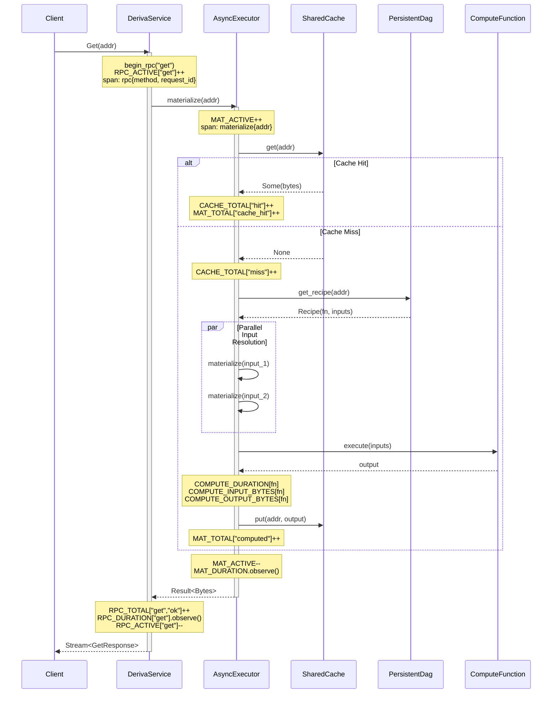

# Design Document: Observability

## Overview

This feature adds production-grade observability to the Computation-Addressed DFS (Deriva) system by integrating structured tracing via `tokio-tracing` and Prometheus metrics across all critical paths. The implementation provides two complementary observability layers:

1. **Tracing (Layer 1)** — Per-request structured logs with span hierarchy, request ID correlation, and configurable output format (text/JSON). Enables debugging individual request flows through cache → DAG → compute → response.

2. **Metrics (Layer 2)** — Prometheus counters, histograms, and gauges for aggregate dashboards and alerting. Covers 23 metrics across 7 categories: RPC, materialization, cache, compute, verification, DAG, and storage.

Both layers are exposed via an axum-based HTTP metrics server on a dedicated port (default 9090, configurable via `--metrics-port`) with `/metrics` and `/health` endpoints.

### Design Rationale

- **Prometheus over OpenTelemetry**: Simpler for single-node, pull-based scraping, battle-tested `prometheus` crate, fewer dependencies. OpenTelemetry can be added as an additional exporter in Phase 3 (distributed).
- **Separate metrics port**: Isolates scrape traffic from gRPC, enables separate firewalling, follows Prometheus conventions.
- **`lazy_static!` for registration**: The `prometheus` crate's macros work naturally with `lazy_static`, ensuring metrics are registered at first access (effectively at startup).
- **Minimal overhead**: Atomic counter/gauge operations (~20ns each), histogram bucket search (~50ns), span create (~100ns). Total per-request overhead target: ≤500ns.

## Architecture

```mermaid
graph TB
    subgraph "Client Layer"
        CLI[deriva-cli]
        GRPC_CLIENT[gRPC Client]
    end

    subgraph "Server Layer (deriva-server)"
        TONIC[tonic gRPC Server :50051]
        SERVICE[DerivaService]
        METRICS_HTTP[axum Metrics Server :9090]
        TRACING_SUB[Tracing Subscriber]
    end

    subgraph "Compute Layer (deriva-compute)"
        EXECUTOR[AsyncExecutor]
        CACHE[SharedCache]
        REGISTRY[FunctionRegistry]
    end

    subgraph "Storage Layer (deriva-storage)"
        DAG[PersistentDag]
        BLOB[BlobStore / LeafStore]
    end

    subgraph "Observability Infrastructure"
        PROM_REG[Prometheus Registry]
        PROM[Prometheus Scraper]
        GRAFANA[Grafana Dashboard]
    end

    CLI --> GRPC_CLIENT --> TONIC
    TONIC --> SERVICE
    SERVICE --> EXECUTOR
    EXECUTOR --> CACHE
    EXECUTOR --> REGISTRY
    EXECUTOR --> DAG
    EXECUTOR --> BLOB

    SERVICE -.->|instrument_rpc!| PROM_REG
    EXECUTOR -.->|MAT_*, COMPUTE_*, CACHE_*| PROM_REG
    CACHE -.->|CACHE_SIZE, CACHE_ENTRIES| PROM_REG
    DAG -.->|DAG_RECIPES, DAG_INSERT_DURATION| PROM_REG
    BLOB -.->|STORAGE_BLOBS, STORAGE_BLOB_BYTES| PROM_REG

    SERVICE -.->|spans + events| TRACING_SUB
    EXECUTOR -.->|spans + events| TRACING_SUB

    METRICS_HTTP -->|encode_metrics()| PROM_REG
    PROM -->|GET /metrics| METRICS_HTTP
    PROM --> GRAFANA

    TRACING_SUB -->|stdout/stderr| LOGS[Log Output text/json]
```

### Request Tracing Flow



## Components and Interfaces

### 1. Metrics Registry (`deriva-server/src/metrics.rs`)

The central module defining all Prometheus metric collectors using `lazy_static!`. Re-exports compute-level metrics from `deriva-compute`.

```rust
// Public interface
pub static ref RPC_TOTAL: CounterVec;           // labels: [method, status]
pub static ref RPC_DURATION: HistogramVec;      // labels: [method]
pub static ref RPC_ACTIVE: GaugeVec;            // labels: [method]
pub static ref MAT_TOTAL: CounterVec;           // labels: [result]
pub static ref MAT_DURATION: Histogram;
pub static ref MAT_ACTIVE: Gauge;
pub static ref MAT_DEPTH: Histogram;
pub static ref CACHE_TOTAL: CounterVec;         // labels: [result]
pub static ref CACHE_EVICTION_TOTAL: Counter;
pub static ref CACHE_SIZE: Gauge;
pub static ref CACHE_ENTRIES: Gauge;
pub static ref CACHE_HIT_RATE: Gauge;
pub static ref COMPUTE_DURATION: HistogramVec;  // labels: [function]
pub static ref COMPUTE_INPUT_BYTES: HistogramVec;  // labels: [function]
pub static ref COMPUTE_OUTPUT_BYTES: HistogramVec; // labels: [function]
pub static ref VERIFY_TOTAL: CounterVec;        // labels: [result]
pub static ref VERIFY_FAILURE_RATE: Gauge;
pub static ref DAG_RECIPES: Gauge;
pub static ref DAG_INSERT_DURATION: Histogram;
pub static ref STORAGE_BLOBS: Gauge;
pub static ref STORAGE_BLOB_BYTES: Gauge;

pub fn encode_metrics() -> String;
```

### 2. Metrics HTTP Server (`deriva-server/src/metrics_server.rs`)

An axum-based HTTP server running on a separate port with two routes:

```rust
pub async fn start_metrics_server(port: u16, state: Arc<ServerState>);

// Routes:
// GET /metrics -> Prometheus text exposition format
// GET /health  -> JSON { status, cache_entries, dag_recipes, uptime_seconds }
```

### 3. RPC Instrumentation (`instrument_rpc!` pattern)

The `begin_rpc` / `record_rpc` function pair instruments all gRPC handlers:

```rust
/// Called at RPC entry: increments active gauge, generates request_id, creates span
fn begin_rpc(method: &str) -> (Instant, tracing::Span);

/// Called at RPC exit: decrements active, increments total with status, observes duration
fn record_rpc(method: &str, start: Instant, ok: bool);
```

Applied to all RPC methods: `get`, `put_leaf`, `put_recipe`, `verify`, `status`, `resolve`, `invalidate`, `cascade_invalidate`, `garbage_collect`, `pin`, `unpin`, `list_pins`.

### 4. Tracing Subscriber (`init_tracing`)

```rust
/// Initialize the global tracing subscriber.
/// - json=false: human-readable fmt with uptime timer
/// - json=true: JSON-formatted events for log aggregation
/// - RUST_LOG env var controls filtering (default: "deriva=info")
fn init_tracing(json: bool);
```

### 5. Materialization Instrumentation (in `AsyncExecutor::materialize`)

The `materialize` method creates an `info_span!("materialize", addr = %addr)` and instruments all internal steps:

- Cache check → DEBUG event (hit/miss)
- Leaf check → DEBUG event
- Recipe lookup → trace
- Input resolution → recursive materialize spans
- Compute execution → INFO event with function, input_bytes, output_bytes, duration
- Cache put → DEBUG event

### 6. CLI Configuration (`clap::Parser`)

```rust
#[derive(Parser)]
struct Args {
    #[arg(long, default_value = "9090")]
    metrics_port: u16,

    #[arg(long, default_value = "text")]
    log_format: String,  // "text" | "json"

    // RUST_LOG env var handled by EnvFilter
}
```

## Data Models

### Complete Metric Table

| # | Metric Name | Type | Labels | Histogram Buckets | Description |
|---|-------------|------|--------|-------------------|-------------|
| 1 | `deriva_rpc_total` | CounterVec | method, status | — | Total RPC calls |
| 2 | `deriva_rpc_duration_seconds` | HistogramVec | method | 1ms, 5ms, 10ms, 50ms, 100ms, 500ms, 1s, 5s, 10s | RPC latency |
| 3 | `deriva_rpc_active` | GaugeVec | method | — | In-flight RPCs |
| 4 | `deriva_materialize_total` | CounterVec | result | — | Materializations by outcome |
| 5 | `deriva_materialize_duration_seconds` | Histogram | — | 1ms, 10ms, 50ms, 100ms, 500ms, 1s, 5s, 30s | Materialization latency |
| 6 | `deriva_materialize_active` | Gauge | — | — | In-flight materializations |
| 7 | `deriva_materialize_depth` | Histogram | — | 0, 1, 2, 3, 5, 10, 20, 50, 100 | DAG depth traversed |
| 8 | `deriva_cache_total` | CounterVec | result | — | Cache hit/miss |
| 9 | `deriva_cache_eviction_total` | Counter | — | — | Cache evictions |
| 10 | `deriva_cache_size_bytes` | Gauge | — | — | Current cache byte size |
| 11 | `deriva_cache_entries` | Gauge | — | — | Current cache entry count |
| 12 | `deriva_cache_hit_rate` | Gauge | — | — | Rolling hit ratio |
| 13 | `deriva_compute_duration_seconds` | HistogramVec | function | 0.1ms, 1ms, 10ms, 50ms, 100ms, 500ms, 1s, 5s | Compute latency per function |
| 14 | `deriva_compute_input_bytes` | HistogramVec | function | 64, 256, 1K, 4K, 16K, 64K, 256K, 1M | Input size distribution |
| 15 | `deriva_compute_output_bytes` | HistogramVec | function | 64, 256, 1K, 4K, 16K, 64K, 256K, 1M | Output size distribution |
| 16 | `deriva_verification_total` | CounterVec | result | — | Verification pass/fail |
| 17 | `deriva_verification_failure_rate` | Gauge | — | — | Rolling failure ratio |
| 18 | `deriva_dag_recipes` | Gauge | — | — | Total recipes in DAG |
| 19 | `deriva_dag_insert_duration_seconds` | Histogram | — | 0.1ms, 0.5ms, 1ms, 5ms, 10ms, 50ms | DAG insert latency |
| 20 | `deriva_storage_blobs` | Gauge | — | — | Total stored blobs |
| 21 | `deriva_storage_blob_bytes` | Gauge | — | — | Total blob byte size |
| 22 | `deriva_cache_eviction_total` | Counter | — | — | Total evictions |
| 23 | `deriva_materialize_depth` | Histogram | — | (see #7) | (same as #7) |

*Note: The actual implementation already includes additional streaming and GC metrics beyond these 23 core metrics.*

### Tracing Span Hierarchy

```
rpc { method="get", request_id="550e8400-..." }
 └─ materialize { addr="caddr(0xabc...)" }
     ├─ [event] cache miss
     ├─ materialize { addr="caddr(0x111...)" }   // recursive input
     │   └─ [event] cache hit
     ├─ materialize { addr="caddr(0x222...)" }   // recursive input
     │   └─ [event] leaf hit
     ├─ [event] compute complete { function="concat/v1", input_bytes=2048, output_bytes=4096, duration_ms=1.2 }
     └─ [event] cache put
```

### Log Output Formats

**Text format** (development):
```
0.015s INFO  deriva_compute::async_executor: materialize addr=caddr(0xdef...)
0.015s DEBUG deriva_compute::async_executor:   cache miss
0.018s INFO  deriva_compute::async_executor:   compute complete function=concat/v1 input_bytes=2048 output_bytes=4096
```

**JSON format** (production):
```json
{
  "timestamp": "2026-02-14T01:43:46.351Z",
  "level": "INFO",
  "target": "deriva_compute::async_executor",
  "span": { "name": "materialize", "addr": "caddr(0xabc...)" },
  "spans": [
    { "name": "rpc", "method": "get", "request_id": "550e8400-..." },
    { "name": "materialize", "addr": "caddr(0xabc...)" }
  ],
  "fields": { "message": "compute complete", "function": "concat/v1", "input_bytes": 2048, "output_bytes": 4096 }
}
```

### Performance Model

| Operation | Overhead | Mechanism |
|-----------|----------|-----------|
| Counter increment | ~20ns | Atomic add |
| Gauge set | ~20ns | Atomic store |
| Histogram observe | ~50ns | Atomic + linear bucket search |
| Span create | ~100ns | Allocation + field formatting |
| Span close | ~50ns | Duration calculation + event emit |
| Total per-request | ~500ns | Sum of ~3 counters + 1 histogram + 1 span |
| `/metrics` encode | ~1ms | Only on scrape (every 15s) |

### Docker Compose Monitoring Stack

```yaml
# docker-compose.monitoring.yml
version: "3.8"
services:
  prometheus:
    image: prom/prometheus:latest
    ports: ["9090:9090"]
    volumes:
      - ./monitoring/prometheus.yml:/etc/prometheus/prometheus.yml
    extra_hosts:
      - "host.docker.internal:host-gateway"

  grafana:
    image: grafana/grafana:latest
    ports: ["3000:3000"]
    environment:
      - GF_SECURITY_ADMIN_PASSWORD=admin
    volumes:
      - ./monitoring/grafana/dashboards:/var/lib/grafana/dashboards
      - ./monitoring/grafana/provisioning:/etc/grafana/provisioning
```

## Correctness Properties

*A property is a characteristic or behavior that should hold true across all valid executions of a system — essentially, a formal statement about what the system should do. Properties serve as the bridge between human-readable specifications and machine-verifiable correctness guarantees.*

### Property 1: RPC instrumentation invariant

*For any* RPC method invocation (regardless of method name or success/failure outcome), the `begin_rpc`/`record_rpc` pair SHALL increment `rpc_total` exactly once with the correct method and status labels, observe the elapsed duration in `rpc_duration_seconds`, and leave `rpc_active` at its original value after completion.

**Validates: Requirements 3.1, 3.2, 3.4, 3.5**

### Property 2: Materialization outcome counter correctness

*For any* materialization of a content address, `deriva_materialize_total` SHALL be incremented exactly once with a result label that correctly reflects the actual outcome: "hit" if resolved from cache, "miss" (computed) if computation was required, or "error" if the operation failed.

**Validates: Requirements 4.1, 4.2, 4.3**

### Property 3: Materialization active gauge balance

*For any* materialization (whether it results in a cache hit, computation, or error), the `deriva_materialize_active` gauge SHALL return to its pre-invocation value upon completion — i.e., the increment on entry and decrement on exit are balanced.

**Validates: Requirements 4.4**

### Property 4: Cache gauge consistency

*For any* sequence of cache put and eviction operations, the `deriva_cache_size_bytes` gauge SHALL equal the actual total byte size of all cached entries, and the `deriva_cache_entries` gauge SHALL equal the actual number of cached entries.

**Validates: Requirements 5.4, 5.5**

### Property 5: Cache hit rate consistency

*For any* sequence of cache lookups resulting in H hits and M misses (where H + M > 0), the `deriva_cache_hit_rate` gauge SHALL equal H / (H + M).

**Validates: Requirements 5.6**

### Property 6: Compute metrics completeness

*For any* compute function execution with function name F, input of total size I bytes, and output of size O bytes, the system SHALL observe I in `compute_input_bytes[F]`, observe O in `compute_output_bytes[F]`, and observe the elapsed wall-clock duration in `compute_duration_seconds[F]`.

**Validates: Requirements 6.1, 6.2, 6.3**

### Property 7: DAG recipe gauge consistency

*For any* sequence of recipe insertions into the DAG, the `deriva_dag_recipes` gauge SHALL equal the actual number of recipes stored (i.e., `dag.len()`).

**Validates: Requirements 7.4**

### Property 8: Storage gauge consistency

*For any* sequence of blob storage operations, `deriva_storage_blobs` SHALL equal the actual blob count, and `deriva_storage_blob_bytes` SHALL equal the actual total byte size of stored blobs.

**Validates: Requirements 8.1, 8.2**

### Property 9: Metrics encode round-trip

*For any* sequence of metric operations (counter increments, histogram observations, gauge sets), calling `encode_metrics()` SHALL produce a string in valid Prometheus text exposition format that contains all registered metric family names.

**Validates: Requirements 2.2**

### Property 10: Request ID is valid UUID v4

*For any* RPC invocation, the `request_id` field attached to the root tracing span SHALL be a valid version-4 UUID in standard hyphenated format (matching `^[0-9a-f]{8}-[0-9a-f]{4}-4[0-9a-f]{3}-[89ab][0-9a-f]{3}-[0-9a-f]{12}$`).

**Validates: Requirements 10.1, 10.3**

### Property 11: JSON log structural validity

*For any* log event emitted with JSON format enabled, the output SHALL be valid JSON containing at minimum the fields: "timestamp", "level", and "target".

**Validates: Requirements 9.2**

### Property 12: Materialization span structure

*For any* materialization of a content address A, a tracing span named "materialize" SHALL be created at INFO level with field `addr` set to the string representation of A, and a DEBUG-level event SHALL be emitted indicating either "cache hit" or "cache miss".

**Validates: Requirements 11.1, 11.2**

## Error Handling

| Scenario | Behavior | Recovery |
|----------|----------|----------|
| Prometheus registry full | Cannot happen — static metric set with bounded labels | N/A |
| Metrics port already in use | Log error with port number, terminate process | Operator reconfigures `--metrics-port` |
| Metrics endpoint under heavy load | axum handles concurrently via tokio; no blocking of gRPC | N/A (inherent) |
| Tracing subscriber not initialized | `tracing` macros are no-ops — no crash, no output | Logs warning at stderr |
| High-cardinality label explosion | Only `function` and `method` labels vary; bounded by registry size | Alert if cardinality > threshold |
| Encode metrics failure | Return HTTP 500 with error message | Retry on next scrape |
| Invalid RUST_LOG syntax | Fall back to default `deriva=info` filter | Log warning about parse failure |
| Long-running materialization | `MAT_ACTIVE` gauge stays elevated; visible in dashboard | Alert rule triggers |
| UUID generation failure | Impossible with `uuid` crate v4 (uses OS randomness) | N/A |
| JSON serialization error in /health | Return HTTP 500 | Indicates server state corruption; investigate |

### Graceful Degradation

The design ensures observability failures never crash the main application:
- Metric operations are infallible after registration (atomic operations)
- Tracing macros compile to no-ops if subscriber is absent
- The metrics HTTP server runs in a separate tokio task; if it panics, gRPC continues
- Health endpoint failures don't affect metrics endpoint

## Testing Strategy

### Property-Based Tests (proptest)

The feature is suitable for PBT because the metric instrumentation logic involves universal invariants (gauge balance, counter correctness, format validity) that must hold across arbitrary inputs.

**Library**: `proptest` (already in workspace dependencies)
**Minimum iterations**: 100 per property

Each property test MUST be tagged with a comment referencing its design property:
```rust
// Feature: observability, Property 1: RPC instrumentation invariant
```

**Properties to implement as PBT:**
1. RPC instrumentation invariant (Property 1)
2. Materialization outcome counter correctness (Property 2)
3. Materialization active gauge balance (Property 3)
4. Cache gauge consistency (Property 4)
5. Cache hit rate consistency (Property 5)
6. Compute metrics completeness (Property 6)
7. DAG recipe gauge consistency (Property 7)
8. Storage gauge consistency (Property 8)
9. Metrics encode round-trip (Property 9)
10. Request ID UUID v4 format (Property 10)
11. JSON log structural validity (Property 11)
12. Materialization span structure (Property 12)

### Unit Tests (example-based)

| Test | What it verifies |
|------|-----------------|
| `test_metrics_registry_initializes` | All 23 metrics accessible without panic |
| `test_health_endpoint_returns_200` | /health returns JSON with status field |
| `test_metrics_port_conflict` | Proper error on port-in-use |
| `test_env_filter_default` | Default filter is `deriva=info` |
| `test_text_format_output` | Text logs contain uptime, target, span |
| `test_all_rpcs_instrumented` | Each RPC method increments rpc_total |
| `test_verification_fail_counter` | Non-deterministic function increments fail |
| `test_cache_eviction_counter` | Eviction increments eviction_total |
| `test_materialization_depth_recorded` | Known-depth recipe records correct depth |

### Integration Tests

| Test | What it verifies |
|------|-----------------|
| `test_full_observability_flow` | Put leaf + recipe, Get, scrape /metrics, verify all metric families present |
| `test_concurrent_scrape_no_blocking` | Parallel /metrics + gRPC traffic |
| `test_json_log_integration` | Full request produces valid JSON log stream |

### Performance Benchmarks

| Benchmark | Target |
|-----------|--------|
| Counter increment overhead | ≤ 20ns |
| Histogram observe overhead | ≤ 50ns |
| Span create + close | ≤ 150ns |
| Total per-request instrumentation | ≤ 500ns |
| `encode_metrics()` for 23 metrics | ≤ 5ms |
