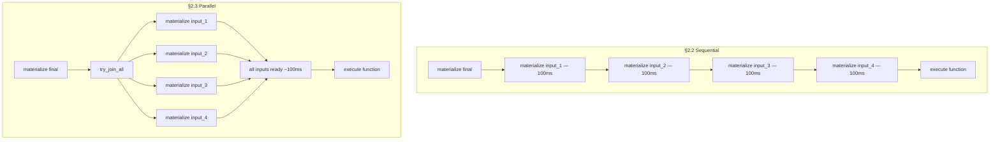
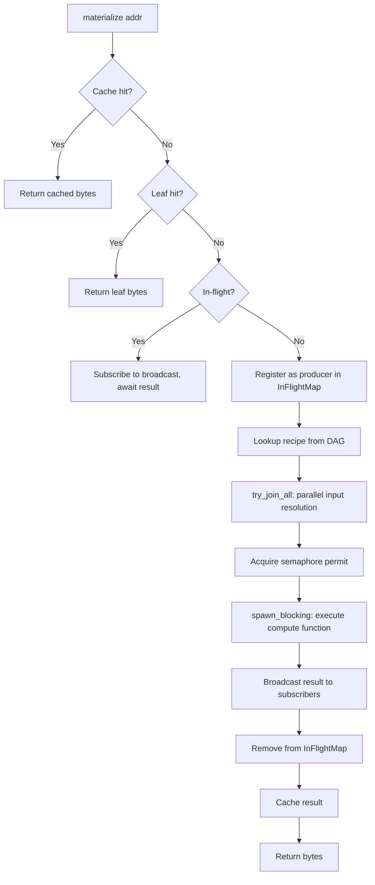
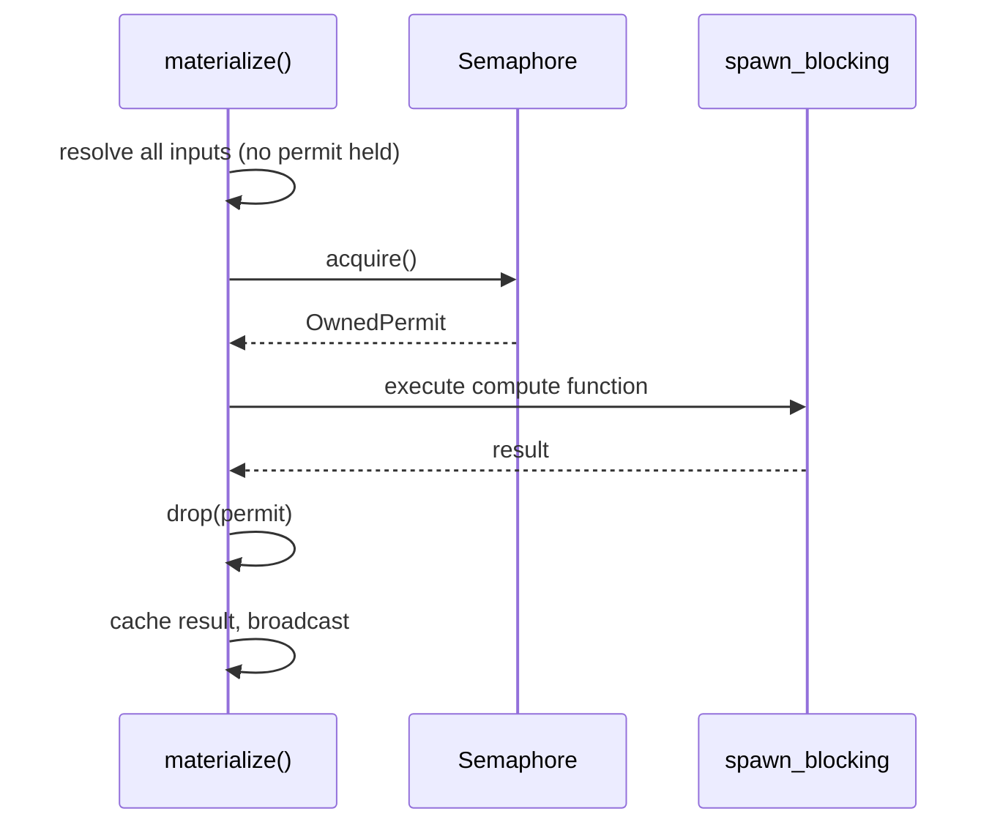
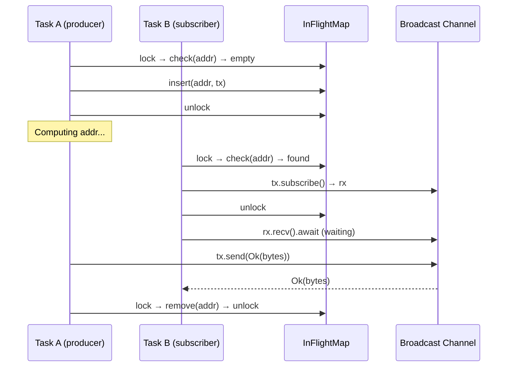
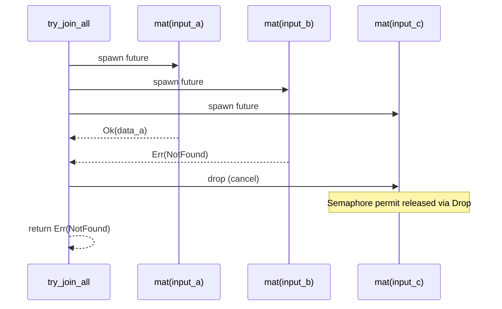

# Design Document: Parallel Materialization

## Overview

Phase 2.3 replaces the sequential input resolution loop in `AsyncExecutor::materialize` with parallel fan-out using `futures::future::try_join_all`. This is conceptually a one-line change that enables concurrent resolution of independent DAG branches, achieving near-linear speedup proportional to DAG width.

The design adds three supporting mechanisms to make unbounded parallelism safe and efficient:

1. **Semaphore-bounded concurrency** — limits concurrent compute operations to prevent resource exhaustion
2. **In-flight request deduplication** — avoids redundant computation when multiple parallel branches request the same CAddr
3. **Scoped permit acquisition** — acquires the semaphore only at the compute step (not during recursive input resolution) to guarantee deadlock freedom

**Target crate:** `deriva-compute` (modify `async_executor.rs`)
**Key dependency:** `futures::future::try_join_all`

## Architecture

### Sequential vs Parallel Execution Model



**Sequential total:** 4 × 100ms = 400ms
**Parallel total:** max(100ms) = 100ms (4x speedup)

### Core Change: For Loop → try_join_all

```rust
// Before (§2.2 — sequential):
let mut input_bytes = Vec::with_capacity(recipe.inputs.len());
for input_addr in &recipe.inputs {
    input_bytes.push(self.materialize(*input_addr).await?);
}

// After (§2.3 — parallel):
let futures: Vec<_> = recipe.inputs.iter()
    .map(|addr| self.materialize(*addr))
    .collect();
let input_bytes = futures::future::try_join_all(futures).await?;
```

`try_join_all` drives all futures concurrently on the Tokio runtime. It preserves input order (output[i] = result of future[i]) and short-circuits on first error, dropping remaining futures.

### Materialization Resolution Order



## Components and Interfaces

### AsyncExecutor Structure

```rust
pub struct AsyncExecutor<C, L, D> {
    cache: Arc<C>,                    // Materialization cache
    leaf_store: Arc<L>,               // Leaf data store
    dag: Arc<D>,                      // DAG/recipe reader
    registry: Arc<FunctionRegistry>,  // Compute function registry
    semaphore: Arc<Semaphore>,        // Concurrency limiter
    in_flight: Arc<Mutex<HashMap<CAddr, broadcast::Sender<Result<Bytes>>>>>,
    pub config: ExecutorConfig,
    pub verification_stats: Arc<VerificationStats>,
}
```

All fields are `Arc`-wrapped, enabling `Clone` for multi-task sharing while maintaining a single global concurrency limit and deduplication map.

### ExecutorConfig

```rust
pub struct ExecutorConfig {
    /// Max concurrent compute operations (default: num_cpus * 2)
    pub max_concurrency: usize,
    /// Broadcast channel buffer size for dedup (default: 16)
    pub dedup_channel_capacity: usize,
    /// Verification mode for determinism checking (default: Off)
    pub verification: VerificationMode,
}
```

### DagReader Trait

```rust
pub trait DagReader: Send + Sync {
    fn get_inputs(&self, addr: &CAddr) -> Result<Option<Vec<CAddr>>>;
    fn get_recipe(&self, addr: &CAddr) -> Result<Option<Recipe>>;
}
```

### Constructor API

```rust
impl<C, L, D> AsyncExecutor<C, L, D> {
    /// Create with default config (backward compatible)
    pub fn new(dag: Arc<D>, registry: Arc<FunctionRegistry>,
               cache: Arc<C>, leaf_store: Arc<L>) -> Self;

    /// Create with custom config
    pub fn with_config(dag: Arc<D>, registry: Arc<FunctionRegistry>,
                       cache: Arc<C>, leaf_store: Arc<L>,
                       config: ExecutorConfig) -> Self;
}
```

### Clone Semantics

```rust
impl<C, L, D> Clone for AsyncExecutor<C, L, D> {
    fn clone(&self) -> Self {
        // All Arc fields are cloned (shared references)
        // Config is copied (value type)
    }
}
```

Cloned instances share: cache, leaf store, DAG, registry, semaphore, in-flight map, and verification stats.

## Data Models

### InFlightMap

```rust
type InFlightMap = Arc<Mutex<HashMap<CAddr, broadcast::Sender<Result<Bytes>>>>>;
```

Lifecycle:
1. **Insert** — when a new CAddr computation begins (no cache/leaf/dedup hit)
2. **Subscribe** — when a subsequent request finds an existing entry
3. **Broadcast** — when the producer completes (success or error)
4. **Remove** — after broadcast, entry is removed from the map

The lock is held only during insert/lookup/remove operations (microseconds), never across await points.

### Semaphore Permit Lifecycle



### Deduplication Lifecycle



### Error Broadcasting

When the producer encounters an error:

```rust
// Producer error path:
let _ = tx.send(Err(error.clone()));  // DerivaError: Clone required
self.in_flight.lock().await.remove(&addr);
```

Each subscriber receives an independent `Clone` of the error. If the producer is dropped without sending (e.g., panics), subscribers receive `RecvError` which maps to `ComputeFailed("producer task failed or was cancelled")`.

### Performance Model by DAG Shape

| DAG Shape | Sequential Time | Parallel Time | Speedup |
|-----------|----------------|---------------|---------|
| Linear chain (depth D, 1 input each) | D × T | D × T | 1x |
| Wide fan-in (N leaves → merge) | N × T | T | Nx |
| Diamond (4 transforms + 2 merges + final) | 550ms | 200ms | 2.75x |
| Binary tree (depth D, fan-out 2) | (2^D - 1) × T | D × T | (2^D - 1)/D |
| Star (N leaves → merge, semaphore limit S) | N × T | ⌈N/S⌉ × T | S (when N > S) |

### Overhead per Materialization Node

| Component | Cost | When |
|-----------|------|------|
| `try_join_all` setup | ~1μs per input | Every recipe |
| `BoxFuture` allocation | ~100 bytes per recursive call | Every non-cached node |
| Semaphore acquire (uncontended) | ~50ns | Every compute step |
| InFlightMap lookup | ~200ns (Mutex + HashMap) | Every non-cached node |
| Broadcast channel | ~500 bytes per in-flight addr | Only during active dedup |

Total per-node overhead: ~2-5μs — negligible vs compute time.

### Deadlock-Freedom Analysis

**Claim:** The scoped permit strategy (acquire only at compute step) prevents deadlock for any DAG shape.

**Proof sketch:**

A deadlock requires circular wait: Task A holds permit, waits for Task B; Task B holds permit, waits for Task A.

With scoped permits:
- Permits are held **only** during `spawn_blocking` (the compute step)
- During input resolution (`try_join_all`), **no permit is held**
- A task waiting for its inputs does not hold a permit
- Therefore, a task needing a permit can always eventually acquire one (existing holders are in `spawn_blocking`, which completes in bounded time)

**Counterexample with naive approach (permits held for entire materialization):**

```
max_concurrency = 2:
  mat(A) acquires permit 1, starts resolving inputs [B, C]
  mat(B) acquires permit 2, starts resolving inputs [D]
  mat(C) needs permit — BLOCKED (both permits held)
  mat(D) needs permit — BLOCKED
  mat(B) waits for mat(D) — BLOCKED
  mat(A) waits for mat(B), mat(C) — BLOCKED
  → DEADLOCK
```

**With scoped permits:**
```
max_concurrency = 2:
  mat(A) starts resolving inputs [B, C] — NO permit held
  mat(B) starts resolving inputs [D] — NO permit held
  mat(C) starts resolving inputs [...] — NO permit held
  mat(D) is a leaf — returns immediately
  mat(B) has all inputs → acquires permit → computes → releases
  mat(C) has all inputs → acquires permit → computes → releases
  mat(A) has all inputs → acquires permit → computes → releases
  → NO DEADLOCK (permits only held during finite compute steps)
```

### Error Cancellation Flow



### Design Rationale

**Why `try_join_all` over `FuturesUnordered`?**
- `try_join_all` preserves input order (output[i] = result of future[i])
- Short-circuits on first error
- Simpler API — no need to collect and re-sort by index
- `FuturesUnordered` is for streaming results; we need ALL inputs before computing

**Why `broadcast` channel for dedup over `tokio::sync::watch`?**
- `watch` only keeps the latest value — slow receivers miss results
- `broadcast` buffers messages, ensuring all subscribers get the result
- Supports both success and error propagation

**Why not spawn individual Tokio tasks?**
- Requires `AsyncExecutor: 'static` (no borrowed references)
- Each task adds ~200 bytes + scheduler overhead
- Harder to cancel on error (need `AbortHandle`)
- `try_join_all` is sufficient and simpler for our use case

**Why `num_cpus * 2` as default concurrency?**
- Balances CPU-bound compute with I/O wait time
- Enough parallelism to keep cores busy during cache/leaf lookups
- Not so high that it overwhelms memory or causes excessive context switching

## Correctness Properties

*A property is a characteristic or behavior that should hold true across all valid executions of a system — essentially, a formal statement about what the system should do. Properties serve as the bridge between human-readable specifications and machine-verifiable correctness guarantees.*

### Property 1: Positional Order Preservation

*For any* recipe with N inputs resolved in parallel, the output vector SHALL satisfy `output[i] == materialize(recipe.inputs[i])` for all i in 0..N, regardless of the order in which individual input futures complete.

**Validates: Requirements 1.2, 10.1, 10.2, 10.3**

### Property 2: Parallel Speedup Proportional to Width

*For any* recipe with N independent inputs each requiring time T to compute, the total wall-clock time for input resolution SHALL be approximately max(T₁, T₂, ..., Tₙ) rather than sum(T₁ + T₂ + ... + Tₙ), bounded by semaphore batching of ⌈N/max_concurrency⌉ × max(Tᵢ).

**Validates: Requirements 1.1, 11.1**

### Property 3: Global Semaphore Bounding

*For any* number of concurrent materialization requests (including across cloned executor instances), at most `max_concurrency` compute steps SHALL execute simultaneously.

**Validates: Requirements 3.1, 3.4, 7.3, 11.3**

### Property 4: Deadlock Freedom for All DAG Shapes

*For any* valid DAG with depth D and maximum fan-out F (where D × F may exceed `max_concurrency`), materialization SHALL complete within bounded time without deadlock.

**Validates: Requirements 4.1, 4.2, 4.4**

### Property 5: Computation Deduplication

*For any* CAddr requested concurrently by N tasks (including across cloned executor instances), the compute function SHALL execute exactly once, and all N requesters SHALL receive the same result bytes.

**Validates: Requirements 5.1, 7.4**

### Property 6: Error Broadcast to All Subscribers

*For any* failing computation with N concurrent subscribers, all N subscribers SHALL receive the same error (a clone of the producer's error) rather than hanging indefinitely.

**Validates: Requirements 2.1, 5.4, 8.2**

### Property 7: Error Short-Circuit Cancellation

*For any* recipe where at least one input fails, `try_join_all` SHALL return the error in wall-clock time proportional to time-to-first-failure rather than total time of all inputs, and no compute function SHALL be invoked.

**Validates: Requirements 2.1, 2.4**

### Property 8: Cache and Leaf Bypass Without Permit

*For any* CAddr present in the cache or leaf store, materialization SHALL succeed even when the semaphore has zero available permits (all permits are held by other tasks).

**Validates: Requirements 9.1, 9.2**

### Property 9: Clone Shared State Consistency

*For any* pair of cloned executor instances, materializing a CAddr via one clone SHALL populate the cache such that the other clone observes a cache hit for the same CAddr.

**Validates: Requirements 7.2**

### Property 10: Linear Chain Negligible Overhead

*For any* linear chain DAG of depth D (single input per node), the total wall-clock time SHALL be within D × T + D × 5μs of sequential execution time (less than 5μs per-node overhead from parallel infrastructure).

**Validates: Requirements 11.2**

### Property 11: Error Propagation Without Wrapping

*For any* error originating at depth D in a nested parallel resolution, the error received at the top level SHALL be the original `DerivaError` variant without additional wrapping layers (no `ComputeFailed(ComputeFailed(...))` nesting).

**Validates: Requirements 2.4**

## Error Handling

| Scenario | Behavior |
|----------|----------|
| Recipe input fails during `try_join_all` | First error returned, siblings cancelled, permits released via Drop |
| Semaphore closed (executor dropped) | `ComputeFailed("semaphore error: ...")` returned |
| Broadcast producer dropped without sending | Subscribers receive `ComputeFailed("producer task failed or was cancelled")` |
| Recipe not found in DAG | `NotFound(addr)` broadcast to subscribers, InFlightMap cleaned |
| Function not found in registry | `FunctionNotFound(id)` broadcast to subscribers |
| `spawn_blocking` panics | `ComputeFailed("join: ...")` returned |
| Nested `try_join_all` error in deep branch | Error propagates up through all parent joins without wrapping |
| Zero inputs recipe | `try_join_all([])` returns `Ok(vec![])` immediately |
| Same CAddr appears twice in recipe.inputs | Dedup ensures single computation, both slots get same result |

### Error Propagation Path

```
try_join_all([mat(a), mat(b)])
  └── mat(b) → try_join_all([mat(c), mat(d)])
                  └── mat(d) → Err(NotFound("xyz"))
                         │
                         ▼
                  try_join_all returns Err(NotFound("xyz"))
                  mat(c) cancelled
                         │
                         ▼
              mat(b) returns Err(NotFound("xyz"))
              broadcast Err to subscribers of b
                         │
                         ▼
       try_join_all returns Err(NotFound("xyz"))
       mat(a) cancelled
                         │
                         ▼
    Top-level returns Err(NotFound("xyz"))  ← same error, no wrapping
```

## Testing Strategy

### Property-Based Testing

The feature is well-suited for property-based testing because:
- The core logic (parallel resolution, ordering, deduplication) is pure computational behavior
- Input space is large (arbitrary DAG shapes, depths, fan-outs, failure positions)
- Universal properties hold across all valid inputs
- Tests can use in-memory mocks (no external services)

**Library:** [proptest](https://crates.io/crates/proptest) for Rust property-based testing

**Configuration:** Minimum 100 iterations per property test (due to randomization).

**Tag format:** `Feature: parallel-materialization, Property {N}: {property_text}`

Each correctness property from the design maps to a property-based test that generates random DAG structures and verifies the invariant holds.

### Timing-Based Verification

Several properties (speedup, deadlock freedom, semaphore bounding) are verified through timing:
- `SlowFunction` — a compute function that sleeps for a configurable duration
- Wall-clock assertions — verify parallelism via `assert!(elapsed < threshold)`
- Deadlock detection — timeout-based (test fails if materialization doesn't complete within expected time)

### Unit Tests (Example-Based)

| Test | Validates |
|------|-----------|
| `test_executor_config_default` | Req 6.1-6.4 |
| `test_executor_config_custom` | Req 6.3 |
| `test_semaphore_closed_error` | Req 3.3 |
| `test_broadcast_dropped_error` | Req 5.5 |
| `test_resolution_order_cache_before_leaf` | Req 9.3 |
| `test_zero_inputs_recipe` | Req 1.3 |
| `test_single_input_recipe` | Req 1.4 |
| `test_deriva_error_clone` | Req 8.1 |

### Integration Tests

| Test | Validates |
|------|-----------|
| `test_parallel_get_rpc_fan_in` | End-to-end parallel resolution via gRPC |
| `test_parallel_multiple_clients` | Concurrent clients, no deadlock |
| `test_stress_100_concurrent` | Resource stability under load |

### Property Test → Design Property Mapping

| Property Test | Design Property | Key Generator |
|--------------|-----------------|---------------|
| `prop_order_preservation` | Property 1 | Random recipes with N distinct leaf inputs |
| `prop_parallel_speedup` | Property 2 | Random fan-in DAGs with SlowFunction |
| `prop_semaphore_bounding` | Property 3 | N tasks > max_concurrency |
| `prop_deadlock_freedom` | Property 4 | Random deep DAGs (depth/fan-out > max_concurrency) |
| `prop_deduplication` | Property 5 | Random CAddr with N concurrent requesters |
| `prop_error_broadcast` | Property 6 | Failing CAddr with N subscribers |
| `prop_error_short_circuit` | Property 7 | Recipes with one failing input among N |
| `prop_cache_leaf_bypass` | Property 8 | Saturated semaphore with cached/leaf CAddrs |
| `prop_clone_shared_state` | Property 9 | Clone pairs with sequential materialize calls |
| `prop_linear_overhead` | Property 10 | Linear chains of varying depth |
| `prop_error_no_wrapping` | Property 11 | Errors at various DAG depths |
