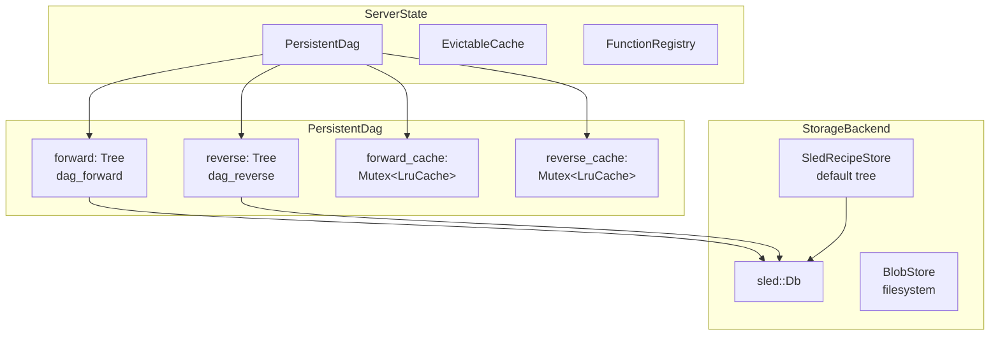
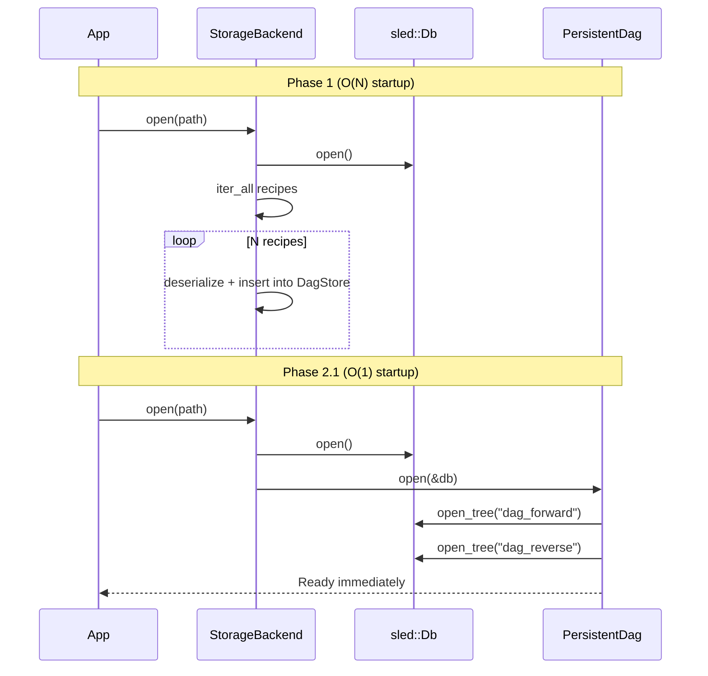
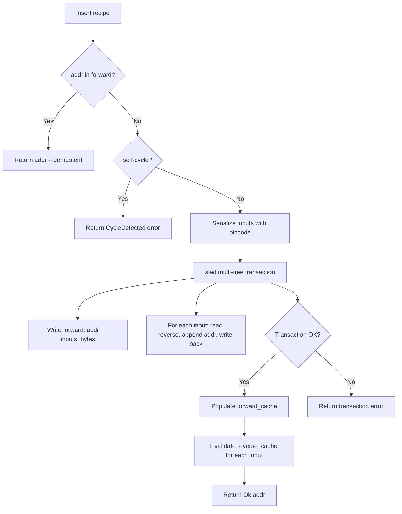
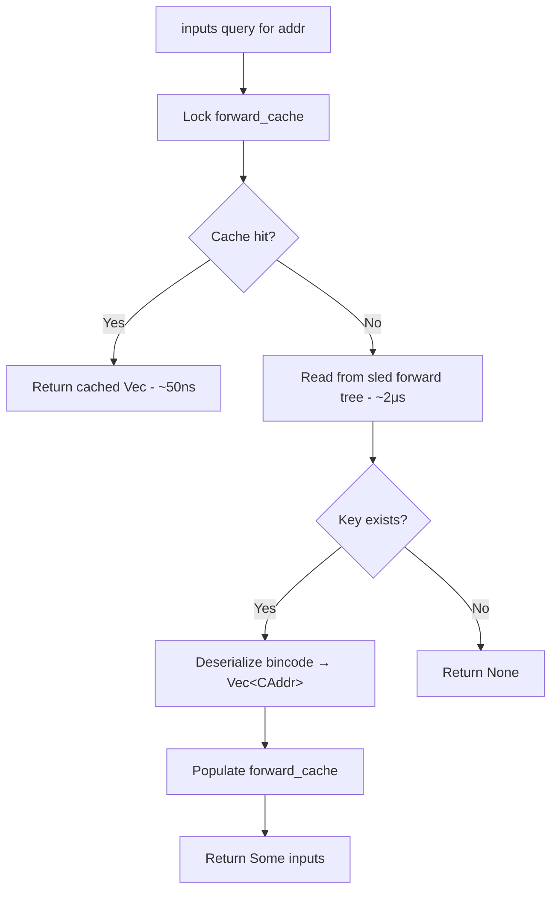
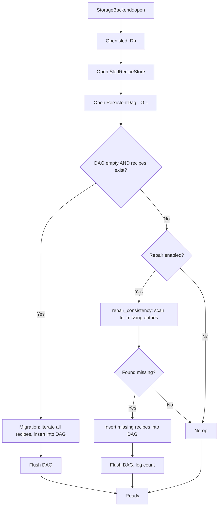

# Design Document: Persistent DAG

## Overview

The Persistent DAG feature replaces the in-memory `DagStore` with a sled-backed `PersistentDag` that stores forward and reverse adjacency lists persistently. This eliminates O(N) startup time (where N is recipe count), reduces memory usage by eliminating duplicated recipe data, and ensures the dependency graph survives process restarts and crashes without reconstruction.

The key architectural insight is that the DAG only needs to store adjacency relationships (which nodes depend on which), not full recipe objects. Recipes are already stored in `SledRecipeStore`. By persisting only the lightweight edge lists and opening sled trees without iteration, startup becomes O(1) regardless of graph size.

### Key Design Decisions

| Decision | Choice | Rationale |
|----------|--------|-----------|
| Storage engine | sled (existing) | Already used for recipe store; share single Db instance |
| Serialization | bincode | Fast, compact, already a project dependency |
| Cache layer | LRU with Mutex | LRU access mutates internal order; sled handles read concurrency |
| Transaction scope | Multi-tree sled transaction | Ensures forward/reverse edge consistency on crash |
| Concurrency | No external RwLock | sled is internally thread-safe; Mutex only on LRU caches |
| Trait abstraction | DagAccess trait | Enables in-memory DagStore for unit tests, PersistentDag for production |

## Architecture



### Startup Flow Comparison



## Components and Interfaces

### DagAccess Trait

The `DagAccess` trait provides a unified interface for DAG operations, implemented by both the in-memory `DagStore` (for testing) and `PersistentDag` (for production).

```rust
/// Trait abstracting DAG operations for testability.
/// Both PersistentDag and DagStore implement this trait.
pub trait DagAccess: Send + Sync {
    fn insert(&self, recipe: &Recipe) -> Result<CAddr>;
    fn contains(&self, addr: &CAddr) -> bool;
    fn inputs(&self, addr: &CAddr) -> Result<Option<Vec<CAddr>>>;
    fn direct_dependents(&self, addr: &CAddr) -> Vec<CAddr>;
    fn transitive_dependents(&self, addr: &CAddr) -> Vec<CAddr>;
    fn resolve_order(&self, addr: &CAddr) -> Vec<CAddr>;
    fn depth(&self, addr: &CAddr) -> u32;
    fn len(&self) -> usize;
    fn is_empty(&self) -> bool;
    fn remove(&self, addr: &CAddr) -> Result<bool>;
}
```

### PersistentDag Struct

```rust
use lru::LruCache;
use std::num::NonZeroUsize;
use std::sync::Mutex;

/// Configuration for PersistentDag cache sizes.
pub struct PersistentDagConfig {
    /// Max entries in forward adjacency cache (default: 10,000)
    pub forward_cache_size: NonZeroUsize,
    /// Max entries in reverse adjacency cache (default: 10,000)
    pub reverse_cache_size: NonZeroUsize,
}

impl Default for PersistentDagConfig {
    fn default() -> Self {
        Self {
            forward_cache_size: NonZeroUsize::new(10_000).unwrap(),
            reverse_cache_size: NonZeroUsize::new(10_000).unwrap(),
        }
    }
}

/// Sled-backed persistent DAG with LRU cache acceleration.
/// Clone + Send + Sync via sled's internal thread-safety.
#[derive(Clone)]
pub struct PersistentDag {
    forward: sled::Tree,                          // dag_forward: addr → bincode(Vec<CAddr>)
    reverse: sled::Tree,                          // dag_reverse: addr → bincode(Vec<CAddr>)
    db: sled::Db,
    forward_cache: Arc<Mutex<LruCache<CAddr, Vec<CAddr>>>>,
    reverse_cache: Arc<Mutex<LruCache<CAddr, Vec<CAddr>>>>,
}
```

### StorageBackend Integration

```rust
pub struct StorageBackend {
    pub recipes: SledRecipeStore,
    pub blobs: BlobStore,
    pub dag: PersistentDag,
    // sled::Db is shared via clone (sled::Db is Arc-based internally)
}

impl StorageBackend {
    pub fn open(root: impl AsRef<Path>) -> Result<Self> {
        let db = sled::open(root.join("storage.sled"))?;
        let recipes = SledRecipeStore::open_with_db(&db)?;
        let dag = PersistentDag::open(&db)?;
        let blobs = BlobStore::open(root.join("blobs"))?;

        // One-time migration if DAG empty but recipes exist
        if dag.is_empty() && !recipes.is_empty() {
            Self::migrate_recipes_to_dag(&recipes, &dag)?;
        }

        Ok(Self { recipes, blobs, dag })
    }

    /// Consistency repair: find recipes in store but not in DAG
    pub fn repair_consistency(&self) -> Result<u64> { ... }
}
```

### ServerState Changes

```rust
// No RwLock needed — sled handles concurrency internally
pub struct ServerState {
    pub dag: PersistentDag,            // was: RwLock<DagStore>
    pub cache: RwLock<EvictableCache>,
    pub registry: FunctionRegistry,
    pub storage: StorageBackend,
}
```

## Data Models

### Sled Tree Layout

Two named sled trees within the shared `sled::Db` instance:

| Tree Name | Key | Key Size | Value | Value Encoding |
|-----------|-----|----------|-------|----------------|
| `dag_forward` | `CAddr` raw bytes | 32 bytes | Ordered input addresses | `bincode(Vec<CAddr>)` |
| `dag_reverse` | `CAddr` raw bytes | 32 bytes | Dependent recipe addresses | `bincode(Vec<CAddr>)` |

The default sled tree continues to store recipe bytes for `SledRecipeStore`.

### Key/Value Schemas

```
dag_forward:
  Key:   [u8; 32]              — CAddr of the recipe
  Value: bincode(Vec<CAddr>)   — ordered list of input addresses
                                  (order matches Recipe.inputs)

dag_reverse:
  Key:   [u8; 32]              — CAddr of an input (leaf or recipe)
  Value: bincode(Vec<CAddr>)   — list of recipe addresses that depend on this input
                                  (no guaranteed order, no duplicates)
```

### Size Estimates

- Each CAddr: 32 bytes
- Average recipe with 3 inputs: forward value = ~100 bytes (bincode overhead + 3×32)
- Average reverse entry with 5 dependents: ~164 bytes
- 100K recipes: ~26 MB on disk for both trees combined (vs ~200+ MB for full Recipe objects in memory)

### Write Path (Insert with Transaction)



### Read Path (with Cache Hit/Miss)



### Startup / Migration / Repair Flows



### Concurrency Model

- **No external RwLock on PersistentDag**: sled trees are internally thread-safe for concurrent reads and writes
- **Mutex on LRU caches**: LRU access (even reads) mutates internal ordering, requiring exclusive access. Contention is low because cache operations are fast (~50ns)
- **Sled transactions**: provide atomicity for multi-tree writes. Transactions may retry on conflict (sled uses optimistic concurrency control)
- **Clone + Send + Sync**: `PersistentDag` derives Clone (sled::Tree and sled::Db are Arc-based). The Mutex<LruCache> is wrapped in Arc for Clone support.

```
Thread 1: insert(recipe_A)    Thread 2: insert(recipe_B)    Thread 3: inputs(addr_X)
    │                              │                              │
    ├─ contains_key? (sled)        ├─ contains_key? (sled)        ├─ cache.lock() → miss
    ├─ transaction {               ├─ transaction {               ├─ sled.get(addr_X)
    │    fwd.insert()              │    fwd.insert()              ├─ cache.lock() → populate
    │    rev.update()              │    rev.update()              └─ return
    │  }                           │  }
    ├─ cache.lock() → populate     ├─ cache.lock() → populate
    └─ return                      └─ return
```

## Correctness Properties

*A property is a characteristic or behavior that should hold true across all valid executions of a system — essentially, a formal statement about what the system should do. Properties serve as the bridge between human-readable specifications and machine-verifiable correctness guarantees.*

### Property 1: Insert-Query Round Trip

*For any* valid Recipe with a non-self-referencing input list, inserting the recipe into the PersistentDag and then querying `inputs(addr)` SHALL return `Some(inputs)` where `inputs` is positionally identical to the original `Recipe.inputs` Vec.

**Validates: Requirements 1.2, 6.1, 6.2, 6.3**

### Property 2: Idempotent Insert

*For any* valid Recipe, inserting it N times (N ≥ 1) into the PersistentDag SHALL produce the same `len()` as inserting it once, the same `inputs()` result, and no error on any insertion.

**Validates: Requirements 1.2, 3.4, 4.1, 4.2, 4.3**

### Property 3: Self-Cycle Rejection Preserves State

*For any* Recipe whose computed address appears in its own input list, calling `insert` SHALL return a `CycleDetected` error, and the DAG state (len, all existing queries) SHALL remain identical to state before the attempted insert.

**Validates: Requirements 1.7, 5.1, 5.2**

### Property 4: Reverse Edge Correctness

*For any* set of successfully inserted recipes, `direct_dependents(addr)` SHALL return exactly the set of recipe addresses whose input lists contain `addr`, with no duplicates and no missing entries.

**Validates: Requirements 1.3, 7.1, 7.2, 7.3**

### Property 5: Remove Correctness

*For any* recipe address present in the DAG, calling `remove(addr)` SHALL return `true`, cause `contains(addr)` to return `false`, and remove `addr` from `direct_dependents` of each of its former inputs. For any address NOT in the DAG, `remove` SHALL return `false` without modifying any state.

**Validates: Requirements 7.5, 11.1, 11.2, 11.3, 11.4, 11.5, 11.6**

### Property 6: Persistence Round Trip

*For any* sequence of insert and remove operations, closing the sled database and reopening the PersistentDag SHALL produce identical results for `contains`, `inputs`, `direct_dependents`, `transitive_dependents`, `resolve_order`, and `depth` queries on all previously inserted addresses.

**Validates: Requirements 1.4, 6.5, 17.5**

### Property 7: Transitive Dependents Completeness

*For any* DAG and any address within it, `transitive_dependents(addr)` SHALL return exactly the set of addresses reachable by following reverse edges via BFS, with each address appearing at most once, the queried address excluded, and direct dependents appearing before their own dependents in the result.

**Validates: Requirements 8.1, 8.2, 8.3, 8.4**

### Property 8: Topological Order Validity

*For any* recipe address in the DAG, `resolve_order(addr)` SHALL return a sequence where for every pair of addresses (A, B), if A is an input to B then A appears before B in the sequence, the queried address appears last, and only addresses present in the forward tree are included.

**Validates: Requirements 9.1, 9.2, 9.3, 9.4**

### Property 9: Depth Computation Correctness

*For any* address in the DAG, `depth(addr)` SHALL return 0 if the address has no entry in the forward tree (leaf), and SHALL return `1 + max(depth(input) for input in inputs)` if it has a non-empty input list.

**Validates: Requirements 10.1, 10.2**

### Property 10: Bincode Serialization Round Trip

*For any* `Vec<CAddr>` of length 0 to 1000, serializing with bincode and then deserializing SHALL produce a value equal to the original.

**Validates: Requirements 1.5**

### Property 11: Model Equivalence (DagStore vs PersistentDag)

*For any* sequence of insert and remove operations applied identically to both a `DagStore` and a `PersistentDag`, all query methods (`contains`, `inputs`, `direct_dependents`, `transitive_dependents`, `resolve_order`, `depth`, `len`) SHALL return equivalent results.

**Validates: Requirements 16.4**

## Error Handling

### Error Categories

| Error Type | Source | Handling Strategy |
|-----------|--------|-------------------|
| `DerivaError::Storage` | sled I/O failures (open, get, insert) | Propagate to caller; do not modify caches |
| `DerivaError::Serialization` | bincode encode/decode failures | Propagate to caller; indicates data corruption |
| `DerivaError::CycleDetected` | Self-referencing recipe | Return error before any I/O; state unchanged |
| Transaction abort | sled conflict or internal failure | Propagate as `DerivaError::Storage`; both trees unchanged |

### Error Propagation Rules

1. **insert**: On transaction failure, neither tree is modified and caches are not updated. Error propagated to caller.
2. **inputs/direct_dependents**: On sled read failure, `inputs` returns `Err`; `direct_dependents` returns empty Vec (graceful degradation for cascade operations).
3. **remove**: On partial failure during reverse edge cleanup, the forward entry may already be removed. This is acceptable because consistency repair on next startup will detect and fix orphaned reverse entries.
4. **open**: If sled::Db or tree open fails, return error immediately — no partial construction of `PersistentDag`.
5. **Migration/Repair**: Individual recipe failures are skipped (logged); the overall operation continues. Final result indicates count of failures.

### Cache Consistency on Error

- Transaction failure: caches remain unmodified (write-through only on success)
- Cache lock poisoning: `lock()` panics are unrecoverable (standard Rust behavior); this is acceptable for a process crash
- Deserialization error on cache miss: error propagated, cache not populated with bad data

## Testing Strategy

### Property-Based Tests (proptest)

Property-based tests validate the 11 correctness properties above using randomly generated DAGs. Each property test runs a minimum of 100 iterations with diverse inputs.

**Library**: `proptest` (already in dev-dependencies)

**Generator strategy**:
- Generate random `CAddr` values (32 random bytes)
- Generate random `Recipe` instances with 1-5 inputs chosen from a pool of leaf addresses
- Generate random operation sequences (inserts and removes) for model-based testing

**Configuration**: Each property test annotated with:
```rust
// Feature: persistent-dag, Property N: <property title>
```

### Unit Tests (example-based)

- Tree creation on fresh database
- PersistentDag implements Clone + Send + Sync (compile-time assertion)
- LRU cache configuration defaults
- Migration trigger conditions
- Consistency repair detection and action
- Error cases: invalid path, corrupt data

### Integration Tests

- Concurrent insert with 8+ threads sharing common input
- O(1) startup timing with large dataset (100K recipes < 10ms)
- Crash recovery via sled transaction atomicity
- Full StorageBackend lifecycle: open → put_recipe → close → reopen → verify
- Memory usage measurement vs in-memory DagStore

### Test File Organization

```
crates/deriva-core/tests/
  persistent_dag.rs          — unit + property tests for PersistentDag
  dag_access_model.rs        — model equivalence property (DagStore vs PersistentDag)

crates/deriva-storage/tests/
  backend.rs                 — integration tests for migration + repair
```
