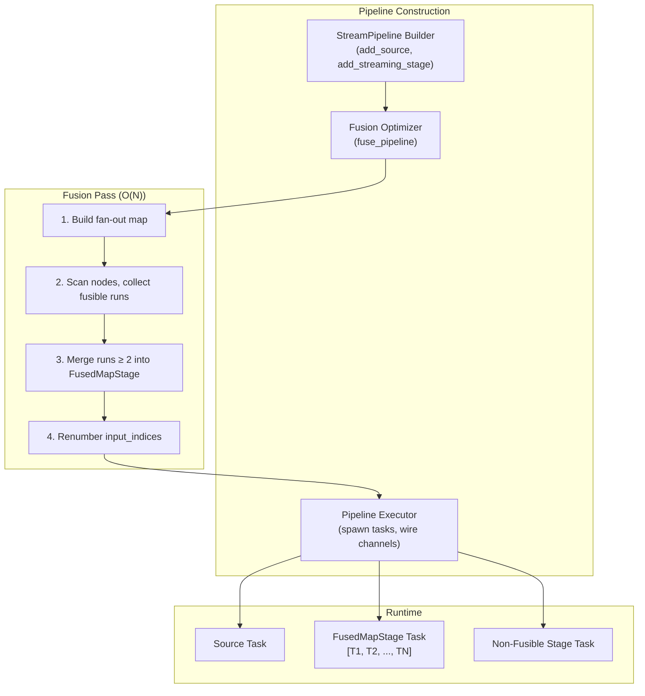
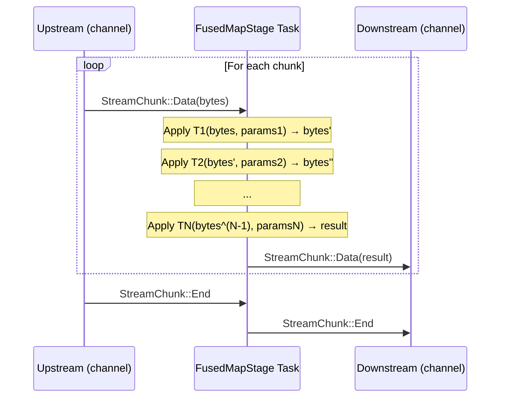
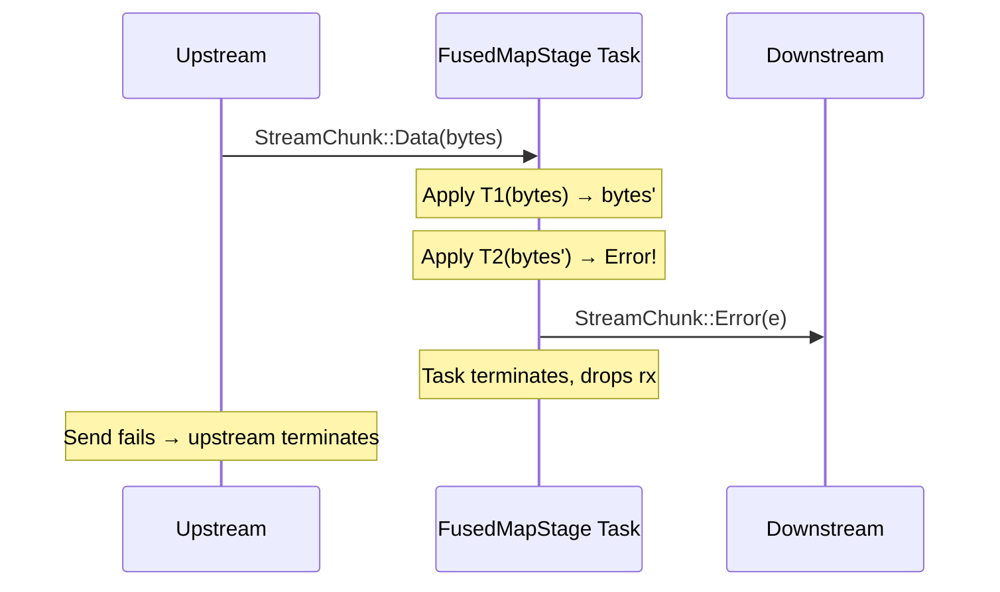

# Design Document: Pipeline Fusion

## Overview

Pipeline Fusion is a construction-time optimizer for Deriva's streaming pipeline that collapses adjacent fusible stages into a single `FusedMapStage`, eliminating inter-stage channel hops. For chains of cheap byte transforms (Identity, Uppercase, XOR, Base64), channel overhead constitutes 5–50% of per-chunk cost. Fusing N stages into 1 eliminates N-1 channel hops, reducing Tokio task count, channel buffer memory, and scheduling overhead while preserving byte-for-byte output equivalence.

The feature consists of three components:
1. **`is_fusible()` trait method** — opt-in metadata on `StreamingComputeFunction` declaring a stage is a pure, stateless, single-input, chunk-by-chunk map.
2. **`FusedMapStage`** — a composite `StreamingComputeFunction` that applies a vector of transforms sequentially per chunk within a single Tokio task.
3. **Fusion optimizer** — an O(N) construction-time pass that scans the pipeline node list, identifies maximal fusible runs, and replaces them with `FusedMapStage` nodes.

### Key Design Decisions

1. **Construction-time fusion**: Fusion runs once at pipeline build time (before `execute()`), not at runtime. This adds zero overhead to per-chunk processing and keeps the runtime path unchanged.
2. **Opt-in via trait method**: Only functions that self-declare as fusible via `is_fusible() → true` are candidates. This prevents accidental fusion of stateful or multi-input stages.
3. **Direct function application (no mini-channels)**: Instead of calling each stage's `stream_execute()` with synthetic channels per chunk, the `FusedMapStage` extracts `Fn(&[u8], &HashMap) -> Result<Bytes>` semantics by calling `stream_execute` once with a single-chunk stream and collecting the output. Future optimization can add a `map_chunk()` trait method for zero-allocation direct invocation.
4. **FusedMapStage is not itself fusible**: `is_fusible()` returns `false` on `FusedMapStage` to prevent recursive/nested fusion — a fused group is always a terminal fusion unit.
5. **Enabled by default**: The `enable_fusion` flag defaults to `true` because the optimization is semantically safe (only affects opt-in stages) and the optimizer pass cost is negligible.

## Architecture



### Pipeline Transformation Example

```
Before fusion (5 nodes, 4 channels, 5 tasks):

  Source → Uppercase → Lowercase → XorCipher → Sha256
   [0]       [1]         [2]         [3]        [4]

Fusion analysis:
  [1] Uppercase:  is_fusible=true, input=[0], fan_out[0]=1 → candidate
  [2] Lowercase:  is_fusible=true, input=[1], fan_out[1]=1 → candidate (extends run)
  [3] XorCipher:  is_fusible=true, input=[2], fan_out[2]=1 → candidate (extends run)
  [4] Sha256:     is_fusible=false → flush run [1,2,3], emit Sha256

After fusion (3 nodes, 2 channels, 3 tasks):

  Source → FusedMap[Upper, Lower, Xor] → Sha256
   [0]              [1]                    [2]

Eliminated: 2 channels, 2 tasks
```

### Partial Fusion with Boundaries

```
Before: Source → F1 → F2 → Resizer → F3 → F4 → Sha256
         [0]    [1]  [2]    [3]      [4]  [5]   [6]

After:  Source → FusedMap[F1,F2] → Resizer → FusedMap[F3,F4] → Sha256
         [0]         [1]            [2]           [3]            [4]

Eliminated: 2 channels, 2 tasks (two fused groups of 2)
```

## Components and Interfaces

### StreamingComputeFunction Trait (extended)

```rust
#[async_trait]
pub trait StreamingComputeFunction: Send + Sync {
    /// Process streaming inputs and produce streaming output.
    async fn stream_execute(
        &self,
        inputs: Vec<mpsc::Receiver<StreamChunk>>,
        params: &HashMap<String, String>,
    ) -> mpsc::Receiver<StreamChunk>;

    fn supports_streaming(&self) -> bool { true }
    fn preferred_chunk_size(&self) -> usize { DEFAULT_CHUNK_SIZE }
    fn channel_capacity(&self) -> usize { DEFAULT_CHANNEL_CAPACITY }

    /// Whether this function can be fused with adjacent fusible stages.
    ///
    /// Return `true` only if the function is a pure, stateless, single-input,
    /// single-output chunk-by-chunk transform that produces exactly one output
    /// chunk per input chunk with no internal buffering.
    fn is_fusible(&self) -> bool { false }

    fn metric_name(&self) -> &'static str {
        let full = std::any::type_name::<Self>();
        full.rsplit("::").next().unwrap_or(full)
    }
}
```

The `is_fusible()` method already exists in the codebase with a `false` default. The 9 core map builtins already override it to `true`. Additional fusible builtins (HexEncode, HexDecode, LineEnding, Base32Encode, Base32Decode, Pad, Trim, BitwiseAnd, BitwiseOr, BitwiseNot, ByteSwap, ChunkHash) also return `true`.

### FusedMapStage

```rust
/// A composite streaming stage that applies a chain of fusible transforms
/// sequentially per chunk within a single Tokio task.
pub struct FusedMapStage {
    /// Ordered vector of (function, params) pairs. Applied in sequence per chunk.
    stages: Vec<(Arc<dyn StreamingComputeFunction>, HashMap<String, String>)>,
}

impl FusedMapStage {
    /// Create a new fused stage. Panics if stages.len() < 2.
    pub fn new(
        stages: Vec<(Arc<dyn StreamingComputeFunction>, HashMap<String, String>)>,
    ) -> Self;

    /// Number of contained transforms.
    pub fn len(&self) -> usize;

    /// Names of contained transforms (for observability).
    pub fn stage_names(&self) -> Vec<&'static str>;
}

#[async_trait]
impl StreamingComputeFunction for FusedMapStage {
    async fn stream_execute(
        &self,
        inputs: Vec<mpsc::Receiver<StreamChunk>>,
        _params: &HashMap<String, String>,
    ) -> mpsc::Receiver<StreamChunk>;

    fn is_fusible(&self) -> bool { false }

    fn metric_name(&self) -> &'static str { "FusedMapStage" }
}
```

### Fusion Optimizer

```rust
/// Fuse adjacent fusible streaming stages into FusedMapStage nodes.
///
/// Returns a new node list with fusible chains merged. Non-fusible nodes
/// pass through unchanged. Input indices are renumbered.
///
/// Time complexity: O(N) where N = number of pipeline nodes.
pub fn fuse_pipeline(nodes: Vec<PipelineNode>) -> (Vec<PipelineNode>, FusionStats);

/// Statistics from a fusion pass.
#[derive(Debug, Clone, Default)]
pub struct FusionStats {
    pub original_count: usize,
    pub fused_count: usize,
    pub stages_eliminated: usize,
    pub fused_groups: usize,
}
```

### PipelineConfig (extended)

```rust
#[derive(Debug, Clone)]
pub struct PipelineConfig {
    pub chunk_size: usize,
    pub channel_capacity: usize,
    pub cache_intermediates: bool,
    pub memory_budget: usize,
    pub enable_fusion: bool, // NEW — default true
}

impl Default for PipelineConfig {
    fn default() -> Self {
        Self {
            chunk_size: DEFAULT_CHUNK_SIZE,
            channel_capacity: DEFAULT_CHANNEL_CAPACITY,
            cache_intermediates: true,
            memory_budget: 0,
            enable_fusion: true,
        }
    }
}
```

### StreamPipeline::execute (modified)

```rust
impl StreamPipeline {
    pub async fn execute(self) -> Result<mpsc::Receiver<StreamChunk>, DerivaError> {
        let start = std::time::Instant::now();
        metrics::STREAM_PIPELINES_TOTAL.inc();

        // NEW: Apply fusion pass if enabled.
        let nodes = if self.config.enable_fusion {
            let (fused_nodes, stats) = fuse_pipeline(self.nodes);
            if stats.stages_eliminated > 0 {
                metrics::record_fusion(stats.stages_eliminated);
                tracing::debug!(
                    original = stats.original_count,
                    fused = stats.fused_count,
                    eliminated = stats.stages_eliminated,
                    groups = stats.fused_groups,
                    "pipeline fusion applied"
                );
            }
            fused_nodes
        } else {
            self.nodes
        };

        // Remainder of execute() unchanged — iterates `nodes` instead of `self.nodes`
        // ...
    }
}
```

## Data Models

### PipelineNode (existing enum, unchanged)

```rust
enum PipelineNode {
    Source { _addr: CAddr, data: Bytes },
    Cached { _addr: CAddr, data: Bytes },
    StreamingStage {
        _addr: CAddr,
        function: Arc<dyn StreamingComputeFunction>,
        params: HashMap<String, String>,
        input_indices: Vec<usize>,
    },
    BatchStage {
        _addr: CAddr,
        function: Arc<dyn ComputeFunction>,
        params: BTreeMap<String, Value>,
        input_indices: Vec<usize>,
    },
}
```

No changes to `PipelineNode` — `FusedMapStage` is stored as a `StreamingStage` node because it implements `StreamingComputeFunction`.

### FusionStats

```rust
#[derive(Debug, Clone, Default)]
pub struct FusionStats {
    /// Original number of pipeline nodes before fusion.
    pub original_count: usize,
    /// Number of nodes after fusion.
    pub fused_count: usize,
    /// Number of stages eliminated (original - fused).
    pub stages_eliminated: usize,
    /// Number of FusedMapStage groups created.
    pub fused_groups: usize,
}
```

### Fusibility Classification (complete)

| # | Function | `is_fusible()` | Reason |
|---|----------|---------------|--------|
| 1 | StreamingIdentity | `true` | Stateless passthrough |
| 2 | StreamingUppercase | `true` | Pure byte transform |
| 3 | StreamingLowercase | `true` | Pure byte transform |
| 4 | StreamingReverse | `true` | Pure byte transform |
| 5 | StreamingBase64Encode | `true` | Pure byte transform |
| 6 | StreamingBase64Decode | `true` | Pure byte transform |
| 7 | StreamingXor | `true` | Stateless param-dependent byte transform |
| 8 | StreamingCompress | `true` | Per-chunk independent compression |
| 9 | StreamingDecompress | `true` | Per-chunk independent decompression |
| 10 | StreamingHexEncode | `true` | Pure byte transform |
| 11 | StreamingHexDecode | `true` | Pure byte transform |
| 12 | StreamingBase32Encode | `true` | Pure byte transform |
| 13 | StreamingBase32Decode | `true` | Pure byte transform |
| 14 | StreamingLineEnding | `true` | Pure byte transform |
| 15 | StreamingPad | `true` | Pure byte transform |
| 16 | StreamingTrim | `true` | Pure byte transform |
| 17 | StreamingBitwiseAnd | `true` | Stateless param-dependent byte transform |
| 18 | StreamingBitwiseOr | `true` | Stateless param-dependent byte transform |
| 19 | StreamingBitwiseNot | `true` | Stateless byte transform |
| 20 | StreamingByteSwap | `true` | Stateless param-dependent byte transform |
| 21 | StreamingChunkHash | `true` | Per-chunk independent hash |
| — | StreamingSha256 | `false` | Accumulator — consumes all before emitting |
| — | StreamingByteCount | `false` | Accumulator |
| — | StreamingChecksum | `false` | Accumulator |
| — | StreamingConcat | `false` | Multi-input combiner |
| — | StreamingInterleave | `false` | Multi-input combiner |
| — | StreamingZipConcat | `false` | Multi-input combiner |
| — | StreamingChunkResizer | `false` | Stateful — changes chunk boundaries |
| — | StreamingTake | `false` | Stateful byte counter |
| — | StreamingSkip | `false` | Stateful byte counter |
| — | StreamingRepeat | `false` | Accumulates full input |
| — | StreamingTeeCount | `false` | Stateful counter |
| — | FusedMapStage | `false` | Already fused — no recursive fusion |

### Fusion Optimizer Algorithm

```
Algorithm: fuse_pipeline(nodes) → (nodes', stats)

Input:  Vec<PipelineNode> — ordered node list
Output: (Vec<PipelineNode>, FusionStats)

1. If nodes.len() < 2: return unchanged.

2. Build fan_out map:
   fan_out[i] = count of nodes where i ∈ input_indices
   Time: O(N × avg_inputs) = O(N) for linear pipelines

3. Scan nodes left to right. Maintain current_run: Vec<(index, function, params)>

4. For each node[i]:
   a. Check if fusible candidate:
      - node is StreamingStage
      - function.is_fusible() == true
      - input_indices.len() == 1
      - input_indices[0] == i - 1  (adjacent predecessor)
      - fan_out[i - 1] == 1  (no other consumer of predecessor)

   b. If candidate: push to current_run, continue

   c. If NOT candidate:
      - Flush current_run:
        * If run.len() >= 2: create FusedMapStage, push as single node
        * If run.len() == 1: push stage as-is (no fusion for singletons)
        * If run.len() == 0: no-op
      - Push current node
      - Reset current_run

5. After loop: flush any remaining run.

6. Renumber: build index_map[old] → new, update all input_indices.

7. Return (result, stats).
```

### FusedMapStage Execution Flow



### Error Flow in FusedMapStage



### Interaction with Other Pipeline Features

| Feature | Interaction | Resolution |
|---------|------------|------------|
| §2.7 Streaming Materialization | Foundation — fusion builds on the existing pipeline executor | Fusion modifies the node list before executor runs |
| §2.9 Size-Aware Mode Selection | Mode selection picks streaming vs batch first | Fusion only applies to streaming stages, runs after mode selection |
| §2.10 Adaptive Chunk Sizing | ChunkResizer is NOT fusible | Resizer breaks fusible chains into separate groups |
| §2.12 Memory Budget | Fewer channels = less buffered memory | Fusion helps memory budget compliance |
| §2.13 Streaming-Aware Caching | Cache intermediates flag | Fused stages don't produce cacheable intermediates (by design) |
| Observability (§2.5) | Fused stages report as single unit | Individual stage metrics lost, but fusion metrics added |

## Correctness Properties

*A property is a characteristic or behavior that should hold true across all valid executions of a system — essentially, a formal statement about what the system should do. Properties serve as the bridge between human-readable specifications and machine-verifiable correctness guarantees.*

### Property 1: Output equivalence (fused vs unfused)

*For any* sequence of fusible transforms [T1, T2, ..., TN] with associated parameters, and *for any* valid input byte sequence, executing the transforms as a FusedMapStage SHALL produce byte-identical output to executing them as N separate stages connected by channels.

**Validates: Requirements 3.7, 4.4, 5.1, 5.2**

### Property 2: Optimizer produces maximal fusible groups

*For any* pipeline node list containing a mix of fusible and non-fusible stages with varying fan-out, the fusion optimizer SHALL produce a result where: (a) every fusible run of length ≥ 2 satisfying all four criteria (is_fusible=true, single input, adjacent predecessor, fan_out=1) is merged into a single FusedMapStage, (b) no FusedMapStage contains a stage that violates any criterion, (c) no two adjacent stages in the output could be further merged (maximality), and (d) single fusible stages surrounded by non-fusible boundaries remain unchanged.

**Validates: Requirements 3.1, 3.2, 3.3, 3.4, 5.3, 5.4, 6.1, 6.2**

### Property 3: Index renumbering preserves data flow

*For any* pipeline node list, after the fusion optimizer runs, all `input_indices` in the resulting node list SHALL point to valid node positions (0 ≤ idx < len), and the logical data flow graph (which node feeds which) SHALL be isomorphic to the original graph with fused groups collapsed.

**Validates: Requirements 3.5**

### Property 4: Error passthrough from input stream

*For any* FusedMapStage and *for any* input stream that contains a `StreamChunk::Error`, the error SHALL appear in the output stream without any transforms being applied to it, and subsequent chunks SHALL not be processed.

**Validates: Requirements 2.5, 7.1**

### Property 5: Internal transform error propagation

*For any* FusedMapStage containing a transform that errors on a given input chunk, the fused stage SHALL emit `StreamChunk::Error` immediately upon that transform's failure, SHALL not apply subsequent transforms in the chain, and SHALL not process further input chunks.

**Validates: Requirements 2.6, 7.2**

### Property 6: Per-stage parameter preservation

*For any* FusedMapStage containing parameterized transforms with distinct parameter sets, each transform Ti SHALL receive exactly its associated parameters when processing a chunk, and the output SHALL be equivalent to applying each Ti with its own parameters sequentially.

**Validates: Requirements 8.1, 8.2, 8.3**

### Property 7: Stage elimination count

*For any* pipeline of N consecutive fusible stages (all satisfying fusion criteria), the fused pipeline SHALL contain exactly 1 node for the fused group instead of N, eliminating exactly N-1 stages.

**Validates: Requirements 10.1, 10.2**

## Error Handling

| Error Condition | Handling | Effect |
|----------------|----------|--------|
| Transform returns error during chunk processing | FusedMapStage emits `StreamChunk::Error`, terminates task | Upstream cancellation via dropped rx |
| Input stream emits `StreamChunk::Error` | FusedMapStage forwards error to output, terminates | Same error semantics as unfused pipeline |
| Input channel closed without End/Error | FusedMapStage task returns (terminates gracefully) | No panic; output channel closes naturally |
| Output receiver dropped (downstream cancellation) | `tx.send()` returns `Err`; task drops rx and terminates | Cancellation propagates upstream via dropped input rx |
| FusedMapStage constructed with < 2 stages | `debug_assert!` in `new()` panics in debug; no-op in release | Programming error — optimizer guarantees ≥ 2 |
| Fusion optimizer receives empty node list | Returns unchanged empty list, stats show 0 eliminated | No-op — valid edge case |
| `enable_fusion = false` | Optimizer pass is skipped entirely | Pipeline executes identically to pre-fusion behavior |

### Error Propagation Strategy

The FusedMapStage follows the same error contract as all `StreamingComputeFunction` implementations:
1. Any `Error` from the input stream is forwarded immediately — no transforms applied.
2. If a transform produces an error, it becomes the output `Error` — processing stops.
3. The task terminates on any terminal condition (End, Error, channel close).
4. Cancellation propagates via Rust's drop semantics on `mpsc::Receiver`.

This ensures the fused pipeline has identical failure semantics to the unfused pipeline — errors appear at the same logical point and propagate the same way.

## Testing Strategy

### Unit Tests

- **is_fusible() declarations**: Verify all fusible builtins return `true`, all non-fusible return `false`.
- **FusedMapStage construction**: Verify panics with < 2 stages, accepts ≥ 2.
- **FusedMapStage basic execution**: Single chunk through 2–5 transforms, verify output.
- **FusedMapStage End forwarding**: Verify End passes through.
- **FusedMapStage Error forwarding**: Verify input Error passes through.
- **FusedMapStage internal error**: Verify mid-chain error terminates processing.
- **Fusion optimizer — linear chain**: All-fusible chain → single FusedMapStage.
- **Fusion optimizer — single stage**: One fusible stage → no fusion.
- **Fusion optimizer — mixed pipeline**: Fusible, non-fusible, fusible → two groups.
- **Fusion optimizer — fan-out boundary**: Stage with fan-out > 1 prevents fusion.
- **Fusion optimizer — BatchStage boundary**: Batch stage between fusible stages creates boundary.
- **Index renumbering**: Verify all indices valid after fusion.
- **Parameter preservation**: XorCipher(0xAA) + XorCipher(0x55) = XorCipher(0xFF).
- **PipelineConfig default**: Verify `enable_fusion` defaults to `true`.
- **enable_fusion=false**: Verify optimizer is skipped.

### Property-Based Tests (using `proptest` crate)

Each property maps to a property-based test running minimum 100 iterations:

| Property | Generator Strategy |
|----------|-------------------|
| P1: Output equivalence | Generate random byte vectors (1–256 KB), random subsets of fusible transforms (2–8), run fused vs unfused, compare byte-for-byte |
| P2: Optimizer maximal groups | Generate random pipeline topologies (3–30 nodes) with random fusibility flags, fan-out patterns, verify post-conditions |
| P3: Index renumbering | Generate random pipelines (5–50 nodes), run optimizer, verify all input_indices are valid and data flow preserved |
| P4: Error passthrough | Generate random byte sequences + random error injection point, verify error appears in output unchanged |
| P5: Internal error propagation | Generate random data + random failing transform position in chain, verify error emitted, no subsequent output |
| P6: Parameter preservation | Generate random parameter maps for N parameterized stages, verify fused output matches sequential application with per-stage params |
| P7: Stage elimination | Generate random N (2–20), create all-fusible chain, verify result has 1 fused node |

**Configuration:**
- Minimum 100 iterations per property test (`proptest` default is 256)
- Tag format: `// Feature: pipeline-fusion, Property N: <description>`
- Generator for pipelines: random mix of fusible/non-fusible stages, random input data sizes, random parameters

### Integration Tests

- End-to-end pipeline execution with fusion enabled vs disabled, byte-compare outputs.
- Mixed pipeline (fusible + accumulator + fusible) producing correct final result.
- Metrics: verify `stages_eliminated` metric incremented after fusion.
- Debug logging: verify fusion log message emitted with correct counts.
- Cancellation: drop output receiver mid-stream, verify upstream cleanup.
- Large pipeline (50+ stages) with multiple fused groups, verify correctness.
