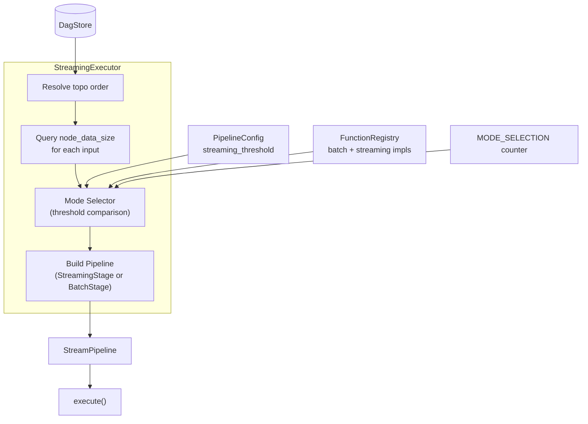
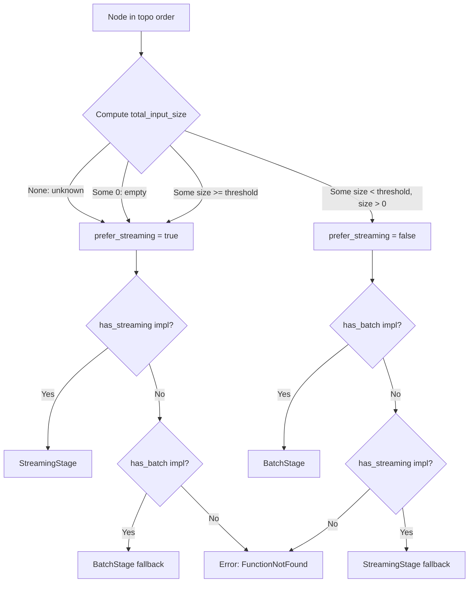

# Design Document: Size-Aware Mode Selection

## Overview

Size-Aware Mode Selection adds intelligent per-node execution mode selection to the `StreamingExecutor`. Instead of unconditionally choosing streaming mode whenever a `StreamingComputeFunction` is registered (the §2.7 behavior), the executor now inspects the total input size for each pipeline node and selects batch or streaming based on a configurable threshold (default 3 MB).

Below the threshold, batch execution avoids streaming overhead (task spawning, channel allocation, chunk framing). Above the threshold, streaming retains its advantages of pipeline parallelism and bounded memory. The decision is O(1) per node (plus O(k) for k inputs to sum), uses a 3-way fallback chain for correctness, and produces hybrid pipelines that the existing §2.7 infrastructure already supports.

### Key Design Decisions

1. **Per-node decision, not per-pipeline**: Each node independently selects its mode based on its own input sizes. This allows optimal mode mixing within a single pipeline execution (e.g., small-input stages run batch, large-input stages run streaming).
2. **Conservative unknown-size handling**: If any input to a node has unknown size (computed node output), the selector defaults to streaming. This is safe because streaming always works with bounded memory, while batch requires materializing all inputs.
3. **Single threshold configuration**: Rather than per-function thresholds or complex heuristics, a single `streaming_threshold` on `PipelineConfig` keeps the API simple and tunable. Special values (0, usize::MAX) allow forcing either mode.
4. **Fallback chain**: When the preferred mode's implementation is unavailable, the selector falls back to the other mode. This ensures pipelines always execute correctly regardless of which implementations are registered.
5. **Zero behavioral change at threshold=0**: Setting `streaming_threshold = 0` produces identical behavior to pre-§2.9 always-streaming logic, providing a safe rollback mechanism.

## Architecture



### Mode Selection Decision Flow



### Hybrid Pipeline Example

```
Recipe: Z = compress(concat(A, B))
  A = 500 KB leaf, B = 800 KB leaf
  threshold = 3 MB

  concat: total input = 1.3 MB < 3 MB → BatchStage
  compress: input from concat (unknown size) → StreamingStage

  Pipeline:
    Source(A) ──┐
                ├──▶ BatchStage(concat) ──▶ batch_to_stream ──▶ StreamingStage(compress) ──▶ output
    Source(B) ──┘
```

## Components and Interfaces

### PipelineConfig (extended)

```rust
/// Default streaming threshold: 3 MB.
pub const DEFAULT_STREAMING_THRESHOLD: usize = 3 * 1024 * 1024;

#[derive(Debug, Clone)]
pub struct PipelineConfig {
    pub chunk_size: usize,            // 64 KB default
    pub channel_capacity: usize,      // 8 default
    pub cache_intermediates: bool,    // true default
    pub memory_budget: usize,         // 0 default (unlimited)
    pub streaming_threshold: usize,   // 3 MB default (NEW)
}
```

The `streaming_threshold` field controls mode selection:
- `0` → always prefer streaming (§2.7 compatibility)
- `usize::MAX` → always prefer batch
- `3 * 1024 * 1024` → default crossover point from benchmark data

### StreamPipeline (new query methods)

```rust
impl StreamPipeline {
    /// Returns the known data size for a pipeline node, or None for computed nodes.
    pub fn node_data_size(&self, idx: usize) -> Option<usize>;

    /// Returns the total known input size for a set of input indices.
    /// Returns None if any input has unknown size.
    pub fn total_input_size(&self, input_indices: &[usize]) -> Option<usize>;
}
```

These methods enable the mode selector to query input sizes without exposing internal node structure.

### StreamingExecutor (modified `materialize_streaming`)

The core selection logic replaces the current "streaming-if-available" branch:

```rust
impl StreamingExecutor {
    pub async fn materialize_streaming(
        &self,
        addr: &CAddr,
        dag: &dyn DagReader,
        cache: &dyn AsyncMaterializationCache,
        leaf_store: &dyn AsyncLeafStore,
        registry: &FunctionRegistry,
    ) -> Result<mpsc::Receiver<StreamChunk>, DerivaError> {
        // ... (topo order resolution, input resolution unchanged) ...

        // NEW: Size-aware mode selection per node
        let input_size = pipeline.total_input_size(&input_indices);
        let prefer_streaming = match input_size {
            None => true,       // unknown → streaming (safe)
            Some(0) => true,    // empty → streaming
            Some(s) => s >= self.config.streaming_threshold,
        };

        // 3-way fallback selection
        let idx = select_with_fallback(
            prefer_streaming, func_id, &registry, &mut pipeline,
            *topo_addr, params, input_indices,
        );
    }
}
```

### Mode Selection Metrics

```rust
// New metrics in metrics.rs
lazy_static! {
    pub static ref MODE_SELECTION: IntCounterVec = register_int_counter_vec!(
        "deriva_mode_selection_total",
        "Execution mode selections by mode and reason",
        &["mode", "reason"]
    ).unwrap();

    pub static ref STREAMING_THRESHOLD_GAUGE: IntGauge = register_int_gauge!(
        "deriva_streaming_threshold_bytes",
        "Configured streaming threshold in bytes"
    ).unwrap();
}
```

Labels for `mode`: `"batch"`, `"streaming"`
Labels for `reason`: `"below_threshold"`, `"above_threshold"`, `"unknown_size"`, `"no_batch_impl"`, `"no_streaming_impl"`

### FunctionRegistry (no changes)

The existing `FunctionRegistry` already provides `get()`, `get_streaming()`, `has_streaming()`, and `contains()` methods. No API changes needed — the mode selector uses these existing queries.

## Data Models

### PipelineConfig (extended struct)

| Field | Type | Default | Description |
|-------|------|---------|-------------|
| `chunk_size` | `usize` | `65536` (64 KB) | Chunk size for streaming |
| `channel_capacity` | `usize` | `8` | Bounded channel capacity |
| `cache_intermediates` | `bool` | `true` | Whether to cache intermediate results |
| `memory_budget` | `usize` | `0` | Memory budget (0 = unlimited) |
| `streaming_threshold` | `usize` | `3145728` (3 MB) | **NEW** — Size threshold for mode selection |

### Mode Selection Decision (internal, not persisted)

| Input | Type | Description |
|-------|------|-------------|
| `input_size` | `Option<usize>` | Total input size; None if any input is unknown |
| `prefer_streaming` | `bool` | Whether streaming is the preferred mode |
| `has_streaming` | `bool` | Whether a streaming impl exists in registry |
| `has_batch` | `bool` | Whether a batch impl exists in registry |

| Output | Type | Description |
|--------|------|-------------|
| Selected mode | `StreamingStage` or `BatchStage` | The pipeline node variant to construct |
| Metric labels | `(mode, reason)` | Labels emitted to MODE_SELECTION counter |

### Telemetry Data

| Metric | Type | Labels | Description |
|--------|------|--------|-------------|
| `deriva_mode_selection_total` | IntCounterVec | `mode`, `reason` | Per-decision counter |
| `deriva_streaming_threshold_bytes` | IntGauge | — | Current threshold value |


## Correctness Properties

*A property is a characteristic or behavior that should hold true across all valid executions of a system — essentially, a formal statement about what the system should do. Properties serve as the bridge between human-readable specifications and machine-verifiable correctness guarantees.*

### Property 1: Node data size reflects stored data length

*For any* Bytes value of arbitrary length n, when stored as a Source or Cached node in a StreamPipeline, `node_data_size` SHALL return `Some(n)` where n equals the byte length of the stored data.

**Validates: Requirements 2.1, 2.2**

### Property 2: Total input size is the sum of known parts

*For any* set of Source and/or Cached pipeline nodes with known sizes s₁, s₂, ..., sₖ, `total_input_size` called with their indices SHALL return `Some(s₁ + s₂ + ... + sₖ)`.

**Validates: Requirements 3.1**

### Property 3: Unknown input propagates to unknown total

*For any* set of pipeline node indices that includes at least one computed node (StreamingStage or BatchStage), `total_input_size` SHALL return `None`, regardless of the sizes of other known-size nodes in the set.

**Validates: Requirements 3.2**

### Property 4: Threshold decision correctness

*For any* `streaming_threshold` value T and total input size result:
- If input size is `None` → `prefer_streaming` is `true`
- If input size is `Some(0)` → `prefer_streaming` is `true`
- If input size is `Some(s)` where `s >= T` → `prefer_streaming` is `true`
- If input size is `Some(s)` where `0 < s < T` → `prefer_streaming` is `false`

In particular:
- When T = 0, `prefer_streaming` is `true` for all known non-zero sizes (since `s >= 0` is always true), matching §2.7 always-streaming behavior.
- When T = `usize::MAX`, `prefer_streaming` is `false` for all known sizes below `usize::MAX`, selecting batch.

**Validates: Requirements 1.2, 1.3, 4.1, 4.2, 4.3, 4.4, 9.1**

### Property 5: Preferred mode selected when implementation exists

*For any* function key and mode preference (streaming or batch), if the preferred mode's implementation exists in the FunctionRegistry, the mode selector SHALL select that mode's stage type (StreamingStage for streaming preference, BatchStage for batch preference).

**Validates: Requirements 5.1, 5.3**

### Property 6: Fallback to alternate mode when preferred unavailable

*For any* function key and mode preference where the preferred mode's implementation does NOT exist but the alternate mode's implementation DOES exist, the mode selector SHALL select the alternate mode's stage type as a fallback.

**Validates: Requirements 5.2, 5.4**

### Property 7: Pipeline execution preserves computational correctness

*For any* valid recipe DAG with inputs of varying sizes (some below threshold, some above), executing the pipeline with size-aware mode selection SHALL produce the same output as executing the same pipeline with all-streaming or all-batch mode, verifying that mode selection does not affect computation results.

**Validates: Requirements 6.2, 6.3**

## Error Handling

### Function Not Found

When neither a batch nor a streaming implementation exists for a function key, the mode selector returns `DerivaError::FunctionNotFound`. This matches the existing §2.7 behavior and propagates up to the caller of `materialize_streaming`.

### Input Resolution Failures

Input resolution failures (leaf not found, cache miss on non-leaf, DAG inconsistency) are handled by the existing topo-order resolution logic in `StreamingExecutor`. These are unchanged by mode selection.

### Overflow in Size Summation

`total_input_size` uses `usize` addition. In practice, overflow is not a concern because:
- Individual node sizes are bounded by available memory
- The sum of inputs to a single node is bounded by the number of inputs × max blob size
- If overflow were possible (theoretical only), Rust's default behavior wraps in release mode. To be defensive, the implementation could use `checked_add` and return `None` on overflow (treating it as unknown size, defaulting to streaming). This is the safe path.

### Metric Registration Failures

Prometheus metric registration uses `lazy_static!` with `.unwrap()`, consistent with the existing metrics infrastructure. Registration failure at startup is a fatal error (indicates conflicting metric names), which is appropriate since it represents a programming error.

## Testing Strategy

### Property-Based Tests (using `proptest`)

Property-based testing is well-suited to this feature because:
- The mode selection algorithm is a pure function of (input_size, threshold, registry_state)
- Input variation (sizes, thresholds, registry combinations) reveals edge cases
- Universal properties (threshold boundary, fallback chain) hold across all valid inputs
- The functions under test are fast (in-memory, no I/O)

**Configuration**: Minimum 100 iterations per property test (proptest default is 256).

Each property test references its design document property:

```rust
// Feature: size-aware-mode-selection, Property 4: Threshold decision correctness
proptest! {
    #[test]
    fn prop_threshold_decision(size in 0..usize::MAX, threshold in 0..usize::MAX) {
        // ...
    }
}
```

**Tag format**: `Feature: size-aware-mode-selection, Property {N}: {title}`

### Unit Tests (example-based)

- `PipelineConfig::default().streaming_threshold == 3145728` (Req 1.1, 1.5)
- `node_data_size` returns `None` for StreamingStage (Req 2.3)
- `node_data_size` returns `None` for BatchStage (Req 2.4)
- `total_input_size` with empty indices returns `Some(0)` (Req 3.3)
- Mixed-mode pipeline produces correct output (Req 6.1)
- FunctionNotFound error when no impl exists (Req 5.5)
- Threshold=0 with batch-only function selects BatchStage (Req 9.2)
- Default threshold != 0 (Req 9.3)
- Metric counter increments for each selection reason (Req 7.2–7.6)
- Gauge set on executor construction (Req 7.8)

### Integration Tests

- End-to-end pipeline execution with small inputs (< 3 MB) verifying batch path taken and correct output
- End-to-end pipeline execution with large inputs (>= 3 MB) verifying streaming path and correct output
- Hybrid pipeline with mixed-size inputs producing correct output through batch_to_stream adapter
- Multi-node pipeline where different nodes select different modes

### Smoke Tests

- `deriva_mode_selection_total` metric exists with expected label structure (Req 7.1)
- `deriva_streaming_threshold_bytes` gauge exists (Req 7.7)
- PipelineConfig accepts extreme values (0, usize::MAX) without panic (Req 1.4)

### Performance Verification

- Benchmark confirming mode selection decision adds < 100 ns overhead per node (Req 8.1–8.3)
- Regression benchmark against §2.7 baseline for small inputs (< 3 MB) showing improvement
- Regression benchmark for large inputs (>= 3 MB) showing no degradation
