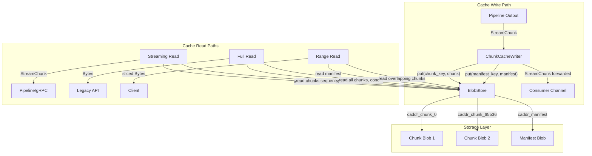
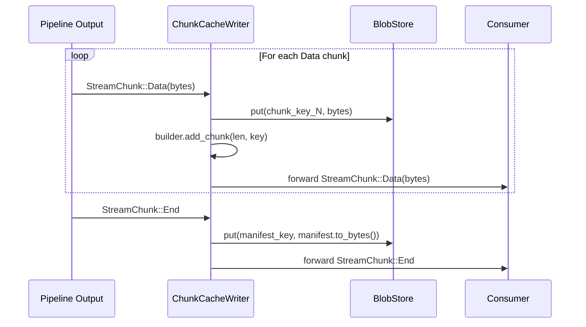
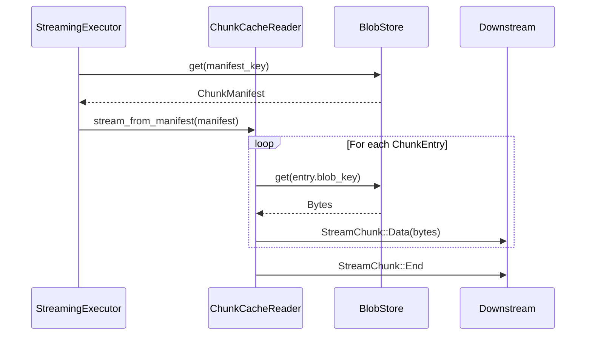

# Design Document: Streaming-Aware Caching

## Overview

Streaming-Aware Caching extends the Deriva caching layer to store computed values as ordered chunks with a manifest index, enabling incremental cache writes during streaming, bounded-memory cache reads, and byte-range reads. This eliminates the "cache-after-collect" bottleneck where the entire output must be buffered in memory before caching — a requirement that defeats streaming's bounded-memory guarantee for large values.

The design introduces a two-tier model: individual chunks stored as separate blobs in BlobStore, and a ChunkManifest that tracks the ordered sequence. Cache writes happen as chunks flow through the pipeline (one chunk in memory at a time), cache reads stream chunks sequentially from storage, and range reads fetch only overlapping chunks.

### Key Design Decisions

1. **Manifest-based indexing**: A ChunkManifest stored alongside chunks provides O(1) lookup for range reads and enables GC to enumerate all chunks for a value.
2. **Size-based path selection**: Values below `chunk_cache_threshold` (default 1MB) use monolithic caching. Values above (or unknown size) use chunk-level. This avoids manifest overhead for small values.
3. **Atomic commit via manifest-last**: Chunks are written first, manifest written last. Missing manifest = not cached (orphan chunks cleaned by GC).
4. **Partial miss = full miss**: If any chunk is missing, treat as cache miss, clean up, and re-cache from scratch. Partial re-execution deferred to future.
5. **Backward-compatible**: Existing `cache.get(addr)` still returns full `Bytes` by concatenating chunks. Legacy single-blob entries coexist with chunk-level entries.
6. **Memory-bounded writes**: ChunkCacheWriter is a pass-through tee — one chunk in memory at any time. No full-value buffering.

## Architecture



### Cache Write Flow



### Cache Read Flow (Streaming)



## Components and Interfaces

### ChunkAddr

```rust
#[derive(Debug, Clone, Copy, PartialEq, Eq, Hash)]
pub struct ChunkAddr {
    pub caddr: CAddr,
    pub offset: u64,
}

impl ChunkAddr {
    pub fn blob_key(&self) -> String;  // deterministic: "{caddr_hex}_chunk_{offset}"
}

pub fn manifest_key(caddr: &CAddr) -> String;  // "{caddr_hex}_manifest"
```

### ChunkManifest

```rust
#[derive(Debug, Clone, Serialize, Deserialize)]
pub struct ChunkManifest {
    pub caddr: CAddr,
    pub total_size: u64,
    pub chunk_size: u32,
    pub chunks: Vec<ChunkEntry>,
}

#[derive(Debug, Clone, Serialize, Deserialize)]
pub struct ChunkEntry {
    pub offset: u64,
    pub length: u32,
    pub blob_key: String,
}

impl ChunkManifest {
    pub fn builder(caddr: CAddr, chunk_size: u32) -> ChunkManifestBuilder;
    pub fn to_bytes(&self) -> Result<Vec<u8>>;
    pub fn from_bytes(data: &[u8]) -> Result<Self>;
    pub fn chunks_for_range(&self, offset: u64, length: u64) -> &[ChunkEntry];
    pub fn validate(&self) -> Result<()>;
}

pub struct ChunkManifestBuilder {
    pub fn add_chunk(&mut self, length: u32, blob_key: String);
    pub fn build(self) -> ChunkManifest;
    pub fn blob_keys(&self) -> Vec<String>;  // for cleanup on error
}
```

**Manifest invariants:**
- `chunks` sorted by ascending offset
- Contiguous: `chunks[i+1].offset == chunks[i].offset + chunks[i].length`
- `chunks[0].offset == 0`
- `sum(chunks[i].length) == total_size`

### ChunkCacheWriter

```rust
pub struct ChunkCacheWriter {
    caddr: CAddr,
    chunk_size: u32,
    blob_store: BlobStore,
}

impl ChunkCacheWriter {
    pub fn new(caddr: CAddr, chunk_size: u32, blob_store: BlobStore) -> Self;
    pub fn wrap(self, input: Receiver<StreamChunk>, capacity: usize) -> Receiver<StreamChunk>;
}
```

Behavior:
- On `Data`: write chunk to BlobStore, append to manifest builder, forward to consumer
- On `End`: write manifest to BlobStore, forward End
- On `Error` or consumer drop: cleanup all written chunks (no manifest = not cached)
- Peak memory: 1 chunk + manifest builder (~20 bytes per entry)

### ChunkCacheReader

```rust
pub fn stream_from_cache(
    manifest: &ChunkManifest,
    blob_store: &BlobStore,
    capacity: usize,
) -> Receiver<StreamChunk>;

pub fn range_read(
    manifest: &ChunkManifest,
    blob_store: &BlobStore,
    offset: u64,
    length: u64,
) -> Result<Bytes>;
```

### AsyncMaterializationCache Extension

```rust
#[async_trait]
pub trait AsyncMaterializationCache: Send + Sync {
    async fn get(&self, addr: &CAddr) -> Option<Bytes>;              // existing
    async fn put(&self, addr: CAddr, data: Bytes) -> u64;            // existing
    async fn contains(&self, addr: &CAddr) -> bool;                  // existing

    // NEW: streaming-aware methods
    async fn get_stream(&self, addr: &CAddr, capacity: usize) -> Option<Receiver<StreamChunk>>;
    async fn has_manifest(&self, addr: &CAddr) -> bool;
    async fn range_read(&self, addr: &CAddr, offset: u64, length: u64) -> Option<Bytes>;
}
```

### PipelineConfig Extension

```rust
pub struct PipelineConfig {
    // existing fields...
    pub chunk_cache_threshold: usize,  // default: 1MB. Below → monolithic; above → chunk-level
}
```

### Size-Based Path Selection

```
output_size < chunk_cache_threshold     → monolithic cache-after-collect
output_size >= chunk_cache_threshold    → ChunkCacheWriter (chunk-level)
output_size unknown (streaming)         → ChunkCacheWriter (chunk-level)
```

## Data Models

### Storage Layout

```
BlobStore directory:
  base/
    ab/cd/abcd1234..._chunk_0        (chunk blob, 64KB)
    ab/cd/abcd1234..._chunk_65536    (chunk blob, 64KB)
    ab/cd/abcd1234..._chunk_131072   (chunk blob, 64KB)
    ab/cd/abcd1234..._manifest       (manifest blob, ~100 bytes)
```

### Cache Lookup Order

```
1. EvictableCache (in-memory) → Bytes hit (fastest, monolithic)
2. BlobStore: manifest_key(addr) → ChunkManifest → chunk-level hit
3. BlobStore: addr → legacy single-blob hit
4. Cache miss → execute pipeline
```

### Manifest Size Estimates

| Value Size | Chunk Size | Chunks | Manifest Size |
|-----------|-----------|--------|---------------|
| 1 MB | 64 KB | 16 | ~320 bytes |
| 100 MB | 64 KB | 1,600 | ~32 KB |
| 1 GB | 64 KB | 16,384 | ~328 KB |
| 4 GB | 64 KB | 65,536 | ~1.3 MB |

### Memory Usage Comparison

| Operation | Monolithic | Chunk-Level |
|-----------|-----------|-------------|
| Cache write | O(total_size) | O(chunk_size) |
| Cache read (full) | O(total_size) | O(total_size) — same, concat all |
| Cache read (stream) | O(total_size) | O(chunk_size × capacity) |
| Range read | O(total_size) — load full, slice | O(range_size + 2 × chunk_size) |

### GC Integration

```
Evicting a chunk-cached CAddr:
1. Read manifest from BlobStore
2. For each ChunkEntry: BlobStore.remove(entry.blob_key)
3. BlobStore.remove(manifest_key)

Orphan cleanup (no manifest):
- Periodic sweep finds chunk blobs matching pattern "*_chunk_*" with no corresponding manifest
- These are remnants of interrupted writes
- Remove them during GC sweep
```

## Correctness Properties

### Property 1: Chunk write round-trip

*For any* sequence of Data chunks flowing through ChunkCacheWriter and subsequently read back via streaming cache read (ChunkCacheReader), the concatenation of read chunks SHALL be byte-identical to the concatenation of original written chunks.

**Validates: Requirements 1.1, 1.2, 3.1, 3.2**

### Property 2: Manifest validity invariant

*For any* ChunkManifest produced by ChunkManifestBuilder, the manifest SHALL satisfy: first entry offset = 0, entries sorted by ascending offset, contiguous with no gaps, and sum of lengths = total_size.

**Validates: Requirements 1.3, 1.4**

### Property 3: Range read correctness

*For any* cached value and any range [start, end) within the value's total_size, range_read SHALL return exactly (end - start) bytes that are byte-identical to the corresponding substring of the full value.

**Validates: Requirements 5.1, 5.2, 5.3, 5.4, 5.5**

### Property 4: Atomic commit semantics

*For any* interrupted cache write (error or cancellation before End), no ChunkManifest SHALL exist in BlobStore for that CAddr, and all partially written chunks SHALL be cleaned up.

**Validates: Requirements 2.3, 2.4**

### Property 5: Bounded memory during write

*For any* streaming cache write of a value of size N, the ChunkCacheWriter's peak memory usage SHALL be bounded by chunk_size + O(N/chunk_size × 20) for the manifest builder, independent of N for practical purposes (manifest entries are ~20 bytes each).

**Validates: Requirements 2.5, 10.1**

### Property 6: Backward-compatible full read

*For any* CAddr stored via chunk-level caching, calling the existing `cache.get(addr)` SHALL return the full value as a single Bytes, byte-identical to the original pipeline output.

**Validates: Requirements 4.1, 4.3, 4.4**

### Property 7: Legacy entry coexistence

*For any* BlobStore containing both legacy single-blob entries and new chunk-level entries, the cache lookup SHALL correctly serve both types without errors.

**Validates: Requirements 4.2, 4.4**

### Property 8: Partial miss cleanup

*For any* CAddr with a ChunkManifest where at least one referenced chunk blob is missing, cache read SHALL return None (miss), and SHALL remove the manifest and remaining chunks to allow clean re-caching.

**Validates: Requirements 8.1, 8.2**

### Property 9: GC removes all chunks atomically

*For any* CAddr with a ChunkManifest, when GC evicts that CAddr, all chunk blobs referenced by the manifest AND the manifest blob itself SHALL be removed from BlobStore.

**Validates: Requirements 7.1, 7.2**

### Property 10: Size-based path selection

*For any* pipeline output with known size S: if S < chunk_cache_threshold then monolithic caching is used; if S >= chunk_cache_threshold then chunk-level caching is used. For unknown size: chunk-level is always used.

**Validates: Requirements 6.1, 6.2, 6.3, 6.4**

### Property 11: ChunkAddr determinism

*For any* CAddr and offset, ChunkAddr::blob_key() SHALL always produce the same string, and two different (CAddr, offset) pairs SHALL produce different keys.

**Validates: Requirements 1.5**

## Error Handling

| Condition | Behavior |
|-----------|----------|
| BlobStore write fails during chunk cache write | Clean up all written chunks, forward error, no manifest written |
| Consumer drops channel during write | Clean up written chunks, writer task terminates |
| Chunk blob missing during streaming read | Return None (cache miss), remove manifest + remaining chunks |
| Manifest corrupt (fails validation) | Treat as cache miss, remove manifest |
| Manifest blob missing | Check for legacy single-blob entry; if absent → cache miss |
| Range read beyond total_size | Return bytes up to total_size, signal actual length |
| BlobStore read fails during streaming read | Emit StreamChunk::Error, terminate stream |
| GC chunk removal fails | Log warning, continue removing other chunks |

## Testing Strategy

### Property-Based Tests (proptest, 100+ iterations)

| Property | Generator | Validation |
|----------|-----------|------------|
| P1: Write round-trip | Random Bytes (1KB–10MB), random chunk sizes | Write chunks → read stream → compare |
| P2: Manifest validity | Random ChunkManifestBuilder sequences | Validate invariants after build |
| P3: Range read | Random values + random ranges | Compare range output with value substring |
| P4: Atomic commit | Inject failures at random chunk positions | Verify no manifest exists, chunks cleaned |
| P5: Bounded memory | Large values (10MB+) | Track peak allocations during write |
| P6: Full read compat | Random chunk-cached values | get() == original bytes |
| P7: Legacy coexist | Mix of legacy + chunked entries | Both types serve correctly |
| P8: Partial miss | Remove random chunks from stored set | Verify miss + cleanup |
| P9: GC atomicity | Store chunks + manifest, run GC | Verify all removed |
| P10: Path selection | Random sizes around threshold | Verify correct path chosen |
| P11: ChunkAddr determinism | Random CAddr + offset pairs | Same inputs → same key; different inputs → different keys |

### Unit Tests

- ChunkManifest builder: add_chunk accumulates correctly
- ChunkManifest validate: correct manifests pass, invalid ones fail
- ChunkManifest chunks_for_range: boundary cases (start of chunk, end of chunk, spanning multiple)
- ChunkAddr blob_key: deterministic, unique
- manifest_key: deterministic
- ChunkCacheWriter: single chunk, multiple chunks, empty stream
- ChunkCacheWriter error cleanup: verify blob removal on failure
- Size-based selection: below/above/at threshold, unknown size
- GC with chunk entries: manifest + chunks removed
- GC with legacy entries: single blob removed (backward compat)

### Integration Tests

- End-to-end: pipeline → ChunkCacheWriter → verify cached → stream read → compare
- Range read serving via gRPC byte-range semantics
- Large value (100MB+) streamed through cache with bounded memory
- Concurrent cache writes for different CAddrs
- GC sweep removes chunk entries and orphans
- Metrics: verify counters/gauges update during cache operations
