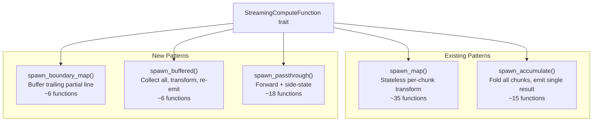

# Design Document: Streaming Function Library Expansion

## Overview

Phase 2.14 expands the streaming function library from 20 to 100 functions across 13 categories (4 existing + 9 new). The expansion adds cryptography (AES-CTR/GCM, HMAC, BLAKE3, MD5, SHA-512), compression codecs (zstd, lz4, snappy, brotli), text processing (grep, sed, replace, redact), validation (JSON, schema, size limits, checksums), analytics (line/word count, histogram, sampling), flow control (rate limit, tee, merge, partition), CAS-specific operations (CAddr embed/verify, Merkle tree), numeric operations (sum, average, bitwise, entropy), and encoding (hex, base32, UTF-8 validation, JSON formatting).

All 80 new functions implement `StreamingComputeFunction`, process data chunk-by-chunk through bounded channels, and integrate with existing pipeline infrastructure (§2.7 streaming, §2.11 fusion, §2.12 memory budget).

### Key Design Decisions

1. **Five implementation patterns**: All functions reuse one of 5 helpers — `spawn_map` (existing), `spawn_accumulate` (existing), `spawn_boundary_map` (new), `spawn_buffered` (new), `spawn_passthrough` (new). This ensures consistent behavior and reduces boilerplate.
2. **Feature-gated**: All 80 new functions gated behind `feature = "extended-streaming"` to keep the base binary lean (~1.4 MB additional compiled deps).
3. **12 new fusible functions**: Pure stateless byte transforms that declare `is_fusible() = true` for §2.11 pipeline fusion.
4. **Configuration via params HashMap**: No struct-level configuration — all tunables passed as `&HashMap<String, String>` with documented keys and defaults.
5. **Consistent error contract**: All functions follow the same error propagation pattern (upstream Error → forward; internal error → emit Error with context; downstream drop → terminate silently).

## Architecture

### Implementation Pattern Hierarchy



### Category Distribution

| # | Category | Count | Pattern(s) | New Dependencies |
|---|----------|-------|------------|-----------------|
| 1 | Crypto & Security | 9 | map, accumulate | `aes`, `ctr`, `aes-gcm`, `hmac`, `md-5`, `blake3`, `regex` |
| 2 | Encoding & Format | 10 | map, boundary_map, buffered | `data-encoding` |
| 3 | Analytics | 11 | accumulate, passthrough, buffered | — |
| 4 | Compression | 10 | map | `zstd`, `lz4_flex`, `snap`, `brotli` |
| 5 | Flow Control | 10 | passthrough, custom | — |
| 6 | Validation | 7 | buffered, passthrough, accumulate | — |
| 7 | Text Processing | 8 | boundary_map, passthrough, map | — |
| 8 | CAS-Specific | 7 | passthrough, accumulate, custom | — |
| 9 | Numeric | 8 | map, accumulate | — |
| | **Total** | **80** | | **12 new crates** |

## Components and Interfaces

### New Helper Patterns

```rust
/// Pattern 3: Boundary-aware map — buffers trailing partial line
fn spawn_boundary_map(
    rx: Receiver<StreamChunk>,
    cap: usize,
    f: impl Fn(&[u8]) -> Result<Bytes, String> + Send + 'static,
) -> Receiver<StreamChunk>;

/// Pattern 4: Buffered transform — collects all, transforms, re-emits
fn spawn_buffered(
    rx: Receiver<StreamChunk>,
    cap: usize,
    chunk_size: usize,
    f: impl FnOnce(Bytes) -> Result<Bytes, String> + Send + 'static,
) -> Receiver<StreamChunk>;

/// Pattern 5: Passthrough with side-state
fn spawn_passthrough<S: Send + 'static>(
    rx: Receiver<StreamChunk>,
    cap: usize,
    init: S,
    on_chunk: impl Fn(&mut S, &Bytes) -> PassAction + Send + 'static,
    on_end: impl FnOnce(S) -> Option<Bytes> + Send + 'static,
) -> Receiver<StreamChunk>;

pub enum PassAction {
    Forward,           // pass chunk unchanged
    Replace(Bytes),    // replace chunk content
    Drop,              // suppress chunk
    Error(String),     // emit error, terminate
}
```

### Helper Behavior Contracts

**spawn_boundary_map:**
- Buffers bytes after last `\n` in each chunk
- Prepends leftover to next chunk before applying transform
- On `End`: flushes remaining buffer through transform, then emits `End`
- On upstream `Error`: propagates immediately

**spawn_buffered:**
- Collects all `Data` chunks into a contiguous buffer
- Applies transform function once on `End`
- Re-emits result as chunks of `chunk_size` bytes
- On upstream `Error`: propagates, discards buffer
- Memory: O(input_size) — not suitable for unbounded streams

**spawn_passthrough:**
- Calls `on_chunk` for each `Data` chunk, acts on returned `PassAction`
- On `End`: calls `on_end`, emits any returned bytes as final `Data`, then `End`
- On upstream `Error`: propagates immediately
- On `PassAction::Error`: emits error, terminates

### Function Registry Integration

```rust
// All 80 functions registered with snake_case names
#[cfg(feature = "extended-streaming")]
pub fn register_extended_streaming(registry: &mut FunctionRegistry) {
    // Crypto
    registry.register_streaming("streaming_encrypt", Arc::new(StreamingEncrypt));
    registry.register_streaming("streaming_decrypt", Arc::new(StreamingDecrypt));
    registry.register_streaming("streaming_aead_encrypt", Arc::new(StreamingAeadEncrypt));
    // ... 77 more
}
```

### Dependency Strategy

All new dependencies behind a single feature flag:

```toml
[features]
extended-streaming = ["aes", "ctr", "aes-gcm", "hmac", "md-5", "blake3",
                      "zstd", "lz4_flex", "snap", "brotli", "regex", "data-encoding"]
```

Total compiled size: ~1,355 KB. All crates are well-established RustCrypto/community crates.

## Data Models

### Function Classification Table (Complete)

| # | Function | Category | Pattern | Fusible | Output Size vs Input |
|---|----------|----------|---------|---------|---------------------|
| 21 | StreamingEncrypt | Crypto | map (stateful) | No | Same |
| 22 | StreamingDecrypt | Crypto | map (stateful) | No | Same |
| 23 | StreamingAeadEncrypt | Crypto | map (stateful) | No | +16 bytes/chunk |
| 24 | StreamingAeadDecrypt | Crypto | map (stateful) | No | -16 bytes/chunk |
| 25 | StreamingHmacSha256 | Crypto | accumulate | No | 32 bytes |
| 26 | StreamingMd5 | Crypto | accumulate | No | 16 bytes |
| 27 | StreamingSha512 | Crypto | accumulate | No | 64 bytes |
| 28 | StreamingBlake3 | Crypto | accumulate | No | 32 bytes |
| 29 | StreamingRedact | Crypto | boundary_map | No | ≤ input |
| 30 | StreamingHexEncode | Encoding | map | **Yes** | 2× input |
| 31 | StreamingHexDecode | Encoding | map | **Yes** | 0.5× input |
| 32 | StreamingUtf8Validate | Encoding | boundary_map | No | Same |
| 33 | StreamingLineEnding | Encoding | map | **Yes** | ≤ 2× input |
| 34 | StreamingJsonPrettyPrint | Encoding | buffered | No | ≥ input |
| 35 | StreamingJsonMinify | Encoding | buffered | No | ≤ input |
| 36 | StreamingJsonLines | Encoding | buffered | No | ~ input |
| 37 | StreamingCsvToJson | Encoding | boundary_map | No | ~ input |
| 38 | StreamingBase32Encode | Encoding | map | **Yes** | 1.6× input |
| 39 | StreamingBase32Decode | Encoding | map | **Yes** | 0.625× input |
| 40 | StreamingFilter | Analytics | passthrough | No | ≤ input |
| 41 | StreamingLineCount | Analytics | accumulate | No | 8 bytes |
| 42 | StreamingWordCount | Analytics | accumulate | No | 8 bytes |
| 43 | StreamingMinMax | Analytics | accumulate | No | 2 bytes |
| 44 | StreamingHistogram | Analytics | accumulate | No | 2048 bytes |
| 45 | StreamingSample | Analytics | passthrough | No | ≤ input |
| 46 | StreamingHead | Analytics | passthrough | No | ≤ input |
| 47 | StreamingTail | Analytics | ring buffer | No | ≤ input |
| 48 | StreamingDeduplicate | Analytics | passthrough | No | ≤ input |
| 49 | StreamingSort | Analytics | buffered | No | Same |
| 50 | StreamingUnique | Analytics | buffered | No | ≤ input |
| 51 | StreamingZstdCompress | Compression | map | No | Variable |
| 52 | StreamingZstdDecompress | Compression | map | No | Variable |
| 53 | StreamingLz4Compress | Compression | map | No | Variable |
| 54 | StreamingLz4Decompress | Compression | map | No | Variable |
| 55 | StreamingSnappyCompress | Compression | map | No | Variable |
| 56 | StreamingSnappyDecompress | Compression | map | No | Variable |
| 57 | StreamingBrotliCompress | Compression | map | No | Variable |
| 58 | StreamingBrotliDecompress | Compression | map | No | Variable |
| 59 | StreamingPad | Compression | map | **Yes** | ≥ input |
| 60 | StreamingTrim | Compression | map | **Yes** | ≤ input |
| 61 | StreamingRateLimit | Flow | passthrough | No | Same |
| 62 | StreamingDelay | Flow | passthrough | No | Same |
| 63 | StreamingTimeout | Flow | passthrough | No | Same |
| 64 | StreamingRetry | Flow | custom | No | Same |
| 65 | StreamingTee | Flow | custom | No | Same (×N) |
| 66 | StreamingMerge | Flow | custom | No | Sum of inputs |
| 67 | StreamingBroadcast | Flow | custom | No | Same (×N) |
| 68 | StreamingPartition | Flow | custom | No | Same (split) |
| 69 | StreamingBatch | Flow | passthrough | No | Same |
| 70 | StreamingDebounce | Flow | passthrough | No | ≤ input |
| 71 | StreamingJsonValidate | Validation | buffered | No | Same |
| 72 | StreamingSchemaValidate | Validation | buffered | No | Same |
| 73 | StreamingMagicBytes | Validation | passthrough | No | Same |
| 74 | StreamingSizeLimit | Validation | passthrough | No | Same |
| 75 | StreamingChecksumVerify | Validation | accumulate | No | Same |
| 76 | StreamingSha256Verify | Validation | accumulate | No | Same |
| 77 | StreamingNonEmpty | Validation | passthrough | No | Same |
| 78 | StreamingReplace | Text | boundary_map | No | Variable |
| 79 | StreamingPrefix | Text | passthrough | No | ≥ input |
| 80 | StreamingSuffix | Text | passthrough | No | ≥ input |
| 81 | StreamingLinePrefix | Text | boundary_map | No | ≥ input |
| 82 | StreamingGrep | Text | boundary_map | No | ≤ input |
| 83 | StreamingSed | Text | boundary_map | No | Variable |
| 84 | StreamingTruncateLines | Text | boundary_map | No | ≤ input |
| 85 | StreamingCharsetConvert | Text | boundary_map | No | Variable |
| 86 | StreamingCAddrEmbed | CAS | passthrough | No | input + 32 |
| 87 | StreamingCAddrVerify | CAS | accumulate | No | Same |
| 88 | StreamingDiff | CAS | custom (2-input) | No | Same |
| 89 | StreamingPatch | CAS | custom (2-input) | No | Same |
| 90 | StreamingMerkleTree | CAS | accumulate | No | 32 bytes |
| 91 | StreamingContentType | CAS | passthrough | No | input + header |
| 92 | StreamingChunkHash | CAS | map | **Yes** | input + 32/chunk |
| 93 | StreamingSum | Numeric | accumulate | No | Variable |
| 94 | StreamingAverage | Numeric | accumulate | No | Variable |
| 95 | StreamingBitwiseAnd | Numeric | map | **Yes** | Same |
| 96 | StreamingBitwiseOr | Numeric | map | **Yes** | Same |
| 97 | StreamingBitwiseNot | Numeric | map | **Yes** | Same |
| 98 | StreamingByteSwap | Numeric | map | **Yes** | Same |
| 99 | StreamingEntropy | Numeric | accumulate | No | Variable |
| 100 | StreamingRollingHash | Numeric | map (stateful) | No | input + hashes |

### Fusibility Summary

12 of 80 new functions are fusible (all pure stateless maps):
- HexEncode (#30), HexDecode (#31), Base32Encode (#38), Base32Decode (#39)
- LineEnding (#33), Pad (#59), Trim (#60)
- BitwiseAnd (#95), BitwiseOr (#96), BitwiseNot (#97), ByteSwap (#98)
- ChunkHash (#92)

Total fusible: 21 of 100 (9 original + 12 new).

## Correctness Properties

### Property 1: Compression round-trip

*For any* byte sequence and any compression codec pair (zstd, lz4, snappy, brotli), compressing then decompressing SHALL produce bytes identical to the original input.

**Validates: Requirements 1.10**

### Property 2: Encryption round-trip (AES-CTR)

*For any* byte sequence, key, and nonce, encrypting then decrypting with AES-256-CTR SHALL produce bytes identical to the original input.

**Validates: Requirements 2.3**

### Property 3: AEAD round-trip (AES-GCM)

*For any* byte sequence, key, and nonce prefix, AEAD encrypting then decrypting SHALL produce bytes identical to the original input with successful tag verification.

**Validates: Requirements 2.4, 2.5**

### Property 4: Encoding round-trip (hex, base32, base64)

*For any* byte sequence, encoding then decoding with hex/base32/base64 SHALL produce bytes identical to the original.

**Validates: Requirements 9.1, 9.2, 9.3, 9.4, 9.5, 9.6**

### Property 5: Accumulator chunk-split invariance

*For any* accumulator function and any byte sequence, the result SHALL be identical whether the input arrives as one chunk or N chunks with arbitrary split points.

**Validates: Requirements 15.5**

### Property 6: Boundary-map line preservation

*For any* text input with newline-delimited lines split across arbitrary chunk boundaries, boundary-map functions SHALL produce the same output as if the entire input were a single chunk.

**Validates: Requirements 3.8, 10.1, 10.2**

### Property 7: Fusible output equivalence

*For any* pair of adjacent fusible functions and any input, executing them as separate stages SHALL produce byte-identical output to executing them fused in a single stage.

**Validates: Requirements 12.3**

### Property 8: Error propagation consistency

*For any* streaming function, receiving an upstream Error chunk SHALL result in that same Error being forwarded downstream with no additional Data chunks emitted afterward.

**Validates: Requirements 13.1**

### Property 9: Empty input handling

*For any* streaming function, receiving an immediate End chunk (no Data) SHALL not panic and SHALL produce at most one output chunk (for accumulators) or no output chunks (for transforms) before End.

**Validates: Requirements 15.2**

### Property 10: PassAction determinism

*For any* passthrough function with deterministic `on_chunk` logic, the same input chunk SHALL always produce the same PassAction and the same output.

**Validates: Requirements 10.5**

## Error Handling

| Category | Error Condition | Error Message Format |
|----------|----------------|---------------------|
| Crypto | Invalid key hex/length | `"aes: invalid key length {actual}, expected 32"` |
| Crypto | Invalid nonce | `"aes: invalid nonce length {actual}, expected 16"` |
| Crypto | AEAD tag verification failed | `"aead: authentication failed at chunk {N}"` |
| Encoding | Invalid hex char | `"hex decode: invalid char '{c}' at position {pos}"` |
| Encoding | Invalid UTF-8 | `"utf8: invalid byte 0x{byte:02x} at position {pos}"` |
| Compression | Corrupt data | `"{codec} decompress: {detail}"` |
| Validation | Invalid JSON | `"json: {parse_error} at line {line} col {col}"` |
| Validation | Size exceeded | `"size limit: {max_bytes} bytes exceeded"` |
| Validation | Hash mismatch | `"sha256 verify: expected {expected}, got {actual}"` |
| Flow | Timeout | `"timeout: no chunk within {ms}ms"` |
| Flow | Retries exhausted | `"retry: {max} attempts failed: {last_error}"` |
| Text | Invalid regex | `"regex: compilation failed: {detail}"` |
| Text | Unknown charset | `"charset: unknown encoding '{name}'"` |
| General | Missing parameter | `"{function}: missing required param '{key}'"` |
| General | Invalid parameter | `"{function}: invalid param '{key}': {parse_error}"` |

## Testing Strategy

### Property-Based Tests (proptest, 100+ iterations)

| Property | Generator | Validation |
|----------|-----------|------------|
| P1: Compression round-trip | Random Bytes (1B–1MB) × 4 codecs | compress → decompress == original |
| P2: AES-CTR round-trip | Random Bytes + random key/nonce | encrypt → decrypt == original |
| P3: AEAD round-trip | Random Bytes + random key/nonce | aead_encrypt → aead_decrypt == original |
| P4: Encoding round-trip | Random Bytes × hex/base32/base64 | encode → decode == original |
| P5: Accumulator split invariance | Random Bytes + random split points × all accumulators | single-chunk == multi-chunk result |
| P6: Boundary-map correctness | Random text with \n + random splits × grep/sed/replace | multi-chunk == single-chunk result |
| P7: Fusion equivalence | Random Bytes × pairs of fusible functions | separate == fused output |
| P8: Error propagation | Random Error chunk × all functions | Error forwarded unchanged |
| P9: Empty input | Immediate End × all functions | No panic, valid terminal |
| P10: PassAction determinism | Same input twice × passthrough functions | Same output |

### Unit Tests (per function)

Each of the 80 functions has at minimum:
- 1 correctness test (known input → expected output)
- 1 empty-input test (End immediately → no panic)
- 1 error-propagation test (upstream Error → forwarded)
- Parameter validation tests (invalid key, missing params)

Total: ~320 unit tests minimum.

### Integration Tests

- Multi-stage pipelines mixing new and existing functions
- Secure pipeline: Source → ZstdCompress → AesEncrypt → HmacSha256
- Log pipeline: Source → Grep("ERROR") → LineCount
- Validation pipeline: Source → JsonValidate → SizeLimit → Sha256Verify
- Fan-out: Source → Tee(3) → [Sha256, ByteCount, Histogram]
- Fusion with new fusible functions: HexEncode → BitwiseNot → Base32Encode (fused)

### Benchmarks

- Compression codec throughput comparison (zstd vs lz4 vs snappy vs brotli vs zlib)
- Crypto throughput (AES-CTR, AES-GCM, HMAC, BLAKE3, SHA-256, SHA-512, MD5)
- Text processing throughput (grep, sed, replace on 100MB log files)
- Fusible chain throughput (fused vs unfused for 5-stage hex→bitwise chains)
