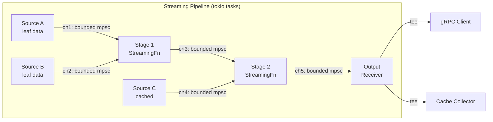

# Design Document: Streaming Materialization

## Overview

Phase 2.7 introduces chunked streaming pipeline execution with backpressure to the Deriva compute engine. Instead of requiring all inputs to be fully materialized in memory before computation begins, data flows through compute stages as 64KB chunks via tokio mpsc channels. This enables concurrent stage execution with bounded memory usage.

**Key benefits:**
- Memory reduction from O(total_input_size) to O(stages × channel_capacity × chunk_size)
- Pipeline parallelism: downstream stages begin processing before upstream completes
- Latency to first byte: clients receive data as soon as the first chunk is processed
- Graceful cancellation: dropping a receiver propagates cancellation upstream
- Backward compatibility: batch functions participate in streaming pipelines via adapters

**Design decisions:**
- **Bounded channels for backpressure** — tokio mpsc with configurable capacity (default 8) prevents unbounded memory growth
- **Cache-after-collect** — streaming results are collected to full Bytes after completion and cached normally, preserving compatibility with the existing CAddr-keyed cache
- **Hybrid mode** — batch functions are automatically wrapped as streaming stages using adapters, allowing any mix of batch/streaming in a single pipeline
- **Prefer streaming** — when both batch and streaming implementations exist, the executor selects streaming

---

## Architecture



```
┌─────────────────────────────────────────────────────────────────┐
│                      Streaming Architecture                       │
│                                                                   │
│  ┌────────────┐    ┌────────────┐    ┌────────────┐              │
│  │  Source     │───▶│  Stage 1   │───▶│  Stage 2   │───▶ Output  │
│  │  (chunks)  │    │  (compute) │    │  (compute) │              │
│  └────────────┘    └────────────┘    └────────────┘              │
│       │                 │                 │                        │
│       ▼                 ▼                 ▼                        │
│  ┌────────────┐    ┌────────────┐    ┌────────────┐              │
│  │  Bounded   │    │  Bounded   │    │  Bounded   │              │
│  │  Channel   │    │  Channel   │    │  Channel   │              │
│  │  (cap=8)   │    │  (cap=8)   │    │  (cap=8)   │              │
│  └────────────┘    └────────────┘    └────────────┘              │
│                                                                   │
│  Backpressure: channel full → upstream send() suspends            │
│  Cancellation: drop receiver → upstream gets SendError            │
│  Memory bound: D × capacity × chunk_size                          │
└─────────────────────────────────────────────────────────────────┘
```

**Component locations:**
| Component | Crate | Module |
|-----------|-------|--------|
| StreamChunk | `deriva-core` | `streaming.rs` |
| StreamingComputeFunction | `deriva-compute` | `streaming.rs` |
| Adapters (batch_to_stream, etc.) | `deriva-compute` | `streaming.rs` |
| StreamPipeline, PipelineConfig | `deriva-compute` | `pipeline.rs` |
| StreamingExecutor | `deriva-compute` | `streaming_executor.rs` |
| FunctionRegistry extension | `deriva-compute` | `registry.rs` |
| Built-in streaming functions | `deriva-compute` | `builtins_streaming/` |
| gRPC integration | `deriva-server` | `service.rs` |
| Metrics | `deriva-compute` | `metrics.rs` |

---

## Components and Interfaces

### StreamChunk Protocol

The fundamental unit of data in a streaming pipeline:

```rust
#[derive(Debug, Clone)]
pub enum StreamChunk {
    Data(Bytes),           // Payload chunk (non-empty)
    End,                   // Stream termination
    Error(DerivaError),    // Failure propagation
}
```

**Ordering invariant:** A well-formed stream produces zero or more `Data` chunks followed by exactly one terminal (`End` or `Error`). No chunks are sent after the terminal.

```
Valid:   Data, Data, Data, End
Valid:   End                        (empty stream)
Valid:   Data, Error                (failure after partial data)
Invalid: Data, End, Data            (data after terminal)
Invalid: End, End                   (duplicate terminal)
Invalid: Data(empty), Data, End     (empty Data payload)
```

**Accessor methods:**
- `is_data() -> bool` — true for Data variant
- `is_end() -> bool` — true for End variant
- `is_error() -> bool` — true for Error variant
- `into_data() -> Option<Bytes>` — extracts payload or None
- `data_len() -> usize` — payload length or 0

### StreamingComputeFunction Trait

```rust
#[async_trait]
pub trait StreamingComputeFunction: Send + Sync {
    async fn stream_execute(
        &self,
        inputs: Vec<mpsc::Receiver<StreamChunk>>,
        params: &HashMap<String, String>,
    ) -> mpsc::Receiver<StreamChunk>;

    fn supports_streaming(&self) -> bool { true }
    fn preferred_chunk_size(&self) -> usize { 65_536 }  // 64KB
    fn channel_capacity(&self) -> usize { 8 }
}
```

**Contract:**
- Input receivers follow the StreamChunk protocol
- Output receiver must follow the StreamChunk protocol
- If any input yields `Error`, the function propagates it to output and terminates
- Implementations are `Send + Sync` (shareable across tokio tasks)
- Functions are typically stateless and cheaply cloneable (stored as `Arc<dyn StreamingComputeFunction>`)

### Batch-to-Stream Adapters

Four adapter functions bridge between batch and streaming execution:

| Adapter | Signature | Purpose |
|---------|-----------|---------|
| `batch_to_stream` | `(Bytes, chunk_size) -> Receiver<StreamChunk>` | Split batch result into chunks |
| `value_to_stream` | `(Bytes, chunk_size, capacity) -> Receiver<StreamChunk>` | Stream leaf/cached data with custom capacity |
| `collect_stream` | `(Receiver<StreamChunk>) -> Result<Bytes, DerivaError>` | Collect stream back to single Bytes |
| `tee_stream` | `(Receiver<StreamChunk>, capacity) -> (Receiver, Receiver)` | Fork stream to two consumers |

**`batch_to_stream`** — Spawns a tokio task that splits the input Bytes into chunks of at most `chunk_size` bytes, sends each as `Data`, then sends `End`. If the receiver is dropped, the task terminates gracefully.

**`value_to_stream`** — Same as `batch_to_stream` but accepts an explicit channel capacity parameter. Used for Source/Cached nodes where the pipeline config controls capacity.

**`collect_stream`** — Consumes a receiver, accumulates all Data chunks, and returns concatenated Bytes on `End`. Returns error on `Error` chunk or premature channel closure (None without End).

**`tee_stream`** — Spawns a task that reads from the input receiver and clones each chunk to two output receivers. Both outputs receive identical streams. If one output receiver is dropped, the tee continues sending to the other.

### StreamPipeline Builder

```rust
pub struct PipelineConfig {
    pub chunk_size: usize,           // Default: 65536 (64KB)
    pub channel_capacity: usize,     // Default: 8
    pub cache_intermediates: bool,   // Default: true
    pub memory_budget: usize,        // Default: 0 (unlimited)
}

pub enum PipelineNode {
    Source { addr: CAddr, data: Bytes },
    Cached { addr: CAddr, data: Bytes },
    StreamingStage { addr: CAddr, function: Arc<dyn StreamingComputeFunction>, params, input_indices: Vec<usize> },
    BatchStage { addr: CAddr, function: Arc<dyn ComputeFunction>, params, input_indices: Vec<usize> },
}

pub struct StreamPipeline {
    nodes: Vec<PipelineNode>,
    config: PipelineConfig,
}
```

**Execution model:**
1. For each node in order (topological — inputs always precede consumers):
   - Source/Cached → spawn `value_to_stream` task, store output receiver
   - StreamingStage → take input receivers from upstream nodes, call `stream_execute`, store output receiver
   - BatchStage → `collect_stream` all inputs, execute batch function, wrap result via `batch_to_stream`
2. Return the last node's output receiver
3. Empty pipeline returns error

### StreamingExecutor

Builds a StreamPipeline from a recipe DAG:

```rust
pub struct StreamingExecutor {
    pub config: PipelineConfig,
}

impl StreamingExecutor {
    pub async fn materialize_streaming(
        &self,
        addr: &CAddr,
        dag: &DagStore,
        cache: &impl MaterializationCache,
        leaf_store: &impl LeafStore,
        registry: &FunctionRegistry,
    ) -> Result<mpsc::Receiver<StreamChunk>, DerivaError>;
}
```

**Pipeline construction algorithm:**
1. Resolve topological order of the recipe DAG
2. For each address in topo order:
   - If cached → `Cached` node
   - If leaf data → `Source` node
   - If recipe with streaming function → `StreamingStage` node
   - If recipe with batch-only function → `BatchStage` node
   - If function not found → return `FunctionNotFound` error
3. Execute the constructed pipeline

### FunctionRegistry Extension

```rust
pub struct FunctionRegistry {
    functions: HashMap<String, Arc<dyn ComputeFunction>>,
    streaming_functions: HashMap<String, Arc<dyn StreamingComputeFunction>>,
}

impl FunctionRegistry {
    pub fn register_streaming(&mut self, name: &str, version: &str, f: Arc<dyn StreamingComputeFunction>);
    pub fn get_streaming(&self, key: &str) -> Option<Arc<dyn StreamingComputeFunction>>;
    pub fn has_streaming(&self, key: &str) -> bool;
}
```

Batch and streaming implementations are stored in separate maps. A function can have both. When both exist, the streaming executor prefers the streaming implementation.

### Built-in Streaming Function Library

20 built-in streaming functions across 4 categories:

#### Category 1: Transforms (9 functions)

Single-input, chunk-by-chunk processing. Each Data chunk is transformed independently.

| # | Name | Behavior | Dependencies |
|---|------|----------|-------------|
| 1 | Identity | Pass-through | — |
| 2 | Uppercase | ASCII uppercase per byte | — |
| 3 | Lowercase | ASCII lowercase per byte | — |
| 4 | Reverse | Reverse bytes within each chunk | — |
| 5 | Base64Encode | Encode each chunk to base64 | `base64` |
| 6 | Base64Decode | Decode each chunk from base64 (Error on invalid) | `base64` |
| 7 | Xor | XOR each byte with `params["key"]` | — |
| 8 | Compress | Zlib-compress each chunk independently | `flate2` |
| 9 | Decompress | Zlib-decompress each chunk (Error on invalid) | `flate2` |

#### Category 2: Accumulators (3 functions)

Single-input, consume-all-then-emit. Update internal state with each chunk, emit single result on `End`.

| # | Name | Behavior | Output | Dependencies |
|---|------|----------|--------|-------------|
| 10 | Sha256 | Incremental SHA-256 hash | 32-byte digest | `sha2` |
| 11 | ByteCount | Count total bytes | 8-byte BE u64 | — |
| 12 | Checksum | Rolling CRC32 | 4-byte BE u32 | `crc32fast` |

#### Category 3: Combiners (3 functions)

Multi-input, merge N streams into one output.

| # | Name | Inputs | Behavior |
|---|------|--------|----------|
| 13 | Concat | N | Sequential: all of input 0, then input 1, ..., then End |
| 14 | Interleave | N | Round-robin: one chunk from each in turn, skip exhausted |
| 15 | ZipConcat | N | Pair-wise: read one chunk from each, concatenate into one output chunk |

#### Category 4: Utilities (5 functions)

Stream manipulation and reshaping.

| # | Name | Behavior | Params |
|---|------|----------|--------|
| 16 | ChunkResizer | Re-chunk to target size (buffer partial) | `target_size` |
| 17 | Take | Forward first N bytes, then End | `bytes` |
| 18 | Skip | Discard first N bytes, forward rest | `bytes` |
| 19 | Repeat | Replay collected input N times | `count` |
| 20 | TeeCount | Forward data + emit chunk count as final Data chunk (8-byte BE u64) | — |

### gRPC Integration

The `get()` RPC automatically selects streaming vs batch:

```
get(addr) →
  1. Check cache → if hit, stream from cache
  2. Check registry.has_streaming(root_function) →
     a. true: build StreamPipeline, tee output to client + cache collector
     b. false: batch materialize, then stream result to client
```

Streaming responses deliver chunks incrementally — the client receives data as the pipeline produces it, without waiting for full materialization.

### Cache-After-Collect Strategy

**Decision:** Cache-after-collect (Option A from design alternatives).

- After streaming completes, the tee'd cache collector accumulates all chunks into a single `Bytes` value
- The full value is cached under the recipe's CAddr
- Future requests return the cached value immediately (no pipeline re-execution)
- If the cache collection fails (error during tee), no partial result is cached

**Rationale:** Simple, compatible with existing CAddr-keyed Bytes cache. Streaming is a compute optimization (pipeline parallelism, bounded memory), not a storage optimization. The cache layer continues to work with full values.

### Observability Metrics

| Metric | Type | Description |
|--------|------|-------------|
| `deriva_stream_pipelines_total` | Counter | Total pipeline executions |
| `deriva_stream_chunks_total` | Counter | Total chunks processed |
| `deriva_stream_bytes_total` | Counter | Total bytes processed |
| `deriva_stream_pipeline_duration_seconds` | Histogram | End-to-end pipeline duration |

Metrics are collected at the pipeline output via a metered wrapper that intercepts chunks before delivering them to the consumer.

### Cancellation and Error Propagation

**Cancellation (downstream → upstream):**
1. Client disconnects → gRPC receiver dropped
2. Tee sender gets `SendError` → tee task terminates, drops input receiver
3. Upstream stage's sender gets `SendError` → stage terminates, drops its input receivers
4. Cascade continues until all source tasks terminate

**Error propagation (upstream → downstream):**
1. A stage encounters an error → emits `Error(e)` chunk to output channel
2. Downstream consumer receives `Error` → stops processing, propagates or returns error
3. `collect_stream` returns `Err(e)` on Error chunk

**Premature closure:**
- If a channel is closed (sender dropped) without sending `End` or `Error`, the downstream consumer treats it as a premature closure error

---

## Data Models

### Core Types

```rust
// deriva-core/src/streaming.rs
#[derive(Debug, Clone)]
pub enum StreamChunk {
    Data(Bytes),
    End,
    Error(DerivaError),
}

// deriva-compute/src/pipeline.rs
#[derive(Debug, Clone)]
pub struct PipelineConfig {
    pub chunk_size: usize,           // 65536
    pub channel_capacity: usize,     // 8
    pub cache_intermediates: bool,   // true
    pub memory_budget: usize,        // 0 = unlimited
}

// Internal to StreamPipeline
enum PipelineNode {
    Source { addr: CAddr, data: Bytes },
    Cached { addr: CAddr, data: Bytes },
    StreamingStage {
        addr: CAddr,
        function: Arc<dyn StreamingComputeFunction>,
        params: HashMap<String, String>,
        input_indices: Vec<usize>,
    },
    BatchStage {
        addr: CAddr,
        function: Arc<dyn ComputeFunction>,
        params: HashMap<String, String>,
        input_indices: Vec<usize>,
    },
}
```

### Memory Model

For a pipeline with `D` streaming stages, `C` channel capacity, and `S` chunk size:

```
Max in-flight memory = D × C × S
Default: D × 8 × 64KB = D × 512KB

Example pipelines:
  3 stages: 3 × 512KB = 1.5MB
  5 stages: 5 × 512KB = 2.5MB
  10 stages: 10 × 512KB = 5MB
```

This is the memory for in-flight chunks only. BatchStage nodes temporarily hold full input/output Bytes for the batch function execution.

### Backpressure Flow

```
Producer rate > Consumer rate:
  1. Channel fills to capacity (8 chunks)
  2. Producer's send().await suspends
  3. Producer stops consuming from its upstream channel
  4. Upstream channel fills → upstream producer suspends
  5. Cascade until all producers are suspended
  6. Pipeline processes at slowest-consumer rate

Consumer resumes:
  1. Consumer reads one chunk → channel has space
  2. Producer's send() completes → producer resumes
  3. Producer reads from upstream → upstream channel has space
  4. Cascade resumes pipeline flow
```

---

## Correctness Properties

*A property is a characteristic or behavior that should hold true across all valid executions of a system — essentially, a formal statement about what the system should do. Properties serve as the bridge between human-readable specifications and machine-verifiable correctness guarantees.*

### Property 1: Stream Protocol Ordering Invariant

*For any* streaming function execution with valid inputs, the output stream SHALL produce zero or more `Data` chunks followed by exactly one terminal (`End` or `Error`), with no chunks after the terminal.

**Validates: Requirements 1.2, 2.6**

### Property 2: Non-Empty Data Chunks

*For any* StreamChunk of variant `Data` produced by any adapter or streaming function, the contained Bytes payload SHALL have length > 0.

**Validates: Requirements 1.3**

### Property 3: Adapter Round-Trip

*For any* non-empty `Bytes` value and any `chunk_size > 0`, `collect_stream(batch_to_stream(data, chunk_size))` SHALL return `Ok(data)` (the original value), and each intermediate `Data` chunk SHALL have length ≤ `chunk_size`.

**Validates: Requirements 3.1, 3.2, 3.3, 4.6**

### Property 4: Tee Stream Correctness

*For any* stream of chunks following the StreamChunk protocol, `tee_stream` SHALL produce two output receivers that each collect to the same `Bytes` value as collecting the original stream would produce.

**Validates: Requirements 3.6, 3.7**

### Property 5: Error Propagation — Function Level

*For any* streaming function (transform, accumulator, or combiner), if any input receiver yields an `Error` chunk, the output receiver SHALL yield an `Error` chunk and no `Data` chunks shall follow.

**Validates: Requirements 2.7, 9.5, 10.5**

### Property 6: Error Propagation — Pipeline Level

*For any* multi-stage pipeline, if a stage emits an `Error` chunk, all downstream stages SHALL terminate and the pipeline output SHALL contain an `Error` chunk.

**Validates: Requirements 15.3**

### Property 7: Pipeline Equivalence with Batch Execution

*For any* valid recipe DAG with any mix of streaming and batch functions, the streaming pipeline output (collected via `collect_stream`) SHALL be byte-for-byte equal to the result of executing the same DAG via batch materialization.

**Validates: Requirements 4.5, 6.1, 16.1, 16.3, 16.4**

### Property 8: FunctionRegistry Round-Trip

*For any* function name and version, after calling `register_streaming(name, version, f)`, `get_streaming(key)` SHALL return `Some` and `has_streaming(key)` SHALL return `true`.

**Validates: Requirements 7.1, 7.2, 7.3, 7.4**

### Property 9: Transform Model Equivalence

*For any* input `Bytes` and any chunk-by-chunk transform function (Identity, Uppercase, Lowercase, Reverse, Base64Encode, Xor), streaming the input through the transform and collecting the output SHALL equal applying the batch transform to the full input.

**Validates: Requirements 8.2, 8.3, 8.4, 8.5, 8.6, 8.7, 8.9**

### Property 10: XOR Involution

*For any* `Bytes` value and any key byte, applying the streaming Xor function twice with the same key SHALL yield the original input bytes.

**Validates: Requirements 8.9**

### Property 11: Compress/Decompress Round-Trip

*For any* `Bytes` value, streaming through Compress then Decompress SHALL yield the original input bytes.

**Validates: Requirements 8.10, 8.11**

### Property 12: Accumulator Model Equivalence

*For any* `Bytes` value split into arbitrary chunk boundaries, the streaming accumulator result SHALL equal the batch computation on the full value. Specifically:
- Sha256: streaming digest == `sha2::Sha256::digest(full_bytes)`
- ByteCount: streaming count == `full_bytes.len()` as u64
- Checksum: streaming crc == `crc32fast::hash(full_bytes)`

**Validates: Requirements 9.2, 9.3, 9.4**

### Property 13: Concat Sequential Correctness

*For any* list of `Bytes` inputs, streaming through Concat and collecting SHALL equal the concatenation of all inputs in order.

**Validates: Requirements 10.2**

### Property 14: Combiner Byte Preservation

*For any* list of `Bytes` inputs, the total number of bytes in the output of Interleave or ZipConcat SHALL equal the sum of all input byte lengths.

**Validates: Requirements 10.3, 10.4**

### Property 15: ChunkResizer Correctness

*For any* input `Bytes` and `target_size > 0`, streaming through ChunkResizer SHALL produce output where: (a) all output chunks except the last have exactly `target_size` bytes, and (b) collected output equals the original input.

**Validates: Requirements 11.2**

### Property 16: Take/Skip Complementarity

*For any* input `Bytes` and `N >= 0`, `Take(N)` output SHALL equal `input[..min(N, len)]`, and `Skip(N)` output SHALL equal `input[min(N, len)..]`. Additionally, concatenating `Take(N)` output with `Skip(N)` output SHALL equal the original input.

**Validates: Requirements 11.3, 11.4**

### Property 17: Repeat Correctness

*For any* input `Bytes` and `count > 0`, streaming through Repeat SHALL produce output equal to the input bytes repeated `count` times.

**Validates: Requirements 11.5**

### Property 18: TeeCount Data Preservation

*For any* input stream, TeeCount output (excluding the final count chunk) SHALL be byte-for-byte identical to the input, and the final Data chunk SHALL contain the chunk count as an 8-byte big-endian u64.

**Validates: Requirements 11.6**

### Property 19: Cancellation Propagation

*For any* pipeline, dropping the output receiver SHALL cause all upstream stage tasks to terminate (sender errors propagate back through the channel graph).

**Validates: Requirements 5.4, 15.1, 15.2**

### Property 20: Metrics Counting Accuracy

*For any* pipeline execution producing known data, the `chunks_total` counter increment SHALL equal the number of Data chunks emitted, and the `bytes_total` counter increment SHALL equal the total bytes emitted.

**Validates: Requirements 14.5**

---

## Error Handling

| Error Condition | Behavior | Error Type |
|----------------|----------|------------|
| Empty pipeline (zero nodes) | Return error immediately | `DerivaError::Compute("empty pipeline")` |
| Function not found in registry | Return error during pipeline construction | `DerivaError::Compute("function not found: {key}")` |
| Recipe not found in DAG | Return error during pipeline construction | `DerivaError::NotFound` |
| Invalid Base64 input (Base64Decode) | Emit `Error` chunk to output | `DerivaError::Compute("invalid base64")` |
| Invalid compressed input (Decompress) | Emit `Error` chunk to output | `DerivaError::Compute("decompression failed")` |
| Premature channel closure (no End/Error) | Consumer returns error | `DerivaError::Compute("stream closed without End marker")` |
| Downstream receiver dropped | Upstream sender gets `SendError`, terminates | Stage drops input receivers (cascade) |
| Input Error chunk | Function propagates Error to output | Original `DerivaError` passed through |
| Background cache collection fails | Log failure, do not cache | No user-visible error (pipeline still delivers to client) |
| Missing `params["key"]` for Xor | Emit `Error` chunk | `DerivaError::Compute("missing param: key")` |
| Missing `params["bytes"]` for Take/Skip | Emit `Error` chunk | `DerivaError::Compute("missing param: bytes")` |
| Missing `params["target_size"]` for ChunkResizer | Emit `Error` chunk | `DerivaError::Compute("missing param: target_size")` |
| Missing `params["count"]` for Repeat | Emit `Error` chunk | `DerivaError::Compute("missing param: count")` |

**Error design principles:**
1. Errors propagate downstream via `Error` chunks — no panics in pipeline stages
2. Cancellation propagates upstream via channel drop — no explicit cancel signals needed
3. Batch function errors (returned as `Result`) are converted to `Error` chunks by the BatchStage wrapper
4. The pipeline never produces partial cached results on error

---

## Testing Strategy

### Property-Based Testing (PBT)

This feature is highly suitable for property-based testing due to:
- Pure function behavior (transforms, accumulators, combiners)
- Universal properties that hold across wide input spaces (any Bytes, any chunk_size)
- Clear round-trip relationships (batch_to_stream/collect_stream, compress/decompress, xor/xor)
- Model-based equivalence (streaming result == batch result)

**Library:** `proptest` (already in workspace dependencies)

**Configuration:** Minimum 100 iterations per property test.

**Tag format:** `// Feature: streaming-materialization, Property {N}: {title}`

**PBT test organization:**
- `tests/streaming_properties.rs` — adapter round-trips, protocol invariants
- `tests/transform_properties.rs` — transform model equivalence, involution
- `tests/accumulator_properties.rs` — accumulator model equivalence
- `tests/combiner_properties.rs` — combiner correctness
- `tests/utility_properties.rs` — Take/Skip/Repeat/ChunkResizer/TeeCount
- `tests/pipeline_properties.rs` — end-to-end pipeline equivalence, error propagation

### Unit Tests (Example-Based)

| Area | Test Cases |
|------|-----------|
| StreamChunk accessors | is_data/is_end/is_error return correct booleans; into_data extracts payload |
| PipelineConfig defaults | chunk_size=65536, channel_capacity=8, cache_intermediates=true, memory_budget=0 |
| StreamingComputeFunction defaults | supports_streaming=true, preferred_chunk_size=65536, channel_capacity=8 |
| Empty pipeline | execute() returns error |
| Function not found | Executor returns FunctionNotFound |
| Premature closure | collect_stream on dropped sender returns error |
| Registry separation | Register both batch and streaming for same key, retrieve each independently |
| Streaming preference | Has both → executor uses streaming |
| Cache hit bypass | Cached value returned without pipeline execution |
| Background cache failure | Error in tee → no cache entry, log emitted |

### Integration Tests

| Area | Test Cases |
|------|-----------|
| Multi-stage pipeline | 3+ stage pipeline produces correct output |
| Hybrid pipeline | Mix of streaming + batch stages produces correct output |
| Backpressure | Slow consumer causes bounded memory usage |
| Cancellation cascade | Drop output receiver → all tasks terminate within timeout |
| gRPC streaming | Client receives chunks incrementally |
| gRPC batch fallback | Non-streaming function uses batch path |
| Cache-after-collect | First request streams + caches, second request hits cache |
| Metrics | Pipeline execution increments all counters correctly |
| Concurrent pipelines | Multiple pipelines execute concurrently without interference |

### Test Generators (for PBT)

```rust
// Arbitrary Bytes of various sizes
fn arb_bytes() -> impl Strategy<Value = Bytes>;          // 0..1MB
fn arb_small_bytes() -> impl Strategy<Value = Bytes>;    // 0..64KB
fn arb_nonempty_bytes() -> impl Strategy<Value = Bytes>; // 1..1MB

// Arbitrary chunk sizes
fn arb_chunk_size() -> impl Strategy<Value = usize>;     // 1..128KB

// Arbitrary stream (list of non-empty chunks + terminal)
fn arb_stream() -> impl Strategy<Value = Vec<StreamChunk>>;

// Arbitrary pipeline configs
fn arb_config() -> impl Strategy<Value = PipelineConfig>;

// Arbitrary valid base64 input
fn arb_base64_input() -> impl Strategy<Value = Bytes>;
```
