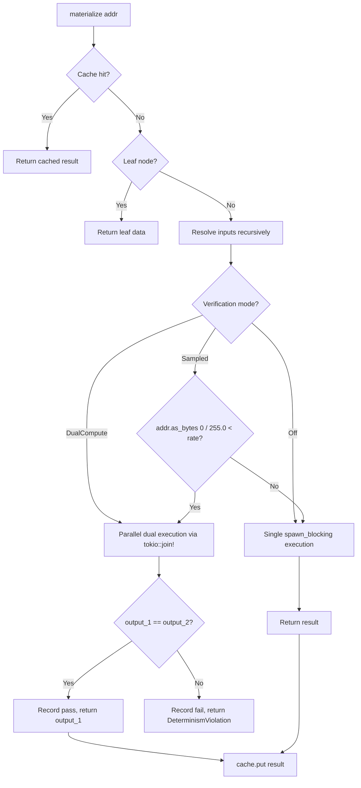

# Design Document: Verification Mode

## Overview

Verification mode adds optional dual-compute determinism checking to the Deriva executor. The system's core invariant is **computation addressing**: the same recipe (function + inputs + params) must always produce the same output. Verification mode detects violations by executing compute functions twice in parallel and comparing outputs byte-for-byte.

The design introduces three configurable modes:
- **Off** — Production default. Single execution, zero overhead.
- **DualCompute** — Always verify. Parallel dual execution for every recipe.
- **Sampled** — Deterministic fraction-based verification using `addr.as_bytes()[0] / 255.0 < rate`.

Key design decisions:
1. **Parallel dual execution** via `tokio::join!` with separate `spawn_blocking` calls minimizes wall-clock overhead (2x CPU but ~1x wall-clock).
2. **Byte-for-byte comparison** instead of hash comparison — simpler, catches ALL differences, no collision risk.
3. **Deterministic sampling** using the content address's first byte — same addr always gets the same verification decision, enabling reproducible debugging.
4. **Verification scope limited to `func.execute()`** — cache hits, leaf reads, and DAG traversal are deterministic by construction.

## Architecture

### Normal vs Verification Flow



### Parallel Dual Compute Timeline

```
Normal mode (Off):
Time ─────────────────────────────────────▶
Thread 1: [====== func.execute(inputs) ======]
                                             Wall: T, CPU: T

Verification mode (DualCompute):
Time ─────────────────────────────────────▶
Thread 1: [====== func.execute(inputs) ======]
Thread 2: [====== func.execute(inputs) ======]
                                             Wall: T, CPU: 2T
```

Both executions run concurrently on the Tokio blocking thread pool. Wall-clock overhead is limited to `tokio::join!` coordination and the byte comparison.

### Verification Scope

Verification applies **only** to `func.execute()` — the single point where non-determinism can enter:

| Step | Verified? | Rationale |
|------|-----------|-----------|
| `cache.get()` | No | Deterministic lookup by content address |
| `leaf_store.get()` | No | Raw data retrieval, no computation |
| `dag.get_recipe()` | No | Deterministic graph lookup |
| Input resolution (recursive) | No | Each compute node verified independently |
| `func.execute()` | **Yes** | Source of potential non-determinism |
| `cache.put()` | No | Stores already-verified result |

## Components and Interfaces

### VerificationMode Enum

```rust
#[derive(Debug, Clone, Copy, PartialEq, Default)]
pub enum VerificationMode {
    #[default]
    Off,
    DualCompute,
    Sampled { rate: f64 }, // 0.0 to 1.0
}
```

Lives in `deriva-compute/src/async_executor.rs`. Configured at server startup via `--verification` CLI flag. Immutable for the lifetime of the executor.

### ExecutorConfig

```rust
pub struct ExecutorConfig {
    pub max_concurrency: usize,
    pub dedup_channel_capacity: usize,
    pub verification: VerificationMode,
}
```

The `verification` field determines how `execute_verified()` behaves for every compute step.

### execute_verified() Method

The core verification logic, called from `materialize()` instead of a bare `spawn_blocking`:

```rust
async fn execute_verified(
    &self,
    addr: &CAddr,
    func: Arc<dyn ComputeFunction>,
    input_bytes: Vec<Bytes>,
    params: &BTreeMap<String, Value>,
) -> Result<Bytes>
```

**Decision logic:**
1. Match on `self.config.verification` to determine `should_verify`
2. For `Sampled { rate }`: `(addr.as_bytes()[0] as f64) / 255.0 < rate`
3. If not verifying: single `spawn_blocking` call
4. If verifying: `tokio::join!` with two `spawn_blocking` calls, then byte comparison

### VerificationStats

```rust
pub struct VerificationStats {
    pub total_verified: AtomicU64,
    pub total_passed: AtomicU64,
    pub total_failed: AtomicU64,
    pub last_failure: tokio::sync::Mutex<Option<DerivaError>>,
}
```

**Methods:**
- `record_pass()` — Atomically increments `total_verified` and `total_passed`
- `record_fail(error)` — Atomically increments `total_verified` and `total_failed`, stores error in `last_failure`
- `failure_rate()` — Returns `total_failed / total_verified`, or 0.0 when `total_verified == 0`

Uses `Ordering::Relaxed` for counters (monotonic, no synchronization needed for stats). Uses `tokio::sync::Mutex` for `last_failure` since it's accessed in async context.

### DeterminismViolation Error

```rust
#[error("determinism violation for {addr}: function {function_id} produced \
         different outputs ({output_1_len} bytes hash={output_1_hash} vs \
         {output_2_len} bytes hash={output_2_hash})")]
DeterminismViolation {
    addr: String,
    function_id: String,
    output_1_hash: String,  // blake3 hex
    output_2_hash: String,  // blake3 hex
    output_1_len: usize,
    output_2_len: usize,
}
```

Blake3 hashes provide compact representation in error messages. Byte lengths help diagnose whether the issue is content-only (same length) or structural (different lengths).

### gRPC Protocol Extensions

**Status RPC** (already in proto) — includes verification fields:
- `verification_mode` (string): "off", "dual", or "sampled:RATE"
- `verification_total` (uint64): count of verification attempts
- `verification_passed` (uint64): passing verifications
- `verification_failed` (uint64): failed verifications
- `verification_failure_rate` (double): computed failure rate

**Verify RPC** — on-demand verification regardless of configured mode:
- Request: `addr` (bytes, 32-byte CAddr)
- Response: `deterministic` (bool), `output_hash` (string), `output_size` (uint64), `compute_time_us` (uint64), `error` (string)

The Verify RPC resolves inputs via `executor.materialize()`, then performs dual-compute directly (bypasses mode configuration). Returns not-found status if addr doesn't exist, internal error if input resolution fails.

### CLI Configuration

```
--verification off          # Default, single execution
--verification dual         # Always dual-compute
--verification sampled:0.1  # 10% deterministic sampling
```

Parsing: `parse_verification(&str) -> Result<VerificationMode, String>` validates the string format, rejects invalid rates (outside 0.0..=1.0), and returns descriptive error messages for malformed input.

## Data Models

### VerificationMode State Machine

```
┌─────────────────────────────────────────────────┐
│ Server Startup                                   │
│ --verification <mode>                            │
└─────────┬───────────────┬───────────────┬───────┘
          │               │               │
          ▼               ▼               ▼
   ┌─────────────┐ ┌─────────────┐ ┌─────────────────┐
   │ Off         │ │ DualCompute │ │ Sampled { rate } │
   │ exec × 1   │ │ exec × 2    │ │ exec × 1 or 2   │
   │ stats: no   │ │ stats: yes  │ │ stats: sampled   │
   └─────────────┘ └─────────────┘ └─────────────────┘
```

Mode is set once at startup and immutable. No runtime mode switching.

### Sampling Decision Model

For `Sampled { rate }`, the verification decision is:

```
verified = (addr.as_bytes()[0] as f64) / 255.0 < rate
```

Properties of this approach:
- **Deterministic**: Same CAddr → same decision every time
- **Uniform**: Blake3 output bytes are uniformly distributed, so `bytes[0]` is uniform over [0, 255]
- **No external state**: No RNG, no Mutex, no counter
- **Reproducible debugging**: If a recipe fails verification, it will always be selected for verification

Distribution examples:
- `rate = 0.10`: Addresses with `bytes[0] < 26` verified (~10.2%)
- `rate = 0.50`: Addresses with `bytes[0] < 128` verified (~50.2%)
- `rate = 0.0`: Never verified (0/255 < 0.0 is false)
- `rate = 1.0`: Always verified (any/255 < 1.0 is true)

### Performance Model

| Mode | CPU Cost | Wall-Clock Cost | Memory During Compute |
|------|----------|-----------------|----------------------|
| Off | 1× | 1× | 1× |
| DualCompute | 2× | ~1× (parallel) | ~2× |
| Sampled(0.1) | 1.1× | ~1× | ~1× average |
| Sampled(0.5) | 1.5× | ~1× | ~1.5× average |

Wall-clock overhead for DualCompute is bounded by:
- `tokio::join!` coordination (~microseconds)
- Byte comparison (`output_1 == output_2`, linear in output size)
- Thread pool scheduling for second task

Expected wall-clock overhead: <20% for typical compute functions that dominate execution time.

## Correctness Properties

*A property is a characteristic or behavior that should hold true across all valid executions of a system — essentially, a formal statement about what the system should do. Properties serve as the bridge between human-readable specifications and machine-verifiable correctness guarantees.*

### Property 1: Off mode executes exactly once

*For any* compute recipe materialized in Off mode, the compute function shall be invoked exactly once.

**Validates: Requirements 2.1, 2.2**

### Property 2: DualCompute mode executes exactly twice

*For any* compute recipe materialized in DualCompute mode, the compute function shall be invoked exactly twice.

**Validates: Requirements 3.1, 3.2**

### Property 3: Deterministic functions pass verification

*For any* deterministic compute function (one that always returns the same output for the same input), dual-compute verification shall return Ok with the correct output bytes.

**Validates: Requirements 3.3, 3.4**

### Property 4: Non-deterministic functions produce DeterminismViolation

*For any* non-deterministic compute function (one that produces different output on repeat invocations with identical inputs), dual-compute verification shall return a DeterminismViolation error containing the recipe CAddr, function_id, and distinct blake3 hashes of both outputs.

**Validates: Requirements 3.5, 3.6, 5.1, 5.2, 5.3, 5.4**

### Property 5: Sampling decision is deterministic per address

*For any* CAddr and sampling rate, the verification decision `(addr.as_bytes()[0] as f64) / 255.0 < rate` shall produce the same boolean result across multiple evaluations — the same address is always verified or always not verified.

**Validates: Requirements 4.1, 4.2**

### Property 6: Sampling rate boundary conditions

*For any* CAddr, a sampling rate of 0.0 shall never trigger verification (execute once), and a sampling rate of 1.0 shall always trigger verification (execute twice).

**Validates: Requirements 4.5, 4.6**

### Property 7: Verification stats consistency

*For any* sequence of verification operations, `total_verified` shall equal `total_passed + total_failed`, and `failure_rate()` shall equal `total_failed / total_verified` (or 0.0 when `total_verified == 0`).

**Validates: Requirements 6.1, 6.2, 6.3, 6.5**

### Property 8: Cache hits bypass verification

*For any* materialization request where the result is already cached, the compute function shall not be invoked regardless of verification mode.

**Validates: Requirements 7.2**

### Property 9: DeterminismViolation error format

*For any* DeterminismViolation error, the Display format shall match: `determinism violation for {addr}: function {function_id} produced different outputs ({output_1_len} bytes hash={output_1_hash} vs {output_2_len} bytes hash={output_2_hash})`.

**Validates: Requirements 5.5**

### Property 10: Sampling distribution approximates expected rate

*For any* sampling rate r and a set of N uniformly-distributed CAddrs (N ≥ 100), the fraction of addresses selected for verification shall approximate r within a tolerance of ±(1/255 + epsilon), reflecting the discrete nature of the first-byte sampling.

**Validates: Requirements 4.1**

## Error Handling

### Error Categories

| Scenario | Behavior |
|----------|----------|
| Both outputs identical | Return `Ok(output_1)`, record pass |
| Outputs differ | Return `Err(DeterminismViolation { ... })`, record failure |
| Function panics (first execution) | `spawn_blocking` catches panic → `ComputeFailed` error |
| Function panics (second execution only) | `spawn_blocking` catches panic → `ComputeFailed` error (not DeterminismViolation) |
| First succeeds, second returns error | Return the compute error (not DeterminismViolation) |
| Both fail with different errors | Return first error |
| Invalid verification mode string at startup | Server fails to start with descriptive parse error |
| Sampled rate outside [0.0, 1.0] | Rejected at parse time with error message |
| Verify RPC for nonexistent address | gRPC NOT_FOUND status |
| Verify RPC with input resolution failure | gRPC INTERNAL status with resolution error details |

### Error Propagation

```
execute_verified()
  ├── spawn_blocking JoinError  → ComputeFailed("join: {e}")
  ├── ComputeError from func    → ComputeFailed("{e}")
  └── output mismatch           → DeterminismViolation { ... }
```

The `DeterminismViolation` error is `Clone` (stored in `last_failure`) and implements `Display` with the required format string. It propagates up through `materialize()` to the gRPC layer where it becomes an INTERNAL status error.

### Design Decision: Byte Comparison vs Hash Comparison

We compare `output_1 == output_2` directly rather than `blake3(output_1) == blake3(output_2)`:
- **Simpler**: No hashing overhead on the happy path
- **Catches all differences**: No hash collision risk (however astronomically unlikely)
- **Performance**: For typical outputs (<1MB), memcmp is faster than hashing both

Hashes are computed only on mismatch for the error message, keeping the hot path fast.

### Design Decision: Deterministic vs Random Sampling

Deterministic sampling (`addr.as_bytes()[0]`) over random:
- **Reproducibility**: A flaky function at address X will always be caught (or never attempted) for the same X
- **No state**: No RNG, no Mutex for shared generator
- **Debuggability**: "Was this address verified?" is answerable from the address alone
- **Uniform**: Blake3 guarantees uniform byte distribution

## Testing Strategy

### Property-Based Testing (PBT)

This feature is well-suited for property-based testing because:
- The core logic (`execute_verified`) is a pure transformation with clear input/output behavior
- Universal properties (deterministic functions always pass, non-deterministic always fail) hold across all inputs
- The sampling decision is a pure function of address bytes and rate
- Stats tracking has algebraic invariants (total = passed + failed)

**PBT Library**: `proptest` (Rust ecosystem standard)

**Configuration**: Minimum 100 iterations per property test.

**Tag format**: `Feature: verification-mode, Property {N}: {property_text}`

Each correctness property maps to a single property-based test:

1. **Property 1** (Off mode single exec): Generate random recipes, verify execution count = 1
2. **Property 2** (DualCompute double exec): Generate random recipes, verify execution count = 2
3. **Property 3** (Deterministic pass): Generate random deterministic functions, verify Ok result
4. **Property 4** (Non-deterministic fail): Generate functions with varying non-determinism, verify DeterminismViolation with correct fields
5. **Property 5** (Sampling determinism): Generate random CAddrs and rates, verify same decision on repeat
6. **Property 6** (Boundary rates): Generate random CAddrs, verify rate=0.0 → no verify, rate=1.0 → always verify
7. **Property 7** (Stats consistency): Generate random pass/fail sequences, verify total = passed + failed
8. **Property 8** (Cache bypass): Generate cached recipes, verify zero executions regardless of mode
9. **Property 9** (Error format): Generate random DeterminismViolation values, verify Display format matches pattern
10. **Property 10** (Distribution): Generate 256+ random CAddrs with various rates, verify observed rate within tolerance

### Unit Tests (Example-Based)

| Test | Description |
|------|-------------|
| `test_verification_off_single_execution` | CountingIdentity with Off mode, assert count == 1 |
| `test_verification_dual_executes_twice` | CountingIdentity with DualCompute, assert count == 2 |
| `test_verification_dual_deterministic_passes` | Identity function passes, returns correct bytes |
| `test_verification_dual_nondeterministic_fails` | NonDeterministicFn fails with DeterminismViolation |
| `test_verification_dual_error_includes_details` | Check addr, function_id, hashes in error |
| `test_verification_sampled_zero_rate` | rate=0.0, assert single execution |
| `test_verification_sampled_one_rate` | rate=1.0, assert dual execution |
| `test_verification_sampled_deterministic_per_addr` | Same addr gets same decision on retry |
| `test_verification_stats_tracking` | 5 passes, verify counters |
| `test_verification_stats_failure_recorded` | 1 fail, verify last_failure stored |
| `test_verification_cached_result_not_reverified` | Cache hit → 0 executions on second call |
| `test_verification_parallel_inputs_each_verified` | Multi-input recipe, each input verified independently |
| `test_parse_verification_valid` | "off", "dual", "sampled:0.1" all parse correctly |
| `test_parse_verification_invalid` | Bad strings produce descriptive errors |

### Integration Tests

| Test | Description |
|------|-------------|
| `test_verification_mode_server_flag` | Start server with `--verification dual`, put+get succeeds |
| `test_verification_mode_rejects_nondeterministic` | Server with dual mode, non-deterministic function → error |
| `test_status_rpc_includes_verification_stats` | Status response contains all verification fields |
| `test_verify_rpc_deterministic` | Verify RPC returns `deterministic: true` for good function |
| `test_verify_rpc_not_found` | Verify RPC for missing addr returns NOT_FOUND |

### Test Helpers

```rust
/// Deterministic function that counts invocations via shared AtomicU64.
struct CountingIdentity { count: Arc<AtomicU64> }

/// Non-deterministic function — returns SystemTime nanos (different each call).
struct NonDeterministicFn;
```

These helpers enable precise verification of execution counts and failure detection.
